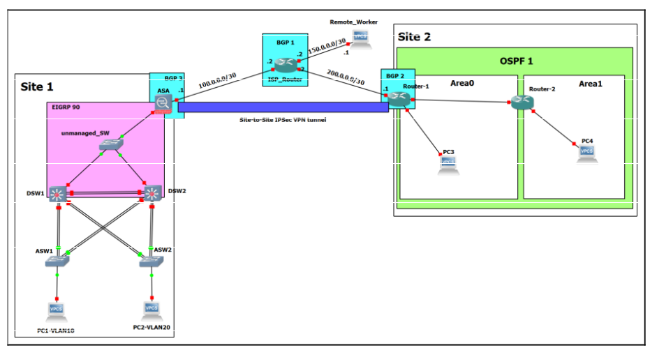
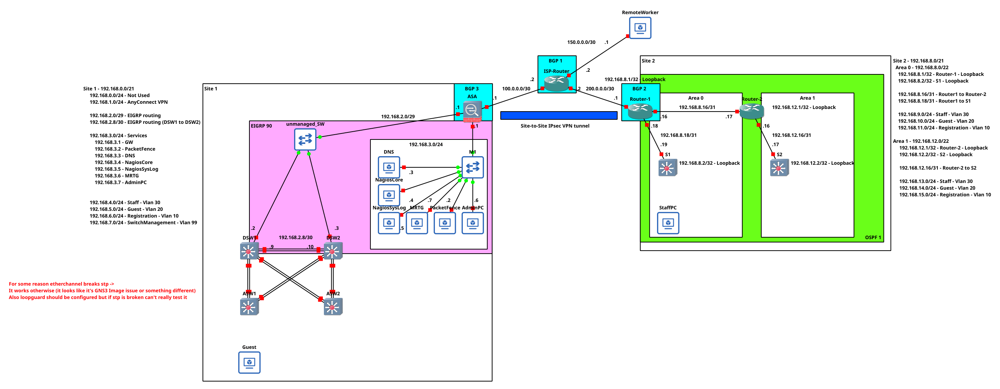

# Assessment Network
Unsurprisingly, due to the fact that I am studying computer networks, we were given an assessment to configure a network in a lab environment<br>
This is pretty much just a configuration dump of what I did without going too much into detail; otherwise it would be a really lengthy document 

## Network Topology and Requirements
 <br>
```
Implementation, management, and monitoring requirements:
    1. Verify Basic Device Settings & Network Connectivity
        a. Ping various components on the network

    2. IP addressing:
        a. Plan your private IP addresses based on your needs.
        b. Regarding the public IP addresses, use the IP addresses shown on the topology.

    3. Layer2 technologies:
        a. Plan and implement STP.
        b. Select the suitable flavour of STP for your network.
        c. Consider trunk links where it is required.
        d. VLANS:
            i. Create and assign VLANs (VLAN10 and VLAN20)
            ii. You can also create more VLANs where it is necessary for design and security reasons.

    4. Layer3 technologies:
        a. Use the EIGRP (AS 90) in Site1, as shown on the topology.
        b. Use OSPF on Site2, as shown on the topology.
        c. Use BGP on ASA, ISP_Router and Router1. Advertise the public IP addresses using BGP. 
        d. In EIGRP and OSPF, make sure the default route is advertised by the edge device.

    5. Redundancy:
        a. Consider using EtherChannels.
        b. Consider using FHRP.

    6. Services:
        a. Configure DHCP service on the ASA to provide IP addresses to the PCs in Site1.
        b. Configure Syslog service to collect logs from the devices using Nagios syslog server.
        c. Configure SNMP service to collect information from the network devices using Nagios SNMP.
        d. You can add more services wherever they are needed.


Security requirements:
    1. Configure Secure Router Administrative Access
        a. Router1 & Router2
        b. Assume that all areas of security from the lab material are required. 
    2. Configure a Zone-Based Policy Firewall
        a. Configure a ZPF on Router1 using the CLI.
    3. Secure the Layer 2 Switches
        a. Configure on all switches.
        b. Assume all areas are secure, including admin access & STP.
    4. Configure Routers and Switches:
        a. As for the routers and switches, admin security is also needed.
        b. You will need to also configure NAT on the device.
    5. Configure ASA management and Firewall Settings:
        a. As for the ASA, admin security is also needed.
        b. Set policies to permit traffic on the ASA.
        c. You will need to also configure NAT on the device.
    6. Configure a Site-To-Site IPsec VPN as shown on the diagram.
        a. Setup between the ASA and Router1 
    7. Configure an appropriate remote access VPN on ASA to allow the remote worker to access the resources in Site1.
    8. Ensure AAA is working properly for all network devices.
```

## Important Note
<mark>There were two major versions of this network before and after the assessment.</mark>
<br>TLDR; The core features of the network were configured correctly in the first version, with just enhancements after the assessment.<br>
As an example we can take MRTG and PacketFence and other devices <br>
<br>I wanted to have MRTG in the network anyway, and it took me 30 minutes to configure it. However, in the assessed version of this network, it was not present. Mainly because it was group work and someone wiped our configurations on real hardware one week before assessment lol.<br>
Hence everything had to be again ported onto the real hardware from GNS3; this being said, it was much slower than working in GNS3, and some things were left out. <br>
<br>PacketFence was present in the assessed network; however, it was configured only on one switch, mainly because I was the only person that knew how to configure it. Forcing it onto the whole network where all the team members did not know what exactly it does would be infeasible in terms of this particular assessment. In the revised network version, PacketFence is configured on all switches; it provides radius logins for switches, and S1 and S2 were added, where in a lab we did not have enough switches to do it.<br>
<br>ASW1‑2, DSW1‑2, ASA, Router 1, Router 2, and configs are pretty much the same as in the first version of the network. The only changes are those accommodating the PacketFence L3 configuration since beginning L2 security, redundancy and other crap that was required was configured <br>
<mark><br>The keypoint being, the first version of the network was graded for 90%, the changes accommodating should push this network around 98-99%</mark>

## Actual Network Topology
 <br>

### What's configured

| What                                                                                                         | Where                          | Description                                                                                                                                                                                                 |
|--------------------------------------------------------------------------------------------------------------|--------------------------------|-------------------------------------------------------------------------------------------------------------------------------------------------------------------------------------------------------------|
| EtherChannel (Both L2 and L3)                                                                                | DSW1-2, ASW1-2                 | Self Explanatory                                                                                                                                                                                            |
| Radius authentication (logging to devices, not 802.1X)                                                       | All devices                    | PacketFence has a feature which allows to configure users in it's database and then you can authenticate to switches and users using PacketFence (radius) which is cool                                     |
| L2 Security (ARP inspection, DHCP snooping, source guard, BPDU guard, root guard, and 802.1X authentication) | All client facing switches     | Self Explanatory I am pretty sure that everything is configured that was mentioned in CCNA, only loopguard is missing but it's because GNS3 images are bugged and I couldn't test it                        |
| Spanning-Tree                                                                                                | DSW1-2, ASW1-2                 | In the orginal version two vlans were present vlan 10, vlan 20, vlan 10 was supposed to go through DSW1 and vlan 20 through DSW2. More Vlans were added but it's still there (RPVST is used and configured) |
| FHRP                                                                                                         | DSW1-2                         | First hop redundancy protocol is configured, with tracking and authentication                                                                                                                               |
| Remote Management (SSH, SNMP)                                                                                | All devices                    | All devices allow for remote management with ACL configured so that access is only from the services network; SNMP is using v3 and is configured with security views                                        |
| OSPF and EIGRP                                                                                               | Where OSPF and EIGRP should be | Both protocols are configured correctly, in OSPF part summarization is configured, in both cases authentication is used and in case of eigrp named eigrp is configured which is considered to be better     |
| Tracking and EIGRP routes                                                                                    | DSW1-2                         | DSW1-2 track IP of ASA, if something goes wrong FHRP priorities are adjusted (this is also true for EIGRP)                                                                                                  |
| NAT & Site-to-Site VPN                                                                                       | ASA, Router-1                  | NAT works, IPSEC VPN works.                                                                                                                                                                                 |
| AnyConnect VPN for RemoteWorker                                                                              | ASA, RemoteWorker              | Anyconnect works, it's configured to allow only traffic to other staff networks (assessment did not specify what exactly to do with it, so it's kinda just there)                                           |
| SysLog, Nagios monitoring                                                                                    | All devices                    | All devices are configured to use syslog, all devices had SNMP configured so that nagios can track their uptime.                                                                                            |
| eBGP                                                                                                         | ASA, ISP-Router, Router-1      | Basic eBGP, it's just kinda there                                                                                                                                                                           |
| MRTG                                                                                                         | ASA, Router-1                  | I wanted to have cool looking network graphs, I used https://hub.docker.com/r/fboaventura/dckr-mrtg/ suprisingly it worked out of the box even with GNS3 images                                             |
| PacketFence and DNS                                                                                          | All devices                    | PacketFence has a L3 configuration on it, DOT1X authentication works and the registration portal, DNS technically is not needed in this network. But it's there and it has a configuration on it            |

Note: This list is not exhaustive <br>
All the configurations are available in the ``configs/`` directory
## Interesting Notes
When I tried to configure source guard and ARP inspection, it was not working after moving the DHCP server from switches to PacketFence and replacing VPCS with actual Windows VMs It magically started working. <br>
Additionally EtherChannel breaks STP on cisco images on real hardware it works normally (without EtherChannel virtualized cisco devices handle stp correctly which interesting) <br>