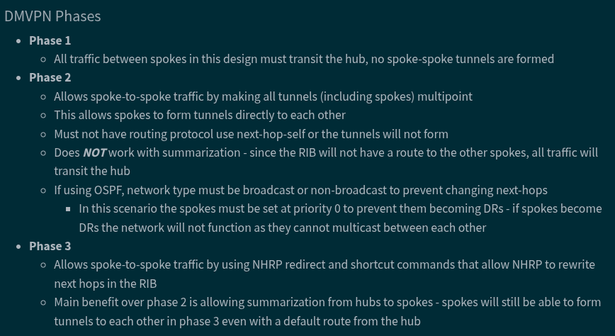
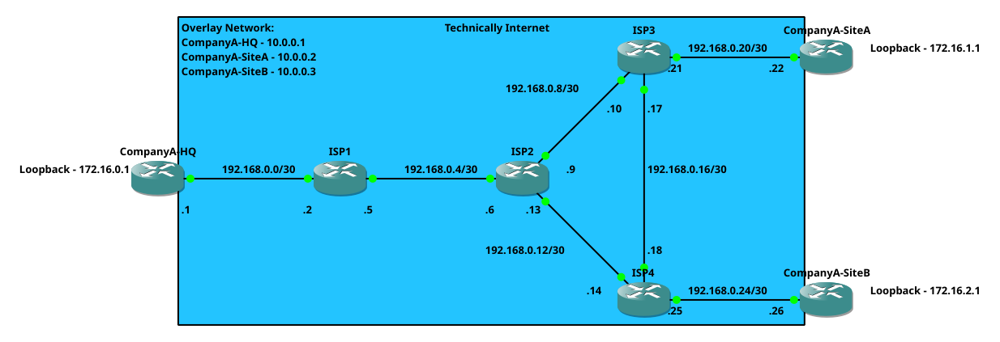
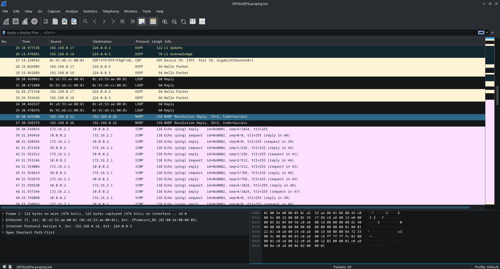
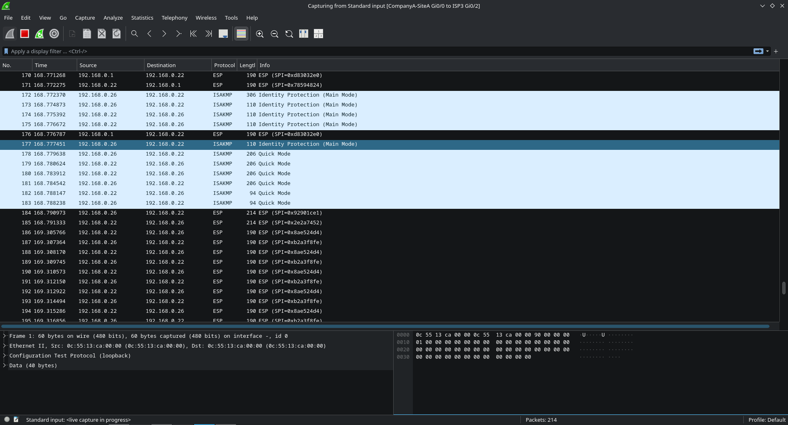

# DMVPN
DMVPN is used to connect multiple sites together <br>
There are 3 phases of DMVPN which are nicely explained by a table below (https://brunbattery.github.io/NetworkNotes/DMVPN.html) <br>
 <br>

I used following sources to help me with configuration: <br>
https://www.cisco.com/c/en/us/support/docs/security/dynamic-multipoint-vpn-dmvpn/211292-Configure-Phase-3-Hierarchical-DMVPN-wit.html <br>
https://www.grandmetric.com/knowledge-base/design_and_configure/dmvpn-phase-3-single-hub-eigrp-hub-example/ <br>
https://community.cisco.com/t5/routing/dmvpn-phase-2/td-p/2716297 <br>
https://networklessons.com/cisco/ccie-routing-switching/dmvpn-phase-2-ospf-routing#Point-to-multipoint_non-broadcast <br>

Note: I will not go too much into details because I tried doing that, and It will be longer than my dissertation especially if I try to explain every single command <br><br>
Note 2: On my GNS3 cisco router image, ``ip nhrp shortcut`` and ``ip nhrp map multicast dynamic`` are enabled by default that's why they are not showing in some of the examples below (Unless I specifically disabled a feature because for example shortcuts are only used for phase 3)
## Lab Setup

Before I start configuration of DMVPN. This network is a template which is duplicated for each DMVPN phase and routing protocol <br>
``192.168.0.X/30`` networks represent public internet <br>
``172.16.0.X/24`` loopbacks represent private networks that would be on each site <br>
``10.0.0.0/24`` network is overlay network (tunnels them self) <br>

At this point following steps are configured 
- Hostnames
- Interfaces with network addresses
- OSPF (On ISP's network)
- Static default route on CompanyA's routers 

Config is available in ``baseNetwork`` folder <br>

## Phase 1 Eigrp
### Hub Config
```
interface Tunnel0
 ip address 10.0.0.1 255.255.255.0
 no ip redirects
 no ip split-horizon eigrp 1
 ip nhrp network-id 100
 no ip nhrp shortcut
 tunnel source GigabitEthernet0/0
 tunnel mode gre multipoint
router eigrp 1
 network 10.0.0.1 0.0.0.0
 network 172.16.0.1 0.0.0.0
 passive-interface Loopback0
```
``no ip split-horizon eigrp 1`` allows a router to advertise a route back out the same interface on which it was received
### Spoke Config
```
interface Tunnel0
 ip address 10.0.0.X 255.255.255.0
 ip nhrp map multicast 192.168.0.1
 ip nhrp network-id 100
 ip nhrp nhs 10.0.0.1
 tunnel source GigabitEthernet0/0
 tunnel destination 192.168.0.1
router eigrp 1
 network 10.0.0.X 0.0.0.0
 network 172.16.X.1 0.0.0.0
 passive-interface Loopback0
```
Nothing interesting there. 
### Routing Table
```
S*    0.0.0.0/0 [1/0] via 192.168.0.21
      10.0.0.0/8 is variably subnetted, 2 subnets, 2 masks
C        10.0.0.0/24 is directly connected, Tunnel0
L        10.0.0.2/32 is directly connected, Tunnel0
      172.16.0.0/16 is variably subnetted, 4 subnets, 2 masks
D        172.16.0.0/24 [90/27008000] via 10.0.0.1, 00:00:09, Tunnel0
C        172.16.1.0/24 is directly connected, Loopback0
L        172.16.1.1/32 is directly connected, Loopback0
D        172.16.2.0/24 [90/28288000] via 10.0.0.1, 00:00:09, Tunnel0
      192.168.0.0/24 is variably subnetted, 2 subnets, 2 masks
C        192.168.0.20/30 is directly connected, GigabitEthernet0/0
L        192.168.0.22/32 is directly connected, GigabitEthernet0/0
```
### Test
```
CompanyA-SiteA#traceroute 172.16.2.1
Type escape sequence to abort.
Tracing the route to 172.16.2.1
VRF info: (vrf in name/id, vrf out name/id)
  1 10.0.0.1 3 msec 2 msec 2 msec
  2 10.0.0.3 4 msec 4 msec 3 msec
CompanyA-SiteA#traceroute 172.16.2.1
Type escape sequence to abort.
Tracing the route to 172.16.2.1
VRF info: (vrf in name/id, vrf out name/id)
  1 10.0.0.1 2 msec 2 msec 2 msec
  2 10.0.0.3 4 msec 4 msec 3 msec
```
All traffic goes through HUB as expected 

## Phase 1 Ospf
### Hub Config
```
interface Tunnel0
 ip address 10.0.0.1 255.255.255.0
 no ip redirects
 ip nhrp network-id 100
 no ip nhrp shortcut
 ip ospf network point-to-multipoint
 tunnel source GigabitEthernet0/0
 tunnel mode gre multipoint
router ospf 1
 passive-interface Loopback0
 network 10.0.0.1 0.0.0.0 area 0
 network 172.16.0.1 0.0.0.0 area 1
```
``ip ospf network point-to-multipoint`` OSPF by default uses broadcasts, mGRE tunnels do not have broadcasts only multicasts and unicasts. Hence, we need to tell OSPF that it's point-to-multipoint
### Spoke Config
```
interface Tunnel0
 ip address 10.0.0.X 255.255.255.0
 ip nhrp map multicast 192.168.0.1
 ip nhrp network-id 100
 ip nhrp nhs 10.0.0.1
 ip ospf network point-to-multipoint
 tunnel source GigabitEthernet0/0
 tunnel destination 192.168.0.1
router ospf 1
 passive-interface Loopback0
 network 10.0.0.X 0.0.0.0 area 0
 network 172.16.X.1 0.0.0.0 area X
```
### Routing Table
```
S*    0.0.0.0/0 [1/0] via 192.168.0.21
      10.0.0.0/8 is variably subnetted, 4 subnets, 2 masks
C        10.0.0.0/24 is directly connected, Tunnel0
O        10.0.0.1/32 [110/1000] via 10.0.0.1, 00:01:42, Tunnel0
L        10.0.0.2/32 is directly connected, Tunnel0
O        10.0.0.3/32 [110/2000] via 10.0.0.1, 00:01:02, Tunnel0
      172.16.0.0/16 is variably subnetted, 4 subnets, 2 masks
O IA     172.16.0.1/32 [110/1001] via 10.0.0.1, 00:01:42, Tunnel0
C        172.16.1.0/24 is directly connected, Loopback0
L        172.16.1.1/32 is directly connected, Loopback0
O IA     172.16.2.1/32 [110/2001] via 10.0.0.1, 00:01:02, Tunnel0
      192.168.0.0/24 is variably subnetted, 2 subnets, 2 masks
C        192.168.0.20/30 is directly connected, GigabitEthernet0/0
L        192.168.0.22/32 is directly connected, GigabitEthernet0/0
```
### Test
```
CompanyA-SiteA# traceroute 172.16.2.1
Type escape sequence to abort.
Tracing the route to 172.16.2.1
VRF info: (vrf in name/id, vrf out name/id)
  1 10.0.0.1 2 msec 2 msec 2 msec
  2 10.0.0.3 4 msec 4 msec 4 msec
CompanyA-SiteA# traceroute 172.16.2.1
Type escape sequence to abort.
Tracing the route to 172.16.2.1
VRF info: (vrf in name/id, vrf out name/id)
  1 10.0.0.1 2 msec 2 msec 2 msec
  2 10.0.0.3 4 msec 4 msec 3 msec
```
All traffic goes through HUB as expected 


## Phase 2 Eigrp
### Hub Config
```
interface Tunnel0
 ip address 10.0.0.1 255.255.255.0
 no ip redirects
 no ip next-hop-self eigrp 1
 no ip split-horizon eigrp 1
 ip nhrp network-id 100
 no ip nhrp shortcut
 tunnel source GigabitEthernet0/0
 tunnel mode gre multipoint
router eigrp 1
 network 10.0.0.1 0.0.0.0
 network 172.16.0.1 0.0.0.0
 passive-interface Loopback0
```
``no ip next-hop-self eigrp 1`` prevents HUB from advertising routes that would have to bounce via the same interface
### Spoke Config
```
interface Tunnel0
 ip address 10.0.0.X 255.255.255.0
 no ip redirects
 ip nhrp map 10.0.0.1 192.168.0.1
 ip nhrp map multicast 192.168.0.1
 ip nhrp network-id 100
 ip nhrp nhs 10.0.0.1
 no ip nhrp shortcut
 tunnel source GigabitEthernet0/0
 tunnel mode gre multipoint
router eigrp 1
 network 10.0.0.X 0.0.0.0
 network 172.16.X.1 0.0.0.0
 passive-interface Loopback0
```
Nothing interesting
### Routing Table
```
S*    0.0.0.0/0 [1/0] via 192.168.0.21
      10.0.0.0/8 is variably subnetted, 2 subnets, 2 masks
C        10.0.0.0/24 is directly connected, Tunnel0
L        10.0.0.2/32 is directly connected, Tunnel0
      172.16.0.0/16 is variably subnetted, 4 subnets, 2 masks
D        172.16.0.0/24 [90/27008000] via 10.0.0.1, 00:04:44, Tunnel0
C        172.16.1.0/24 is directly connected, Loopback0
L        172.16.1.1/32 is directly connected, Loopback0
D        172.16.2.0/24 [90/28288000] via 10.0.0.3, 00:04:44, Tunnel0
      192.168.0.0/24 is variably subnetted, 2 subnets, 2 masks
C        192.168.0.20/30 is directly connected, GigabitEthernet0/0
L        192.168.0.22/32 is directly connected, GigabitEthernet0/0
```
We can clearly see overlay address of other spoke
### Test
```
CompanyA-SiteA#traceroute 172.16.2.1
Type escape sequence to abort.
Tracing the route to 172.16.2.1
VRF info: (vrf in name/id, vrf out name/id)
  1 10.0.0.1 2 msec 2 msec 2 msec
  2 10.0.0.3 4 msec 5 msec 2 msec
CompanyA-SiteA#traceroute 172.16.2.1
Type escape sequence to abort.
Tracing the route to 172.16.2.1
VRF info: (vrf in name/id, vrf out name/id)
  1 10.0.0.3 2 msec 2 msec 2 msec
```
First packet was sent via HUB because our spoke did not know underlay address of another spoke, however our spoke requested this information and as of second traceroute direct communication occurred 

## Phase 2 Ospf
### Hub Config
```
interface Tunnel0
 ip address 10.0.0.1 255.255.255.0
 no ip redirects
 ip nhrp network-id 100
 no ip nhrp shortcut
 ip ospf network broadcast
 tunnel source GigabitEthernet0/0
 tunnel mode gre multipoint
router ospf 1
 passive-interface Loopback0
 network 10.0.0.1 0.0.0.0 area 0
 network 172.16.0.1 0.0.0.0 area 1
```
``ip ospf network broadcast`` this makes OSPF broadcast messages, spokes are able to form adjectives as they would be on one link and network (as exactly we are in this case). The problem is that all OSPF neighbours will broadcast LSA's resulting in increased router load and performance problems, and it has limited scalability but is the only solution for spokes to form adjacencies together in this particular dmvpn phase 2 scenario. (Alternatively you can use non-broadcast mode and manually configure neighbours however at this point what is the point of OSPF and dynamic routing protocol) 

### Spoke Config
```
interface Tunnel0
 ip address 10.0.0.X 255.255.255.0
 no ip redirects
 ip nhrp map 10.0.0.1 192.168.0.1
 ip nhrp map multicast 192.168.0.1
 ip nhrp network-id 100
 ip nhrp nhs 10.0.0.1
 no ip nhrp shortcut
 ip ospf network broadcast
 ip ospf priority 0
 tunnel source GigabitEthernet0/0
 tunnel mode gre multipoint
router ospf 1
 passive-interface Loopback0
 network 10.0.0.X 0.0.0.0 area 0
 network 172.16.X.1 0.0.0.0 area X
```
Nothing interesting
### Routing Table
```
S*    0.0.0.0/0 [1/0] via 192.168.0.21
      10.0.0.0/8 is variably subnetted, 2 subnets, 2 masks
C        10.0.0.0/24 is directly connected, Tunnel0
L        10.0.0.2/32 is directly connected, Tunnel0
      172.16.0.0/16 is variably subnetted, 4 subnets, 2 masks
O IA     172.16.0.1/32 [110/1001] via 10.0.0.1, 00:00:53, Tunnel0
C        172.16.1.0/24 is directly connected, Loopback0
L        172.16.1.1/32 is directly connected, Loopback0
O IA     172.16.2.1/32 [110/1001] via 10.0.0.3, 00:00:53, Tunnel0
      192.168.0.0/24 is variably subnetted, 2 subnets, 2 masks
C        192.168.0.20/30 is directly connected, GigabitEthernet0/0
L        192.168.0.22/32 is directly connected, GigabitEthernet0/0
```
Again we can see other spoke's overlay address 
### Test
```
CompanyA-SiteA# traceroute 172.16.2.1
Type escape sequence to abort.
Tracing the route to 172.16.2.1
VRF info: (vrf in name/id, vrf out name/id)
  1 10.0.0.1 2 msec 2 msec 2 msec
  2 10.0.0.3 3 msec 5 msec 2 msec
CompanyA-SiteA# traceroute 172.16.2.1
Type escape sequence to abort.
Tracing the route to 172.16.2.1
VRF info: (vrf in name/id, vrf out name/id)
  1 10.0.0.3 2 msec 1 msec 2 msec
```
The same as with eigrp, first packet was sent via HUB because our spoke did not know underlay address of another spoke, however at the same time spoke requested this information and as of second traceroute direct communication occurred 

## Phase 3 Eigrp
### Hub Config
```
interface Tunnel0
 ip address 10.0.0.1 255.255.255.0
 no ip redirects
 no ip split-horizon eigrp 1
 ip nhrp network-id 100
 ip nhrp redirect
 ip summary-address eigrp 1 172.16.0.0 255.255.0.0
 tunnel source GigabitEthernet0/0
 tunnel mode gre multipoint
router eigrp 1
 network 10.0.0.1 0.0.0.0
 network 172.16.0.1 0.0.0.0
 passive-interface Loopback0
```
In this example we have ``ip nhrp redirect`` and ``ip nhrp shortcut`` enabled (shortcut is hidden, if you do ``show run all`` you will see it). Those two commands enable the response of quicker route to spoke <br>
``no ip next-hop-self eigrp 1`` is not used because spokes will not know each other's overlay address till HUB sends information to them on how to directly connect to each other <br>
Additionally we are running route summarization ``ip summary-address eigrp 1 172.16.0.0 255.255.0.0`` 

### Spoke Config
```
interface Tunnel0
 ip address 10.0.0.X 255.255.255.0
 no ip redirects
 ip nhrp map 10.0.0.1 192.168.0.1
 ip nhrp map multicast 192.168.0.1
 ip nhrp network-id 100
 ip nhrp nhs 10.0.0.1
 tunnel source GigabitEthernet0/0
 tunnel mode gre multipoint
router eigrp 1
 network 10.0.0.X 0.0.0.0
 network 172.16.X.1 0.0.0.0
 passive-interface Loopback0
```
Nothing interesting happening on spoke 
### Routing Table + Test
```
CompanyA-SiteA#show ip route
Codes: L - local, C - connected, S - static, R - RIP, M - mobile, B - BGP
       D - EIGRP, EX - EIGRP external, O - OSPF, IA - OSPF inter area 
       N1 - OSPF NSSA external type 1, N2 - OSPF NSSA external type 2
       E1 - OSPF external type 1, E2 - OSPF external type 2
       i - IS-IS, su - IS-IS summary, L1 - IS-IS level-1, L2 - IS-IS level-2
       ia - IS-IS inter area, * - candidate default, U - per-user static route
       o - ODR, P - periodic downloaded static route, H - NHRP, l - LISP
       a - application route
       + - replicated route, % - next hop override, p - overrides from PfR

Gateway of last resort is 192.168.0.21 to network 0.0.0.0

S*    0.0.0.0/0 [1/0] via 192.168.0.21
      10.0.0.0/8 is variably subnetted, 2 subnets, 2 masks
C        10.0.0.0/24 is directly connected, Tunnel0
L        10.0.0.2/32 is directly connected, Tunnel0
      172.16.0.0/16 is variably subnetted, 3 subnets, 3 masks
D        172.16.0.0/16 [90/27008000] via 10.0.0.1, 00:00:12, Tunnel0
C        172.16.1.0/24 is directly connected, Loopback0
L        172.16.1.1/32 is directly connected, Loopback0
      192.168.0.0/24 is variably subnetted, 2 subnets, 2 masks
C        192.168.0.20/30 is directly connected, GigabitEthernet0/0
L        192.168.0.22/32 is directly connected, GigabitEthernet0/0
CompanyA-SiteA#traceroute 172.16.2.1
Type escape sequence to abort.
Tracing the route to 172.16.2.1
VRF info: (vrf in name/id, vrf out name/id)
  1 10.0.0.1 2 msec 2 msec 2 msec
  2 10.0.0.3 4 msec 4 msec 4 msec
CompanyA-SiteA#traceroute 172.16.2.1
Type escape sequence to abort.
Tracing the route to 172.16.2.1
VRF info: (vrf in name/id, vrf out name/id)
  1 10.0.0.3 2 msec 2 msec 2 msec
CompanyA-SiteA#show ip route
Codes: L - local, C - connected, S - static, R - RIP, M - mobile, B - BGP
       D - EIGRP, EX - EIGRP external, O - OSPF, IA - OSPF inter area 
       N1 - OSPF NSSA external type 1, N2 - OSPF NSSA external type 2
       E1 - OSPF external type 1, E2 - OSPF external type 2
       i - IS-IS, su - IS-IS summary, L1 - IS-IS level-1, L2 - IS-IS level-2
       ia - IS-IS inter area, * - candidate default, U - per-user static route
       o - ODR, P - periodic downloaded static route, H - NHRP, l - LISP
       a - application route
       + - replicated route, % - next hop override, p - overrides from PfR

Gateway of last resort is 192.168.0.21 to network 0.0.0.0

S*    0.0.0.0/0 [1/0] via 192.168.0.21
      10.0.0.0/8 is variably subnetted, 3 subnets, 2 masks
C        10.0.0.0/24 is directly connected, Tunnel0
L        10.0.0.2/32 is directly connected, Tunnel0
H        10.0.0.3/32 is directly connected, 00:00:04, Tunnel0
      172.16.0.0/16 is variably subnetted, 4 subnets, 3 masks
D        172.16.0.0/16 [90/27008000] via 10.0.0.1, 00:00:27, Tunnel0
C        172.16.1.0/24 is directly connected, Loopback0
L        172.16.1.1/32 is directly connected, Loopback0
H        172.16.2.0/24 [250/255] via 10.0.0.3, 00:00:04, Tunnel0
      192.168.0.0/24 is variably subnetted, 2 subnets, 2 masks
C        192.168.0.20/30 is directly connected, GigabitEthernet0/0
L        192.168.0.22/32 is directly connected, GigabitEthernet0/0
CompanyA-SiteA#
```
At first, we can see summarized route (``172.16.0.0/16 [90/27008000] via 10.0.0.1, 00:00:27, Tunnel0``) when first packet is sent HUB forwards this packet and responds to spoke with quicker route (Direct connection) <br>
Which then is installed into the routing table (``H        172.16.2.0/24 [250/255] via 10.0.0.3, 00:00:04, Tunnel0``) 

## Phase 3 Ospf
I need to revisit that I have config for it that half works. I believe I have an issue with route summarization anyway as part of university we will cover OSPF with area's so that will address that <br>
Also I believe that configurations that I found on internet are invalid and I start to lose patience with this one particular protocol. (I knew it required some special handling) <br>
Anyway I was talking to lecturer about DMVPN he said that if it's proprietary why not at this point just use eigrp which makes sense there will be no devices other than cisco on other side <br>
Aside of that He also mentioned that OSPF and DMVPN require specific design with areas which might not be always feasible (Will cover it later on). 
Either this section will be revisited or not. I got the concept so it's good.

## Checking Direct Connections
In this whole lab I just checked with traceroute whether direct connection occurs, however it would be beneficial to check it with wireshark just because I might have missed something <br>
 <br>
From topology we can see that the "fastest" route (with the least hops) from CompanyA-SiteA to CompanyA-SiteB is via ISP3-ISP4 <br>
For purpose of this particular section I am sniffing traffic on ISP1 and between ISP3 and ISP4. The expected result should be that initially traffic goes via HUB, but later it goes through ISP3 and ISP4 <br>
I am providing PCAP's of these tests under ``directConnectionTests``

phase 2: eigrp and ospf passed
phase 3: eigrp passed

Note: This section is the only reason I found issue with my phase 3 ospf configuration
## Additional Security Considerations
Currently, our tunnels just tunnel traffic without any encryption whatsoever <br>
We can change it with ipsec profile <br>
Note: This config is taken from cisco https://www.cisco.com/c/en/us/support/docs/security-vpn/ipsec-negotiation-ike-protocols/29240-dcmvpn.html <br>
We just need to configure 
```
crypto isakmp policy 10
hash md5
authentication pre-share
crypto isakmp key cisco123 address 0.0.0.0 0.0.0.0
crypto ipsec transform-set strong esp-3des esp-md5-hmac 
crypto ipsec profile cisco
set security-association lifetime seconds 120
set transform-set strong 
```
And then add
```
tunnel protection ipsec profile cisco
```
to our tunnel interface <br>
I am going to explain commands in a table <br>

| Command                                                 | Description                                                                                                                                                                                                                                                    |
|---------------------------------------------------------|----------------------------------------------------------------------------------------------------------------------------------------------------------------------------------------------------------------------------------------------------------------|
| crypto isakmp policy 10                                 | Here we define our policy and priority, from what I read if we have other policy with higher priority it will be overtaken by the one with higher priority                                                                                                     |
| hash md5                                                | Hash that is used for authentication, I would suggest to use something like sha256 there not md5 as md5 can have a hash collision relatively easily                                                                                                            |
| authentication pre-share                                | We are using pre-shared passwords, alternatively we could use rsa                                                                                                                                                                                              |
| crypto isakmp key cisco123 address 0.0.0.0 0.0.0.0      | We are setting password "cisco123" for all hosts (0.0.0.0 0.0.0.0), we can specify a subnet or specific host there for the purpose of this lab this is good enough. But it's good to keep in mind that we might want other routers to have different passwords |
| crypto ipsec transform-set strong esp-3des esp-md5-hmac | Here we are setting what actual encryption will be used for our packets, in this case ``esp-3des`` is used for encryption and ``esp-md5-hmac`` is used for detection if packet was altered during transmission                                                 |
| crypto ipsec profile cisco                              | Used to create a ipsec profile named ``cisco``                                                                                                                                                                                                                 |
| set security-association lifetime seconds 120           | Basically how often connection is re-established and keys are verified again                                                                                                                                                                                   |
| set transform-set strong                                | We are applying transform-set called ``strong`` to profile ``cisco`` (you know what I mean)                                                                                                                                                                    |
| tunnel protection ipsec profile cisco                   | We are applying ipsec profile ``cisco`` to the tunnel it self                                                                                                                                                                                                  |

We can verify that our config is correctly configured with following commands 
- show crypto engine connection active — Displays the total encrypts and decrypts per SA.
- show crypto ipsec sa — Displays the stats on the active tunnels.
- show crypto isakmp sa — Displays the state for the ISAKMP SA.

```
CompanyA-HQ#show crypto isakmp sa
IPv4 Crypto ISAKMP SA
dst             src             state          conn-id status
192.168.0.1     192.168.0.22    QM_IDLE           1002 ACTIVE
192.168.0.1     192.168.0.26    QM_IDLE           1001 ACTIVE

IPv6 Crypto ISAKMP SA

CompanyA-HQ#
```
Just for additional test I will ping ``172.16.2.1`` from CompanyA-SiteA router and wireshark it <br>
Wireshark shows us clearly what we are doing <br>
 <br>
However after we encrypted it wireshark cannot deduct on what we are doing because our data is encrypted <br>
 <br>

Note: We have to configure the tunnel encryption on both sides, in this case on all 3 routers <br>
Note 2: I might have used suboptimal options for encryption and hashing, On real hardware and more recent hardware better encryption options might be available so reading docs or doing slightly more research might be good for you but concept is the same <br>