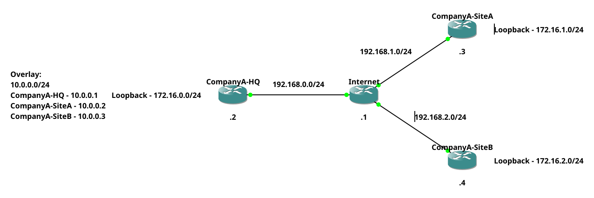
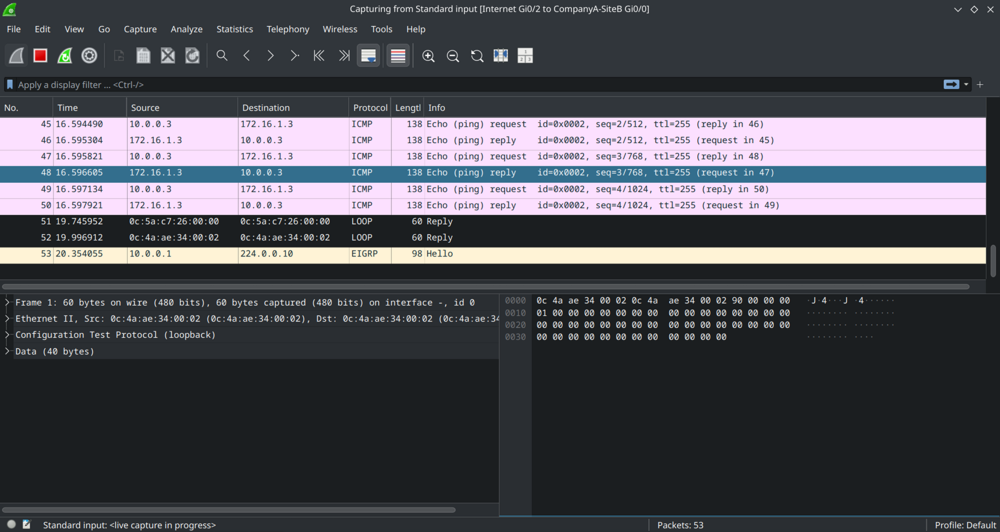

# DMVPN
A DMVPN is used to connect multiple sites together <br>
There are 3 phases of DMVPN <br>

| Phase   | Description                                                                                                             | Expected Packet Flow                                                                                                     |
|---------|-------------------------------------------------------------------------------------------------------------------------|--------------------------------------------------------------------------------------------------------------------------|
| Phase 1 | All traffic is routed through central hub                                                                               | Router-A -> HUB -> Router-B                                                                                              |
| Phase 2 | HUB is used as a centralized information provider on how to reach other router directly                                 | Router-A -> Router-B (Router-A and Router-B have information from HUB how to contact each other directly)                |
| Phase 3 | Basically a phase 2 but HUB is used for initial bootstrapping after this point spokes provide information to each other | Router-A -> Router-B (Router-A pulls information from HUB, other spokes can provide information about route to Router-B) |

Note: NHRP is used to resolve what should be next hop in our tunnel
## Lab Setup
 <br>
Before I start configuring DMVPN. This is my default network which will be reset for each DMVPN phase <br>
``192.168.X.0/24`` networks represent public internet <br>
``172.16.X.0/24`` loopbacks represent private networks that would be on each site <br>
``10.0.0.0/24`` network is overlay network (tunnels them self) <br>

At this step following steps are only configured <br>
- Hostname
- Interfaces with network address
- Static routes (So routers can access each other via public IP only)

This stage of configuration is available in ``initialConfig`` folder <br>

## Setting up phase 1
DMVPN uses mGRE tunnel. This tunnel uses already existing network and overlays it with another network <br>
Effectively devices in the tunnel think they are connected directly on a separate network <br>

Let's start with configuring a HUB (CompanyA-HQ) <br>
```
interface Tunnel0
 ip address 10.0.0.1 255.255.255.0
 no ip redirects
 ip nhrp network-id 100
 ip ospf network point-to-multipoint
 tunnel source GigabitEthernet0/0
 tunnel mode gre multipoint
router ospf 1
 passive-interface Loopback0
 network 10.0.0.0 0.0.0.255 area 0
 network 172.16.0.0 0.0.0.255 area 0
```

| Command                             | Description                                                                                                                                                                                                                                                                                                       |
|-------------------------------------|-------------------------------------------------------------------------------------------------------------------------------------------------------------------------------------------------------------------------------------------------------------------------------------------------------------------|
| ip address 10.0.0.1 255.255.255.0   | IP address of the tunnel it self                                                                                                                                                                                                                                                                                  |
| no ip redirects                     | Prevents from forwarding packets (because this is a special scenario where we are under tunnel the job of this particular command is replaced with NHRP which forwards packets differently and relevantly to our tunnel) with this option enabled our packets could be send to wrong destination and make a loop) |
| ip nhrp network-id 100              | NHRP network ID, it needs to match on both sides                                                                                                                                                                                                                                                                  |
| ip ospf network point-to-multipoint | OSPF by default is expecting only one peer at the end of connection, in this case this is false. We need it to tell OSPF that there will be more peers                                                                                                                                                            |
| tunnel source GigabitEthernet0/0    | The source interface (Kind of where to listen for clients to connect)                                                                                                                                                                                                                                             |
| tunnel mode gre multipoint          | mGRE tunnel can be either point-to-point (Router to Router) or multipoint (Router to Routers), in our case we will manage multiple connections                                                                                                                                                                    |
| passive-interface Loopback0         | Standard practise of disabling OSPF advertisement on interfaces where it shouldn't be                                                                                                                                                                                                                             |

The config on Spokes (CompanyA-Site{A,B})  is pretty similar but there are some changes <br>
```
interface Tunnel0
 ip address 10.0.0.X 255.255.255.0
 ip nhrp network-id 100
 ip nhrp nhs 10.0.0.1
 ip ospf network point-to-multipoint
 tunnel source GigabitEthernet0/0
 tunnel destination 192.168.0.2
router ospf 1
 passive-interface Loopback0
 network 10.0.0.0 0.0.0.255 area 0
 network 172.16.X.0 0.0.0.255 area 0
```

Note: The only difference is that ``no ip redirects`` is not in there (This makes sense as we want to forward traffic with spoke, where with HUB it should go through tunnel) <br>
The other difference is we have a ``tunnel destination`` which again makes sense as it must connect somewhere right <br>
After those operations if we look at routing table we can see that routes were correctly discovered via OSPF and through the Tunnel0 interface <br>
```
      10.0.0.0/8 is variably subnetted, 4 subnets, 2 masks
C        10.0.0.0/24 is directly connected, Tunnel0
O        10.0.0.1/32 [110/1000] via 10.0.0.1, 00:00:17, Tunnel0
O        10.0.0.2/32 [110/2000] via 10.0.0.1, 00:00:17, Tunnel0
L        10.0.0.3/32 is directly connected, Tunnel0
      172.16.0.0/16 is variably subnetted, 4 subnets, 2 masks
O        172.16.0.2/32 [110/1001] via 10.0.0.1, 00:00:17, Tunnel0
O        172.16.1.3/32 [110/2001] via 10.0.0.1, 00:00:17, Tunnel0
C        172.16.2.0/24 is directly connected, Loopback0
L        172.16.2.4/32 is directly connected, Loopback0
S     192.168.0.0/24 [1/0] via 192.168.2.1
S     192.168.1.0/24 [1/0] via 192.168.2.1
      192.168.2.0/24 is variably subnetted, 2 subnets, 2 masks
C        192.168.2.0/24 is directly connected, GigabitEthernet0/0
L        192.168.2.4/32 is directly connected, GigabitEthernet0/0
```
Now if we try to traceroute from CompanyA-SiteB to CompanyA-SiteA <br>
```
CompanyA-SiteB#traceroute 10.0.0.2
Type escape sequence to abort.
Tracing the route to 10.0.0.2
VRF info: (vrf in name/id, vrf out name/id)
  1 10.0.0.1 1 msec 2 msec 1 msec
  2 10.0.0.2 2 msec 2 msec 2 msec
CompanyA-SiteB#
```
We can see that traffic went through HUB and then to CompanyA-SiteA router <br>

Note: OSPF is good for phase 1, but it wouldn't work with phase 2 or 3 as OSPF has a "static" routing table it wouldn't take account of spoke to spoke traffic and OSPF would want to route via HUB rather than spoke directly <br>
This could be circumvented with some black magic but from what I read just use eigrp or bgp for phase 2 or 3 <br>
Note 2: By default tunnels only forward unicast traffic, we can allow to forward multicast traffic with ``ip nhrp map dynamic multicast`` however this breaks eigrp, in case of OSPF this is fine <br>

## Setting up phase 2
The difference between phase 1 and 2 is that now HUB provides information to each spoke how to communicate directly (When you send first packet, it returns the underlay address of other router so direct communication can occur) <br>

HUB Config <br>
```
interface Tunnel0
 ip address 10.0.0.1 255.255.255.0
 no ip redirects
 no ip split-horizon eigrp 1
 ip nhrp network-id 100
 ip nhrp redirect
 tunnel source GigabitEthernet0/0
 tunnel mode gre multipoint
router eigrp 1
 network 10.0.0.0 0.0.0.255
 network 172.16.0.0 0.0.0.255
 passive-interface Loopback0
```
Again, table to explain commands <br>

| Command                     | Description                                                                                                                                                                                                                             |
|-----------------------------|-----------------------------------------------------------------------------------------------------------------------------------------------------------------------------------------------------------------------------------------|
| no ip split-horizon eigrp 1 | Basically if you do not do this, HUB will receive eigrp routes but will not inform other spokes about the route, this command allows HUB to advertise route information to other spokes which after this point can communicate directly |
| ip nhrp redirect            | Remember when I was talking in phase 1 about no ip redirects command, NHRP maps real ip's to overlay ip's allowing direct communication, in this case we are allowing to forward traffic based on those mappings                        |

Okay now let's go to spokes configuration <br>
```
interface Tunnel0
 ip address 10.0.0.X 255.255.255.0
 no ip redirects
 ip nhrp map 10.0.0.1 192.168.0.2
 ip nhrp map multicast 192.168.0.2
 ip nhrp network-id 100
 ip nhrp nhs 10.0.0.1
 tunnel source GigabitEthernet0/0
 tunnel mode gre multipoint
router eigrp 1
 network 10.0.0.0 0.0.0.255
 network 172.16.X.0 0.0.0.255
 passive-interface Loopback0
```
And again a table <br>

| Command                           | Description                                                                                                                                                                |
|-----------------------------------|----------------------------------------------------------------------------------------------------------------------------------------------------------------------------|
| ip nhrp map 10.0.0.1 192.168.0.2  | Map's overlay address (10.0.0.1) to host (192.168.0.2)                                                                                                                     |
| ip nhrp map multicast 192.168.0.2 | Tells NHRP where to send multicast traffic                                                                                                                                 |
| ip nhrp nhs 10.0.0.1              | Who is responsible for resolving overlay addresses into underlay addresses (so spoke-to-spoke communication can occur, in this case it's address of HUB's overlay network) |

At this point when you will do traceroute, first packet will go through HUB because direct connection is not known yet, after this point routers can communicate directly <br>
```
CompanyA-SiteB#traceroute 172.16.1.3 
Type escape sequence to abort.
Tracing the route to 172.16.1.3
VRF info: (vrf in name/id, vrf out name/id)
  1 10.0.0.1 1 msec 1 msec 1 msec
  2 10.0.0.2 3 msec 2 msec 2 msec
CompanyA-SiteB#traceroute 172.16.1.3 
Type escape sequence to abort.
Tracing the route to 172.16.1.3
VRF info: (vrf in name/id, vrf out name/id)
  1 10.0.0.2 1 msec 1 msec 1 msec
CompanyA-SiteB#
```
And a routing table <br>
```
      10.0.0.0/8 is variably subnetted, 3 subnets, 2 masks
C        10.0.0.0/24 is directly connected, Tunnel0
H        10.0.0.2/32 is directly connected, 00:00:34, Tunnel0
L        10.0.0.3/32 is directly connected, Tunnel0
      172.16.0.0/16 is variably subnetted, 4 subnets, 2 masks
D        172.16.0.0/24 [90/27008000] via 10.0.0.1, 12:36:57, Tunnel0
D   %    172.16.1.0/24 [90/28288000] via 10.0.0.1, 12:32:54, Tunnel0
C        172.16.2.0/24 is directly connected, Loopback0
L        172.16.2.4/32 is directly connected, Loopback0
S     192.168.0.0/24 [1/0] via 192.168.2.1
S     192.168.1.0/24 [1/0] via 192.168.2.1
      192.168.2.0/24 is variably subnetted, 2 subnets, 2 masks
C        192.168.2.0/24 is directly connected, GigabitEthernet0/0
L        192.168.2.4/32 is directly connected, GigabitEthernet0/0
```
Note: We can see that 172.16.1.0/24 route is going via 10.0.0.1 which is via hub. However, we can also see that there is a ``%`` sign. From my understanding this is only used for initial discovery of networks and traceroute confirms that in fact traffic is routed straight to other router not via HUB <br>

## Setting up phase 3 
The difference between phase 2 and 3 is ``ip nhrp shortcut`` on spokes <br> 
What it does is instead of Router sending first packet and then HUB replying with information on how to reach other router directly <br>
Shortcuts should form even before first packets are send <br>

Unfortunately due to fact that I am using virtualized images of routers it doesn't work <br>
When I try to add ``ip nhrp shortcut`` it doesn't work lol <br>
If I do ``no tunnel mode``, I can add ``ip nhrp shortcut`` but this shouldn't work this way <br>
From my research I believe I am correct with what I said there <br>
https://networklessons.com/cisco/ccie-routing-switching/dmvpn-phase-3-bgp-routing (ip nhrp shortcut and tunnel mode gre multipoint clearly working together) <br>
https://journey2theccie.wordpress.com/2020/04/17/dmvpn-phase-3-configuration/ (the same thing) <br>
and more ...  <br>

## Adding encryption
Currently, our tunnels just tunnel traffic without any encryption whatsoever <br>
We can change it with ipsec profile <br>
Note: This config is taken from cisco https://www.cisco.com/c/en/us/support/docs/security-vpn/ipsec-negotiation-ike-protocols/29240-dcmvpn.html <br>
We just need to configure 
```
crypto isakmp policy 10
hash md5
authentication pre-share
crypto isakmp key cisco123 address 0.0.0.0 0.0.0.0
crypto ipsec transform-set strong esp-3des esp-md5-hmac 
crypto ipsec profile cisco
set security-association lifetime seconds 120
set transform-set strong 
```
And then add
```
tunnel protection ipsec profile cisco
```
to our tunnel interface <br>
I will go with table for explanations cause why not <br>

| Command                                                 | Description                                                                                                                                                                                                                                                    |
|---------------------------------------------------------|----------------------------------------------------------------------------------------------------------------------------------------------------------------------------------------------------------------------------------------------------------------|
| crypto isakmp policy 10                                 | Here we define our policy and priority, from what I read if we have other policy with higher priority it will be overtaken by the one with higher priority                                                                                                     |
| hash md5                                                | Hash that is used for authentication, I would suggest to use something like sha256 there not md5 as md5 can have a hash collision relatively easily                                                                                                            |
| authentication pre-share                                | We are using pre-shared passwords, alternatively we could use rsa                                                                                                                                                                                              |
| crypto isakmp key cisco123 address 0.0.0.0 0.0.0.0      | We are setting password "cisco123" for all hosts (0.0.0.0 0.0.0.0), we can specify a subnet or specific host there for the purpose of this lab this is good enough. But it's good to keep in mind that we might want other routers to have different passwords |
| crypto ipsec transform-set strong esp-3des esp-md5-hmac | Here we are setting what actual encryption will be used for our packets, in this case ``esp-3des`` is used for encryption and ``esp-md5-hmac`` is used for detection if packet was altered during transmission                                                 |
| crypto ipsec profile cisco                              | Used to create a ipsec profile named ``cisco``                                                                                                                                                                                                                 |
| set security-association lifetime seconds 120           | Basically how often connection is re-established and keys are verified again                                                                                                                                                                                   |
| set transform-set strong                                | We are applying transform-set called ``strong`` to profile ``cisco`` (you know what I mean)                                                                                                                                                                    |
| tunnel protection ipsec profile cisco                   | We are applying ipsec profile ``cisco`` to the tunnel it self                                                                                                                                                                                                  |

We can verify that our config is correctly configured with following commands 
- show crypto engine connection active — Displays the total encrypts and decrypts per SA.
- show crypto ipsec sa — Displays the stats on the active tunnels.
- show crypto isakmp sa — Displays the state for the ISAKMP SA.

```
CompanyA-HQ#show crypto isakmp sa 
IPv4 Crypto ISAKMP SA
dst             src             state          conn-id status
192.168.0.2     192.168.2.4     QM_IDLE           1003 ACTIVE
192.168.0.2     192.168.1.3     QM_IDLE           1002 ACTIVE

IPv6 Crypto ISAKMP SA

CompanyA-HQ#
```
Just for additional test I will ping ``172.16.1.3`` from CompanyA-SiteB router and wireshark it <br>
Wireshark shows us clearly what we are doing <br>
 <br>
However after we encrypted it, as expected it's well encrypted wireshark cannot deduct on what we are doing <br>
 <br>

Note: We have to configure the tunnel encryption on both sides, in this case on all 3 routers <br>
Note 2: I might have used suboptimal options for encryption and hashing, On real hardware and more recent hardware better encryption options might be aviable so reading docs or doing slightly more research might be good for you but concept is the same <br>