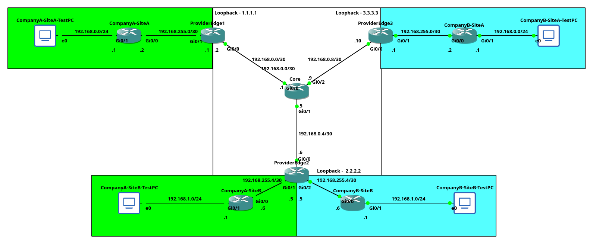
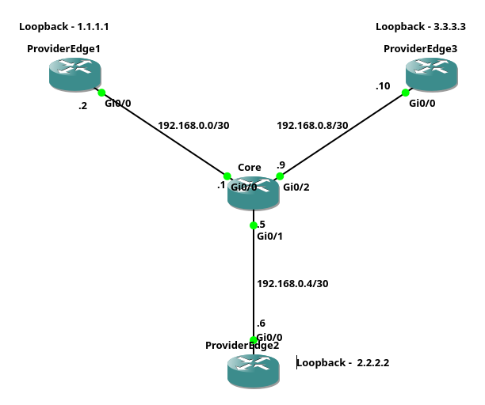
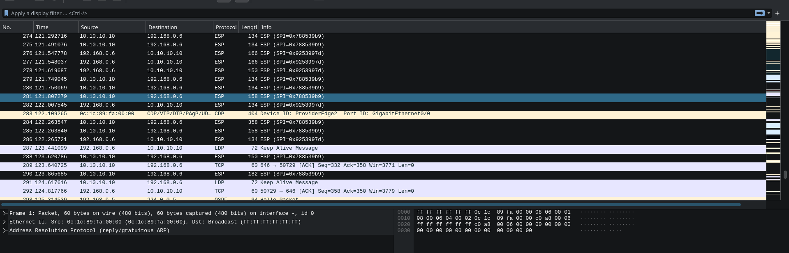

# MPLS
Assume you own a company, you want to connect multiple sites together <br>
One of your options is to set up a DMVPN and manage it yourself <br>
Alternatively if your ISP supports MPLS, you can outsource this problem to ISP <br>

Now from ISP's perspective <br>
CompanyA with following networks 192.168.0.0/24 and 192.168.1.0/24 wants to connect sites together <br>
So you route their traffic, and they are happy <br>
Then CompanyB comes in and says they want the same networks 192.168.0.0/24 and 192.168.1.0/24 <br>
Now there is a problem, because they use literally the same networks. And you can't have two the same networks in your network right? <br>

What MPLS does, it adds additional labels to the packets. Those labels replace standard routing effectively allowing to distinguish between 192.168.0.0/24 from CompanyA or CompanyB <br>

## Lab Setup
 <br>
As an additional help to understand my network there is a table <br>

| Network                   | Colour | Who's network |
|---------------------------|--------|---------------|
| 192.168.0.0/24            | White  | ISP's         |
| 192.168.{0,1,255}.0/24    | Green  | CompanyA's    |
| 192.168.{0,1,255}.0/24    | Cyan   | CompanyB's    |

## Initial Config
 <br>
This was my starting point before adding MPLS <br>
There is nothing special just configure 
- IP addresses
- Loopbacks
- OSPF

The config is available in ``initialConfig`` directory 

## Actually Configuring MPLS
### Enabling LDP
The first thing I did is enable LDP <br>
LDP shares labels with other routers, and it stands for Label Distribution Protocol <br>
```
router ospf 1
 mpls ldp autoconfig
```
In my case it was done on Core and ProviderEdge{1,2,3} routers <br>
Here is an expected view from Core router if you configured it correctly <br>
```
Core#show mpls ldp neighbor 
    Peer LDP Ident: 3.3.3.3:0; Local LDP Ident 192.168.0.9:0
        TCP connection: 3.3.3.3.646 - 192.168.0.9.53604
        State: Oper; Msgs sent/rcvd: 1825/1828; Downstream
        Up time: 1d02h
        LDP discovery sources:
          GigabitEthernet0/2, Src IP addr: 192.168.0.10
        Addresses bound to peer LDP Ident:
          192.168.0.10    3.3.3.3         
    Peer LDP Ident: 2.2.2.2:0; Local LDP Ident 192.168.0.9:0
        TCP connection: 2.2.2.2.646 - 192.168.0.9.18936
        State: Oper; Msgs sent/rcvd: 1829/1826; Downstream
        Up time: 1d02h
        LDP discovery sources:
          GigabitEthernet0/1, Src IP addr: 192.168.0.6
        Addresses bound to peer LDP Ident:
          192.168.0.6     2.2.2.2         
    Peer LDP Ident: 1.1.1.1:0; Local LDP Ident 192.168.0.9:0
    ...
```

### Configuring BGP
Then I configured BGP <br>
```
router bgp 1
 neighbor 2.2.2.2 remote-as 1
 neighbor 2.2.2.2 update-source Loopback0
 !
 address-family vpnv4
  neighbor 2.2.2.2 activate
```

In this context ``neighbor 2.2.2.2 remote-as 1`` means we are adding a neighbor with which we will share routes <br>
``neighbor 2.2.2.2 update-source Loopback0`` means to communicate with ``2.2.2.2`` neighbour we will use Loopback 0 interface, this is a standard practise <br>


```
address-family vpnv4
  neighbor 2.2.2.2 activate
```
Previously we enabled label sharing between routers, however routers do not know how to reach those labels yet, this enables it <br>  

In context of this network, core router doesn't need to be BGP connected. It just forwards traffic and doesn't make MPLS decisions <br>
(You can figure out what to do with other routers)
### Configuring VRF's
VRF's are basically separate routing tables, this means if you create a VRF for interface it will not be able to access well other routing tables <br>
Think about it this way, CompanyA and CompanyB have 192.168.0.0/24 networks. However, their real destinations are different, hence they have different routing table depending on a Company. <br>
Hence separate routing tables are required <br>
```
ip vrf CompanyA
 rd 1:1
 route-target export 1:1
 route-target import 1:1
```
``ip vrf CompanyA`` creates routing table called ``CompanyA`` <br><br>
``rd`` stands for Route Distinguisher, It's an 64-bit Integer, the ``1:1`` is just human-readable format of it, internally this is integer. <br>
What it really does it allow you to uniquely identify networks <br>
Example with a table <br>

| Route Distinguisher real value | Network        |
|--------------------------------|----------------|
| 1                              | 192.168.0.0/24 |
| 2                              | 192.168.0.0/24 |

We can clearly see that even if both networks are 192.168.0.0/24 <br>
The Route Distinguisher value provides us a way to uniquely address networks. This is the real reason why we can have CompanyA and CompanyB with the same networks. The RD values provide uniqueness that allows us to route the traffic directly where we want <br>
```
route-target export 1:1
route-target import 1:1
```
Those two commands are so simple in concept <br>
``route-target export`` means we are exporting this VRF as 1:1 <br>
``route-target import`` analogously means we want to import VRF information for RD 1:1 <br>
This makes sense as soon we will pass information to BGP, if you configure another VRF somewhere, you need to specify to what routing table it actually belongs to is it CompanyA or CompanyB. And import/export routing information based on the distinguisher <br>

At this point I added CompanyA's and CompanyB's devices and topology looked like that (connected without configuration) <br>
 <br>
Now you have to apply the VRF to the interface. Let's take a look at ProviderEdge1. I applied `` ip vrf forwarding CompanyA`` to ``interface GigabitEthernet0/1`` <br>
At this point you can set ip address to this interface. If you try to do it before. Applying vrf will clear configuration of the interface <br>

### Final Redistribution of the Routes
Realistically, our Customers will want routing protocol such as OSPF to perform automatic route updates <br>
However, we as ISP are providing routes to other branches of the Company hence we have to manage the OSPF <br>
At this point we are using ospf with process ID of 1 to route our internal traffic <br>
Let's create another ospf process that will be used to distribute only Company's routes, it's totally separate from our network <br>
```
router ospf 2 vrf CompanyA
 redistribute bgp 1 subnets
 network 192.168.255.1 0.0.0.0 area 0
```
And let's also do it with BGP <br>
```
router bgp 1
 ...
 address-family ipv4 vrf CompanyA
  redistribute ospf 2
```
The reason for it is, OSPF does not have direct communication with other OSPF instance <br>
CompanyA-SiteA -> (Our Router OSPF) -> (Our Router BGP) -> (Our different router BGP) -> (Our different router OSPF) -> CompanyA-SiteB <br>

### Finally Working
At this point it should be working <br>
```
CompanyA-SiteA#traceroute 192.168.1.1
Type escape sequence to abort.
Tracing the route to 192.168.1.1
VRF info: (vrf in name/id, vrf out name/id)
  1 192.168.255.1 1 msec 1 msec 0 msec
  2 192.168.0.1 [MPLS: Labels 17/20 Exp 0] 1 msec 2 msec 1 msec
  3 192.168.255.5 [MPLS: Label 20 Exp 0] 2 msec 2 msec 1 msec
  4 192.168.255.6 2 msec 1 msec 2 msec
```
We can clearly see that in middle our traffic was routed via MPLS through ISP's network <br>

# MPLS-VPN
MPLS-VPN is literary just MPLS but the traffic is encrypted <br>
For the purpose of this particular section I duplicated above MPLS network and added DMVPN with OSPF and IPSec (Configuration is available in ``MPLS-VPNConfig``) <br>
I will outline the steps I took to configure it <br>
1. Configured overlay network (DMVPN)
2. Removed loopback interfaces (In this particular example, loopbacks are not needed I can point BGP to overlay addresses however If you would run multiple tunnels potentially leaving loopbacks is feasible also neighbours via overlay address look more clearly)
3. Removed ldp from underlay network (We can exchange ldp on overlay network that is encrypted)
4. Added one more ospf process (Just allow it to share ldp information, most of the stuff is done by BGP anyway)
5. Reconfigure BGP (BGP was pointed to loopbacks, but I removed those just reconfigure it to overlay addresses and it's ok)
6. Done

At this point I used wireshark and verified that it works <br>
 <br>
There is also Wireshark dump available in ``media/Core-PE2.pcapng.lz4``