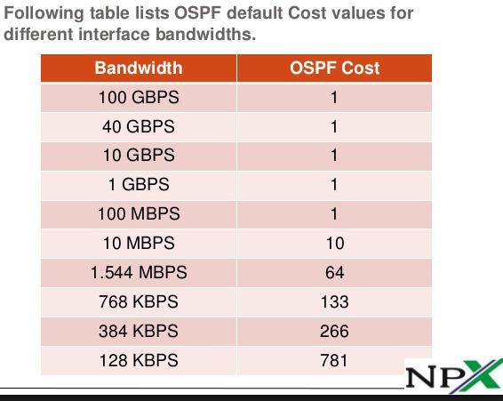
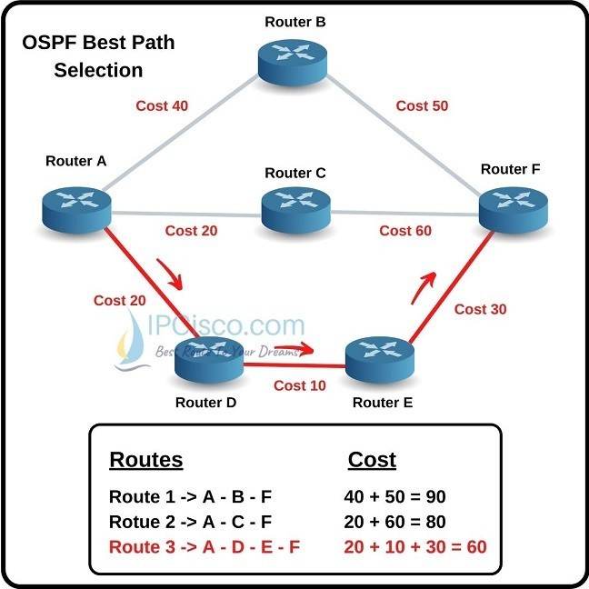

# OSPF 
This is my revision for OSPF <br>
I cover most important points or something that could pop up on exam <br>

## OSPF Boiler Plate Information
OSPF is Link State routing protocol <br>
OSPF is an Interior Gateway Protocol <br>
OSPF has two versions v2 and v3. (v3 is for ipv6) <br>
OSPF uses multicast ``224.0.0.5`` for all OSPF routers (explained below) <br>
OSPF uses multicast ``224.0.0.6`` to send updates to DR/BDR (explained below) <br>
OSPF supports VLSM and summarization and uses SPF (Dijkstra) algorithm to calculate the shortest path  

## OSPF More Interesting Information
### Areas && Topology Database && Route Selection
Each OSPF router has a full copy of all networks and link costs in the area in a Topology Database/Table <br>
This allows OSPF to calculate the best path to a network and take account of link speed <br>
The cost is calculated from link bandwidth <br>
 <br>
We can change the cost for a link manually <br>
Note: Table shows that anything above 100Mbp/s has cost of 1. This is because OSPF was from ancient times when it was classified as high speed. To prevent situations where interfaces with 100 Mbp/s and 10 Gbp/s are treated the same. We can change ``auto-cost reference-bandwidth`` <br>
SPF just calculates path that has the lowest cost. Image below nicely showcases it <br>
 <br>
Both images are referenced from https://ipcisco.com/lesson/ospf-cost-and-spf-algorithm/ <br>

Because storing all of that information in Topology Database is resource intensive we split network into multiple areas (Cisco recommends 50 devices in one area) <br>
Also each route update needs to be updated on all routers in area so there is feasible limit to scaling <br>

If I am mentioning areas it's also important to mention that all areas should be adjacent to area 0 <br>
You can configure something like Area 0 -> Area 1 -> Area 2. <br>
However area 2 will be unable to form adjacency (As Area 2 router will be expecting to be connected to Area 0 router) <br>
You can bypass this using virtual links which will make Area 2 router form direct adjacency with Area 0 router. (Sort of like a tunnel but not really) <br>
However this is poor design. 

Note: Creation of another area is not enough, summarization is required to minimize sending route updates from one area to second area
## Neighbour Forming
### Hello Messages
Router ID is determined as follows: 
- Manually Provided (router ospf XYZ -> router-id X.X.X.X)
- Highest IP address of Loopback Interface
- Highest IP address of ACTIVE physical interface

Note: If none are available OSPF will not start <br>

Hello Timers
- Every 10 seconds on Broadcast or Point-to-Point networks
- Every 30 seconds on NBMA networks
Hold Timers
- 4 x Hello time

Both can be changed manually. Must be matching on both sides <br>

Hello messages contain following information:
- Router ID (Must be unique for each router in all areas. It looks like ipv4 address but is not)
- Hello and Hold timers
- Network mask 
- Area ID 
- Neighbours
- Router priority (Explained somewhere below, used in DR and BDR election)
- DR and BDR IP address
- Authentication password

If any of these don't match <br>
Hello and Hold timers, Network Mask, Area ID, Authentication Password <br>
Adjacency will not form <br>

### Init State
When hello message is received routers check its contents (What exactly is above)
### 2-way state
After that hold timer is reset and attempt is being made to form neighbour-sheep
### Exstart State
- Routers determine which one of them is Master and Slave (Master is the one with higher priority and if it's the same for both routers, Higher Router-ID is master)
- Then master sends Database Descriptor to slave 
### Loading State
- DBD is received by slave
- Slave is sending DBD to Master
- Both check DBDs, If they have routes from DBD's if not they request LSR
- If a router receives LSR router responds with LSU 

| What                      | Description                                                                                                                                                                                                                                                                |
|---------------------------|----------------------------------------------------------------------------------------------------------------------------------------------------------------------------------------------------------------------------------------------------------------------------|
| Database Descriptor (DBD) | Basically summarized version of OSPF's Topology Database. We are not sending whole OSPF's Topology Database because what if it would be huge. Instead other router is making requests on bits that it doesn't know (Prevents pulling whole database in one massive chunk)  |
| Link State Request (LSR)  | Sort of explained it above, Router looks at DBD and checks what it doesn't know. If it requires more information it sends LSR                                                                                                                                              |
| Link State Update (LSU)   | Self explanatory just an update with route information                                                                                                                                                                                                                     |

### Full State
- After DBD's, LSR's, LSU's
- At this stage routers have the same topology database
- All routes and networks are exchanged
- At this point Dijkstra algorithm is used to calculate links costs and identifying best paths

## Neighbour Types
### TLDR (I actually read it)
Tldr; (I actually read it) <br>
DR and BDR are not required in point-to-point networks. (When connecting routers via ethernet, and it's /30 network aka point-to-point, configure ip ospf network point-to-point as otherwise DR and BDR election occurs which is pointless. This is because on ethernet it expects more nodes to be on the other side where for example on serial connections this will not happen as it's always point-to-point, in this particular case ospf will know that it is point to point and will not do DR and BDR election)

Tldr2; (I actually read it) <br>
Assuming you connect multiple routers in one network such as /24. If a router wants to communicate a route update. It does not need to communicate it to everyone. It communicates the route update to Designated Router via (244.0.0.6) and then Designated Router communicates with the rest of routers (244.0.0.5) about the route update <br> 
This effectively reduces network load/cpu load and gives a central point of route updates <br>
BDR is literary Backup Designated Router <br>
DROTHER is neither, it just sends route updates to DR and receives from it (which would be all the rest of routers) <br>

Router can be DR on one interface and DROTHER or BDR on other interface (this is because it's per multi-access network) <br>

### Election Process
DR is elected by:
- Highest OSPF interface priority (0-255), 0 means it will does not participate will not become DR
- Highest Router-ID

## Summarization
It was mentioned, but I will mention it again. Creation of another area is not enough, summarization is required to minimize sending route updates from one area to second area <br>
Summarization can only be done on ABR and ASBR <br>
To summarize you have to do <br>
```
router ospf X
 area X range ip mask
```

## Router Types
| Router Type | Description                                                                                                               |
|-------------|---------------------------------------------------------------------------------------------------------------------------|
| ABR         | Router that connects two different OSPF areas                                                                             |
| ASBR        | Router that is connected to OSPF and other routing protocol possibly redistributing routes from/to other routing protocol |
Again I found a helpfull image from https://ipcisco.com/lesson/ospf-area-border-router-abr-and-asbr/ <br>


### LSA's and Network Types
Those were poorly covered in my lecture additionally I would want to make a lab out of those <br>
Don't have time for that now hence TODO