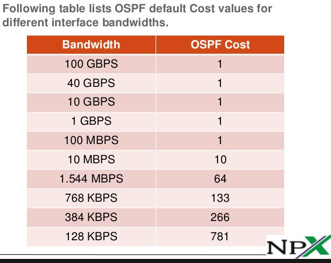
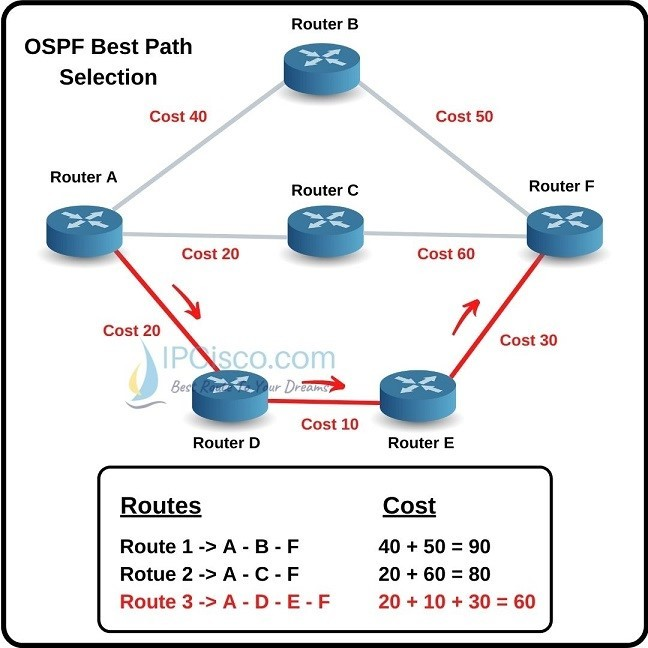
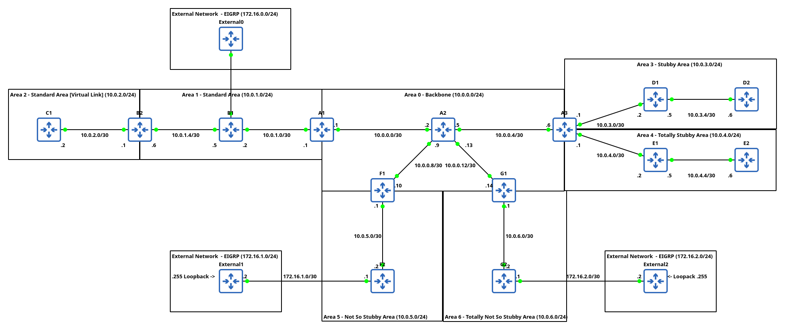

# OSPF
Basics of OSPF and its areas <br>
There is also a lab with all area types at the bottom

## OSPF Key Points
OSPF is a Link State routing protocol <br>
OSPF is an Interior Gateway Protocol <br>
OSPF has two versions v2 and v3 (v3 is for ipv6) <br>
OSPF uses multicast ``224.0.0.5`` for all OSPF routers (explained below) <br>
OSPF uses multicast ``224.0.0.6`` to send updates to DR/BDR (explained below) <br>
OSPF supports VLSM, summarization and uses SPF (Dijkstra) algorithm to calculate the shortest path  

## Route Selection
Each OSPF router has a full copy of all networks and link costs in the area in a Topology Database/Table <br>
This allows OSPF to calculate the best path to a network and take account of link speed <br>
The cost is calculated from link bandwidth <br>
 <br>
We can change the cost for a link manually <br>

Note: Table shows that anything above 100Mbps has cost of 1. This is because OSPF is an ancient protocol where speeds of 100Mbps were considered as cutting edge. To prevent situations where interfaces with 100 Mbps and 10 Gbps are treated the same. We can change ``auto-cost reference-bandwidth`` <br>

SPF just calculates path that has the lowest cost. Image below nicely showcases it <br>
 <br>
Both images are referenced from https://ipcisco.com/lesson/ospf-cost-and-spf-algorithm/ <br>

## OSPF Areas
In order to calculate the optimal path and take account of link speeds each OSPF router has an internal database of each router's networks and links in its internal database <br>
It's expected that for huge networks this is unsustainable as each router would need to store a lot of information and each route update would require to be broadcast onto all routers in the area, which in huge topologies would be slow and inefficient <br>
This is why OSPF networks should be split into multiple areas (Cisco recommends 50 devices in one area) <br>

## Router Types
| Router Type | Description                                                                                                                                                                           |
|-------------|---------------------------------------------------------------------------------------------------------------------------------------------------------------------------------------|
| ABR         | Router that connects two different OSPF areas                                                                                                                                         |
| ASBR        | Router that is connected to OSPF and other routing protocol possibly redistributing routes from/to other routing protocol (It's the boundary between OSPF and other routing protocol) |

### Summarization
Summarization is used to reduce number of advertised networks. As an example instead of advertising 64 networks of (10.0.0.0/30, 10.0.0.4/30 ... 10.0.0.252/30) <br>
Those networks can be summarized to one bigger network range of (10.0.0.0/24) which will decrease number of updates and strain on hardware while also reducing convergence times <br>

Summarization can only be performed on ABR and ASBR routers <br>
``area X range 10.0.0.0/24`` is used to summarize routes in OSPF itself <br>
``summary-address 10.0.0.0/24`` is used on routes redistributed from other routing protocols such as EIGRP <br>

Note: Summarization is only beneficial when combined with areas, since routes within the same area are already shared in full (in the topology database)

### LSAs
| LSA Type                  | Description                                                                                                                                                                                                                                                                                                           | Which Area                                                                          |
|---------------------------|-----------------------------------------------------------------------------------------------------------------------------------------------------------------------------------------------------------------------------------------------------------------------------------------------------------------------|-------------------------------------------------------------------------------------|
| LSA 1 - Router LSA        | Generated by every OSPF router, Describes the router's directly connected links (IP Networks and Subnet Masks) and costs (link bandwidth). Used by other routers to build the internal topology table                                                                                                                 | Stays within area of origin                                                         |
| LSA 2 - Network LSA       | Generated by the DR on multi-access networks (explained below). Similar to LSA type 1, with the difference that it contains all of the network information from other Routers in multi-access link                                                                                                                    | Stays within area of origin                                                         |
| LSA 3 - Summary LSA       | Generated by ABRs, LSA Type 3 "summarizes" Type 1 and Type 2 LSAs and shares the known networks in one area to other area. However each network is advertised as a each LSA Type 3 meaning that 20 networks, 20 advertisements. (Greatly benefits from summarization). This LSA type is also shared between all areas | All areas                                                                           |
| LSA 4 - ASBR Summary LSA  | Generated by ABRs, contains information on how to reach ASBR in another area (helps with reaching routes redistributed onto OSPF). Each area ABR will point itself as a hop to the redistributed route                                                                                                                | Generated at ABR, stays within area of ABR                                          |
| LSA 5 - External LSA      | Generated by ASBRs for routes redistributed from other protocols. Send to all areas and is unchanged through the OSPF domain                                                                                                                                                                                          | All areas                                                                           |
| LSA 7 - NSSA External LSA | Same purpose as LSA 5, However in an NSSA area LSA 5 are blocked and in order to advertise external network from NSSA network this LSA is used which is later converted to Type 5 at ABR when broadcasting to other areas                                                                                             | Stays as LSA 7 within area of origin, converted to LSA 5 when leaving the area NSSA |

Note: Really good video explaining it https://youtu.be/Wf755546JhA

### Area Types
| Area Type                                 | Description                                                                                                                                                                                                                                                                                                                                                                                           | Blocked LSAs                                         |
|-------------------------------------------|-------------------------------------------------------------------------------------------------------------------------------------------------------------------------------------------------------------------------------------------------------------------------------------------------------------------------------------------------------------------------------------------------------|------------------------------------------------------|
| BackBone Area (Area 0)                    | Technically a standard area, but has a specific purpose of being adjacent to all other areas. (Virtual link can be used to omit this requirement however it's considered poor design)                                                                                                                                                                                                                 | None                                                 |
| Standard Area                             | Default, Accepts all LSA types                                                                                                                                                                                                                                                                                                                                                                        | None                                                 |
| Stub Area                                 | Used when an Area is a dead-end (it only has one exit point). ABR will inject a default route onto this area (as there is no other path anyway). This area blocks LSA type 4,5 but doesn't block the most "heavy" LSA type 3                                                                                                                                                                          | 4,5                                                  |
| Totally Stubby Area                       | I thought that as stub area injects a default route, it would not need to exchange information about other areas as there is a default route (right it doesn't make sense) but it does, totally stubby area blocks this, making this area only exchange LSA Type 1,2 and if any route needs to go out of area there is a default route and the topology database is much smaller. (Cisco Proprietary) | 3,4,5                                                |
| Not so Stubby Area (NSSA)                 | Stub Area + allows to generate type 7 LSAs by ASBR that carry information about redistributed routes into OSPF (which then is being converted into LSA 5 when it leaves the NSSA area)                                                                                                                                                                                                                | 4,5 (Uses Type 7 to exchange redistributed routes)   |
| Totally not so Stubby Area (Totally NSSA) | Totally Stubby Area + allows to generate type 7 LSAs by ASBR that carry information about redistributed routes into OSPF (which then is being converted into LSA 5 when it leaves the Totally NSSA area) (Cisco Proprietary)                                                                                                                                                                          | 3,4,5 (Uses Type 7 to exchange redistributed routes) |

## Neighbor Forming
### Hello Messages
Router ID is determined as follows: 
- Manually Provided (with the ``router-id X.X.X.X`` command)
- Highest IP address of Loopback Interface
- Highest IP address of ACTIVE physical interface

Note: If none are available OSPF will not start <br>

Hello Timers
- Every 10 seconds on Broadcast or Point-to-Point networks
- Every 30 seconds on NBMA networks
Hold Timers
- 4 x Hello time

Both can be changed manually. Must be matching on both sides <br>

Hello messages contain following information:
- Router ID (Must be unique for each router in all areas. It looks like ipv4 address but is not)
- Hello and Hold timers
- Network mask 
- Area ID 
- Neighbors
- Router priority (Explained somewhere below, used in DR and BDR election)
- DR and BDR IP address
- Authentication password

If any of these don't match (Hello and Hold timers, Network Mask, Area ID, Authentication Password)
Adjacency will not form <br>

### Down State
Hello messages are sent but OSPF doesn't know if a neighbor is there <br>
Essentially ``Hello, I am there``

### Init State
Our Router has received a Hello message, however other router did not yet acknowledge the adjacency in the Hello message

### 2-way state
When other router responds that our router in fact is a neighbor to our router the process moves to Exstart <br>
The move to Exstart happens for DR, BDR, DROTHER TO DR/BDR routers and on NBMA networks <br>
For DROTHER routers communicating with other DROTHER routers in multi-access network the hello timer resets hold timer, and they permanently stay in 2-way state

### Exstart State
Routers determine which one of them is Master and Slave (Master is the one with higher priority and if it's the same for both routers, Higher Router-ID is master) <br>
After this step Exchange occurs

### Exchange
Both routers exchange DBDs. Master initiates, slave responds with its own DBD

### Loading State
Both check DBDs, if they have routes from DBD's if not they send LSR <br>
If a router receives LSR router responds with LSU <br>
And after LSU is completed LSAck is sent to confirm that the router has received the LSU

### Full State
After databases were exchanged both routers have the same topology database <br>
At this point Dijkstra algorithm is used to calculate link costs and identifying the best paths <br>
And routes appear

### Acronyms
| Acronym                            | Description                                                                                                                                                                                                                                                               |
|------------------------------------|---------------------------------------------------------------------------------------------------------------------------------------------------------------------------------------------------------------------------------------------------------------------------|
| Database Descriptor (DBD)          | Basically summarized version of OSPF's Topology Database. We are not sending whole OSPF's Topology Database because what if it would be huge. Instead other router is making requests on bits that it doesn't know (Prevents pulling whole database in one massive chunk) |
| Link State Request (LSR)           | Sort of explained it above, Router looks at DBD and checks what it doesn't know. If it requires more information it sends LSR                                                                                                                                             |
| Link State Update (LSU)            | Self explanatory just an update with route information                                                                                                                                                                                                                    |
| Link State Acknowledgement (LSAck) | Sent to confirm receipt of an LSU                                                                                                                                                                                                                                         |

## Neighbor Types
DR and BDR are not required in point-to-point networks <br>
This can be configured using ``ip ospf network point-to-point`` as otherwise DR and BDR election will occur which is not needed on point-to-point links <br>

Designated Router (DR) and Backup Designated Router (BDR) election occurs to reduce number of broadcasts on multi-access networks. (Multiple Routers connected to a switch on a for example /24 network) <br>
What actually happens is instead of each router sending route updates to each other, which would cause a lot of multicast updates. The routers send updates to DR with multicast address of (224.0.0.6). And DR router acts as a single aggregator for all other routers (DROTHER) and it's the DR that sends updates to other routers in a multi-access network using multicast address of 224.0.0.5 <br>
Effectively, DR coordinates route updates if multiple routers exist on the same network. Rather than each router shouting at each other route updates <br>
BDR - Is a Backup-DR, It doesn't do anything unless DR stops sending hello messages (Effectively the dead timer expires), then BDR becomes a DR <br>
DROTHER - Are other routers they are neither a DR nor a BDR, they actively send route updates to DR and listen for route updates from DR <br>

Note: Routers roles are per interface/multi-access link. Meaning on one link the router can be DR, and on another link it can be a DROTHER or BDR. And quite obviously router cannot have more than one role at a time (per link)

### Election Process
DR is elected by:
- Highest OSPF interface priority (0-255), 0 means it will not participate in becoming DR
- Highest Router-ID

BDR is elected the same way, it just has lower priorities. There is no need for tie-breaker as Router-IDs are unique, and it will always find a BDR <br>
Note: When router joins a network after election process, the roles are not updated even if it has higher priority or Router-ID

## Virtual Links
As OSPF expects all areas to be connected to Area 0, creating a network where areas are not adjacent to Area 0 will not work <br>
For example; Area 2 <-> Area 1 <-> Area 0 <br>
This can be circumvented using virtual links <br>
In this example Virtual Link needs to be created on ABR between Area 2 and Area 1 and also on an ABR inside Area 0 connecting to Area 1 <br>
This is really simple to do ``area 1 virtual-link X.X.X.X`` <br>
Where X.X.X.X is a Router-ID (it looks like IPv4, but it's not) <br>
And, even though we want to ``virtual link`` Area 2, we specify Area 1 which is the transit Area through which area 2 is going through <br>
However, virtual links are considered a poor design and should not be used.

## Authentication
By default, OSPF will form an adjacency with any router connected to the network, meaning a rogue router could inject malicious routes and poison the OSPF topology <br>
To prevent this, OSPF authentication can be configured per interface using two commands: <br>

``ip ospf authentication`` — plain text authentication (weak, not recommended) <br>
``ip ospf authentication message-digest`` — MD5 hashed authentication (recommended) <br>

The authentication key is set with ``ip ospf authentication-key`` and must match on both sides. If the keys do not match, adjacency will not form.

## Lab
 <br>

Configs are available in the ``configs/`` directory <br>
What's configured: 
- Virtual Link
- All area types
- Redistribution (in almost each area type)
- Summarization (both for redistributed routes and OSPF routes)

### Area 0 Routes
```
      10.0.0.0/8 is variably subnetted, 16 subnets, 3 masks
C        10.0.0.0/30 is directly connected, Ethernet0/0
L        10.0.0.2/32 is directly connected, Ethernet0/0
C        10.0.0.4/30 is directly connected, Ethernet0/1
L        10.0.0.5/32 is directly connected, Ethernet0/1
C        10.0.0.8/30 is directly connected, Ethernet0/2
L        10.0.0.9/32 is directly connected, Ethernet0/2
C        10.0.0.12/30 is directly connected, Ethernet0/3
L        10.0.0.13/32 is directly connected, Ethernet0/3
O IA     10.0.1.0/24 [110/20] via 10.0.0.1, 01:45:05, Ethernet0/0
O IA     10.0.1.0/30 [110/50] via 10.0.0.1, 01:44:56, Ethernet0/0
O IA     10.0.1.4/30 [110/40] via 10.0.0.1, 01:44:56, Ethernet0/0
O IA     10.0.2.0/24 [110/40] via 10.0.0.1, 01:44:56, Ethernet0/0
O IA     10.0.3.0/24 [110/20] via 10.0.0.6, 01:45:05, Ethernet0/1
O IA     10.0.4.0/24 [110/20] via 10.0.0.6, 01:45:05, Ethernet0/1
O IA     10.0.5.0/30 [110/20] via 10.0.0.10, 01:45:10, Ethernet0/2
O IA     10.0.6.0/30 [110/20] via 10.0.0.14, 01:45:10, Ethernet0/3
      172.16.0.0/24 is subnetted, 3 subnets
O E2     172.16.0.0 [110/20] via 10.0.0.1, 01:45:05, Ethernet0/0
O E2     172.16.1.0 [110/20] via 10.0.0.10, 01:45:09, Ethernet0/2
O E2     172.16.2.0 [110/20] via 10.0.0.14, 01:45:09, Ethernet0/3
```
### Area 1 Routes (Standard Area)
```
      10.0.0.0/8 is variably subnetted, 13 subnets, 3 masks
O IA     10.0.0.0/30 [110/20] via 10.0.1.1, 01:45:53, Ethernet0/0
O IA     10.0.0.4/30 [110/30] via 10.0.1.1, 01:45:48, Ethernet0/0
O IA     10.0.0.8/30 [110/30] via 10.0.1.1, 01:45:48, Ethernet0/0
O IA     10.0.0.12/30 [110/30] via 10.0.1.1, 01:45:48, Ethernet0/0
C        10.0.1.0/30 is directly connected, Ethernet0/0
L        10.0.1.2/32 is directly connected, Ethernet0/0
C        10.0.1.4/30 is directly connected, Ethernet0/1
L        10.0.1.5/32 is directly connected, Ethernet0/1
O IA     10.0.2.0/24 [110/20] via 10.0.1.6, 01:45:53, Ethernet0/1
O IA     10.0.3.0/24 [110/40] via 10.0.1.1, 01:45:48, Ethernet0/0
O IA     10.0.4.0/24 [110/40] via 10.0.1.1, 01:45:48, Ethernet0/0
O IA     10.0.5.0/30 [110/40] via 10.0.1.1, 01:45:48, Ethernet0/0
O IA     10.0.6.0/30 [110/40] via 10.0.1.1, 01:45:48, Ethernet0/0
      172.16.0.0/16 is variably subnetted, 6 subnets, 3 masks
O        172.16.0.0/24 is a summary, 01:46:26, Null0
C        172.16.0.0/30 is directly connected, Ethernet0/2
L        172.16.0.1/32 is directly connected, Ethernet0/2
D        172.16.0.255/32 [90/409600] via 172.16.0.2, 01:46:29, Ethernet0/2
O E2     172.16.1.0/24 [110/20] via 10.0.1.1, 01:45:47, Ethernet0/0
O E2     172.16.2.0/24 [110/20] via 10.0.1.1, 01:45:47, Ethernet0/0
```
### Area 2 Routes (Virtual Link)
```
      10.0.0.0/8 is variably subnetted, 13 subnets, 3 masks
O IA     10.0.0.0/30 [110/40] via 10.0.2.1, 01:46:37, Ethernet0/0
O IA     10.0.0.4/30 [110/50] via 10.0.2.1, 01:46:37, Ethernet0/0
O IA     10.0.0.8/30 [110/50] via 10.0.2.1, 01:46:37, Ethernet0/0
O IA     10.0.0.12/30 [110/50] via 10.0.2.1, 01:46:37, Ethernet0/0
O IA     10.0.1.0/24 [110/40] via 10.0.2.1, 01:46:37, Ethernet0/0
O IA     10.0.1.0/30 [110/30] via 10.0.2.1, 01:46:42, Ethernet0/0
O IA     10.0.1.4/30 [110/20] via 10.0.2.1, 01:46:42, Ethernet0/0
C        10.0.2.0/30 is directly connected, Ethernet0/0
L        10.0.2.2/32 is directly connected, Ethernet0/0
O IA     10.0.3.0/24 [110/60] via 10.0.2.1, 01:46:37, Ethernet0/0
O IA     10.0.4.0/24 [110/60] via 10.0.2.1, 01:46:37, Ethernet0/0
O IA     10.0.5.0/30 [110/60] via 10.0.2.1, 01:46:37, Ethernet0/0
O IA     10.0.6.0/30 [110/60] via 10.0.2.1, 01:46:37, Ethernet0/0
      172.16.0.0/24 is subnetted, 3 subnets
O E2     172.16.0.0 [110/20] via 10.0.2.1, 01:46:42, Ethernet0/0
O E2     172.16.1.0 [110/20] via 10.0.2.1, 01:46:37, Ethernet0/0
O E2     172.16.2.0 [110/20] via 10.0.2.1, 01:46:37, Ethernet0/0
```
### Area 3 Routes (Stubby Area)
```

O*IA  0.0.0.0/0 [110/21] via 10.0.3.5, 01:47:22, Ethernet0/0
      10.0.0.0/8 is variably subnetted, 14 subnets, 3 masks
O IA     10.0.0.0/30 [110/40] via 10.0.3.5, 01:47:22, Ethernet0/0
O IA     10.0.0.4/30 [110/30] via 10.0.3.5, 01:47:22, Ethernet0/0
O IA     10.0.0.8/30 [110/40] via 10.0.3.5, 01:47:22, Ethernet0/0
O IA     10.0.0.12/30 [110/40] via 10.0.3.5, 01:47:22, Ethernet0/0
O IA     10.0.1.0/24 [110/50] via 10.0.3.5, 01:47:20, Ethernet0/0
O IA     10.0.1.0/30 [110/80] via 10.0.3.5, 01:47:12, Ethernet0/0
O IA     10.0.1.4/30 [110/70] via 10.0.3.5, 01:47:12, Ethernet0/0
O IA     10.0.2.0/24 [110/70] via 10.0.3.5, 01:47:12, Ethernet0/0
O        10.0.3.0/30 [110/20] via 10.0.3.5, 01:47:22, Ethernet0/0
C        10.0.3.4/30 is directly connected, Ethernet0/0
L        10.0.3.6/32 is directly connected, Ethernet0/0
O IA     10.0.4.0/24 [110/30] via 10.0.3.5, 01:47:22, Ethernet0/0
O IA     10.0.5.0/30 [110/50] via 10.0.3.5, 01:47:22, Ethernet0/0
O IA     10.0.6.0/30 [110/50] via 10.0.3.5, 01:47:22, Ethernet0/0
```
### Area 4 Routes (Totally Stubby Area)
```
O*IA  0.0.0.0/0 [110/21] via 10.0.4.5, 01:47:39, Ethernet0/0
      10.0.0.0/8 is variably subnetted, 3 subnets, 2 masks
O        10.0.4.0/30 [110/20] via 10.0.4.5, 01:47:39, Ethernet0/0
C        10.0.4.4/30 is directly connected, Ethernet0/0
L        10.0.4.6/32 is directly connected, Ethernet0/0
```
### Area 5 Routes (NSSA)
```
O*N2  0.0.0.0/0 [110/1] via 10.0.5.1, 01:48:13, Ethernet0/0
      10.0.0.0/8 is variably subnetted, 13 subnets, 3 masks
O IA     10.0.0.0/30 [110/30] via 10.0.5.1, 01:48:13, Ethernet0/0
O IA     10.0.0.4/30 [110/30] via 10.0.5.1, 01:48:13, Ethernet0/0
O IA     10.0.0.8/30 [110/20] via 10.0.5.1, 01:48:13, Ethernet0/0
O IA     10.0.0.12/30 [110/30] via 10.0.5.1, 01:48:13, Ethernet0/0
O IA     10.0.1.0/24 [110/40] via 10.0.5.1, 01:48:07, Ethernet0/0
O IA     10.0.1.0/30 [110/70] via 10.0.5.1, 01:47:59, Ethernet0/0
O IA     10.0.1.4/30 [110/60] via 10.0.5.1, 01:47:59, Ethernet0/0
O IA     10.0.2.0/24 [110/60] via 10.0.5.1, 01:47:59, Ethernet0/0
O IA     10.0.3.0/24 [110/40] via 10.0.5.1, 01:48:04, Ethernet0/0
O IA     10.0.4.0/24 [110/40] via 10.0.5.1, 01:48:04, Ethernet0/0
C        10.0.5.0/30 is directly connected, Ethernet0/0
L        10.0.5.2/32 is directly connected, Ethernet0/0
O IA     10.0.6.0/30 [110/40] via 10.0.5.1, 01:48:09, Ethernet0/0
      172.16.0.0/16 is variably subnetted, 4 subnets, 3 masks
O        172.16.1.0/24 is a summary, 01:48:46, Null0
C        172.16.1.0/30 is directly connected, Ethernet0/1
L        172.16.1.1/32 is directly connected, Ethernet0/1
D        172.16.1.255/32 [90/409600] via 172.16.1.2, 01:48:49, Ethernet0/1
```
### Area 6 Routes (Totally NSSA)
```
O*IA  0.0.0.0/0 [110/11] via 10.0.6.1, 01:48:41, Ethernet0/0
      10.0.0.0/8 is variably subnetted, 2 subnets, 2 masks
C        10.0.6.0/30 is directly connected, Ethernet0/0
L        10.0.6.2/32 is directly connected, Ethernet0/0
      172.16.0.0/16 is variably subnetted, 4 subnets, 3 masks
O        172.16.2.0/24 is a summary, 01:49:14, Null0
C        172.16.2.0/30 is directly connected, Ethernet0/1
L        172.16.2.1/32 is directly connected, Ethernet0/1
D        172.16.2.255/32 [90/409600] via 172.16.2.2, 01:49:16, Ethernet0/1
```