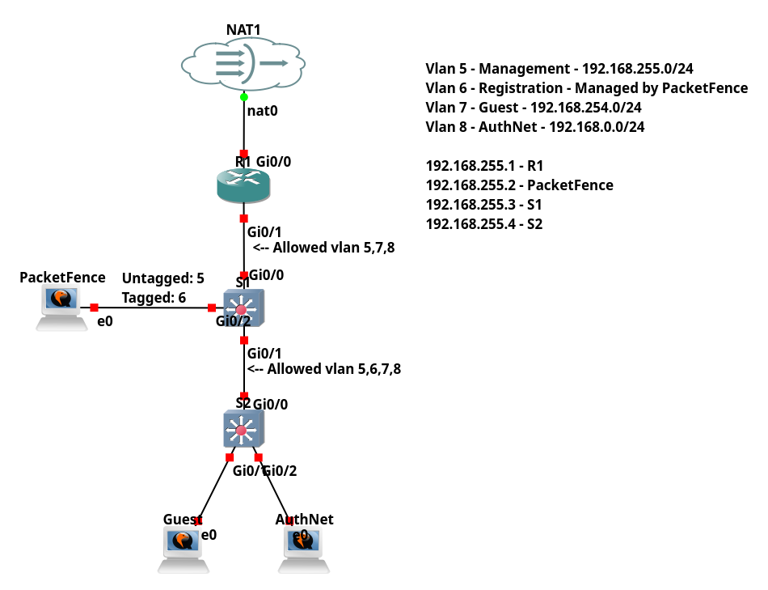
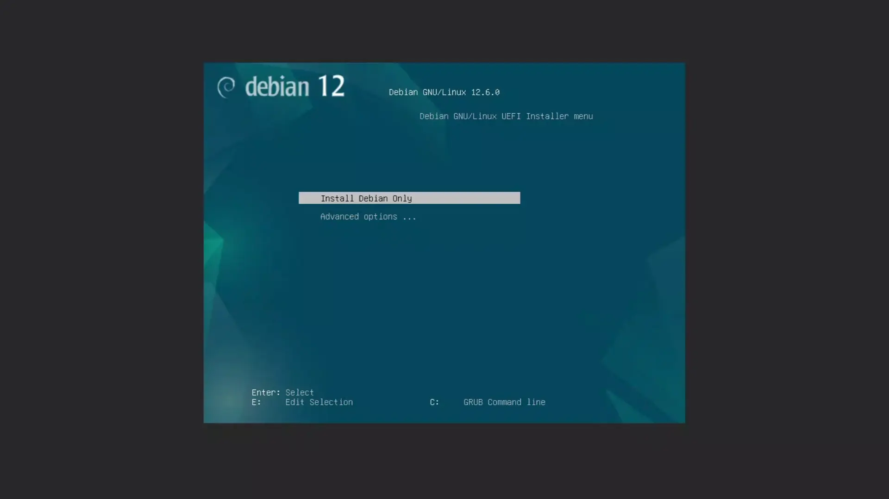

# PacketFenceL2
In this example I am going to do a simple Deployment of PacketFence <br>
I will configure Local Users on PacketFence and attempt to authenticate with dot1x and captive portal <br>
Additionally there will be a Guest Network 

## Lab Setup



## Initial Configuration of Network
For the initial configuration I configured simple router on a stick, there is also NAT and DHCP <br>
Additionally I configured access lists as follows:
- Guests cannot reach each other
- Guests cannot access management and AuthNet network
- AuthNet cannot access management and Guest network

I provide initial configuration in ``initialConfig`` folder <br>
 <br>
At this point only PacketFence is missing from the network 

## Installation of PacketFence
Installation of PacketFence is really simple. You just boot the iso and provide some configuration such as admin password, domain name <br>
Make sure that PacketFence has access to internet (otherwise it will fail, it looks like it pulls fresh docker images on install) and that you gave it enough of ram, it's recommended to run it with 16Gb's <br>


## Configuration of PacketFence
When you finish the installation, You can access PacketFence via web portal on https://(yourip):1443 <br>
You will be prompted for initial configuration <br>
I highly suggest to configure the management interface on native vlan, If you do not it seems that network service fails as it expects eth0 to be up <br>
 <br>
Now, after initial configuration you need to configure as follows: <br>
- Enable Local Authentication on Radius
- Change Database hashing method to ntlm
- Create Role (In my cause AuthNet, you can name whatever you want)
- Configure switches 
    - Configure switch IP address and vendor
    - Configure switch De-Authentication method
    - Assign correct vlans to roles
    - Configure Radius 
- Configure default connection profile
- Create additional connection profile for DOT1X auth  
After all of it reboot PacketFence <br>
Then create a user in my case I created user "Zbysiek" with Password1, make sure to assign correct role <br>


## Finishing Configuration on Switches
I followed this documentation https://www.packetfence.org/doc/PacketFence_Network_Devices_Configuration_Guide.html#_cisco <br>
Configure switches to use PacketFence <br>
```
dot1x system-auth-control
aaa new-model
aaa group server radius packetfence
 server name pfnac
aaa authentication dot1x default group packetfence
aaa authorization network default group packetfence
aaa accounting dot1x default start-stop group packetfence

radius server pfnac
  address ipv4 192.168.255.2 auth-port 1812 acct-port 1813
  key 0 Password1
 
radius-server vsa send authentication

aaa server radius dynamic-author
 client 192.168.255.2 server-key Password1
 port 3799
```

Additionally, you have to configure interfaces <br>
Also I use GNS3 and it seems that my cisco image is not fully working as expected. <br>
authentication order priority should fallback to mab once timeout is reached, but it does not work. <br>
The workaround is to use ``authentication open``, But in real network this should work. <br>
```
 description DynamicAuthPort
 switchport mode access
 negotiation auto
 authentication order dot1x mab
 authentication priority dot1x mab
 authentication port-control auto
 authentication periodic
 authentication timer reauthenticate 10800
 authentication timer restart 10800
 mab
 no snmp trap link-status
 dot1x pae authenticator
 dot1x timeout quiet-period 2
 dot1x timeout tx-period 3
```
At this point everything is configured. 

## Testing
### Guest


### AuthNet via Captive Portal


### AuthNet via DOT1X
Before testing configure DOT1X on Windows client <br>
 <br>
And now, when we connect captive portal does not show up, and we are assigned to the correct vlan <br>
