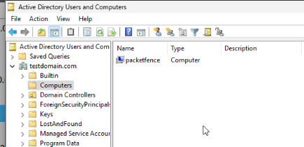

# PacketFenceL3
In this example I am going to do a more advanced deployment of PacketFence <br>
The overall plan is to have a captive portal for guests, and authenticate staff via DOT1X <br>
Additionally there are two buildings and PacketFence needs to handle routed networks

## Topology
 <br>
Note: Vlans in BuildingA and BuildingB do not need to match

## Initial Configuration
I started by planning IP schemes and vlans. <br>
Then I configured a basic network the main key points are:
- NAT
    - Nothing crazy it's there. 
- DHCP
    - Registration VLANs are handled by PacketFence
    - Guests, do not have access to local networks (only WAN) hence DNS points to 8.8.8.8
    - Staff Networks point with DNS to WindowsServer
- Access Lists
    - Registration have most limited connectivity, access to only packet fence captive portal and dhcp
    - Guests, cannot access local networks only WAN
    - Staff Networks, can access Windows server, and access each other (e.g Engineering to Engineering)
    - Above networks are separated and cannot reach other

At this point network looked like that and was ready to add PacketFence and Windows Server, additionally initial configuration is available in a folder.


## Configuration of Windows Server
1. Configure Network Interface and Computer Name <br>

2. Install ADDS and DNS <br>

3. Add forwarder to DNS <br>

4. Configure GPO <br>
I used Windows Server 2025, apparently something changed with this version as per https://forum.netgate.com/topic/187453/ldap-authentication-with-active-directory-windows-server-2025-bind-fails/5 <br>
If you don't do that PacketFence just won't connect to domain. <br>

5. Create OU Structure and Users <br>
 <br>


At this point Windows Server is configured

## Configuration of PacketFence
1. Installation <br>
Additional Listener "Radius" was later removed by me because it was redundant. Interface with type management already listens for radius <br>

2. Create Roles <br>

3. Create Active Directory Domain <br>
 <br>
If you do it successfully, packetfence should pop up as a computer <br>

4. Create Internal Authentication source <br>
<mark>This is important config, take a look at it thoroughly</mark>

5. Adjust Realms <br>
Note: For DOT1X login I don't provide domain, if you want to do that you might need to configure stripping. <br>

6. Configure Connection Profiles <br>
Note: Default connection profile has only null as a source so the captive portal is only for guests <br>

7. Add switches <br>
Note: Config for all my switches is the same only ip addresses are different

8. Finally add routed networks <br>


Note: If you get errors like ``Module-Failure-Message = "chrooted_mschap: Program returned code (1) and output ''"`` <br>
Check on switch if ``test aaa group packetfence user password legacy`` will result in <br>
``Module-Failure-Message = "rest: {"control:PacketFence-Authorization-Status":"allow","Reply-Message":"User has no role defined in PacketFence to allow switch login (SWITCH_LOGIN_READ or SWITCH_LOGIN_WRITE or SWITCH_PROBE)"}",`` <br>
If so PacketFence is connected to domain correctly and reads users. Check connection profile, realms or change database hashing method to ntlm.

At this point PacketFence is ready

## Final Configuration of Switches
1. Make sure switch can communicate with packetfence
2. Configure AAA and add radius
    ```
    dot1x system-auth-control
    aaa new-model
    aaa group server radius packetfence
     server name pfnac
    aaa authentication dot1x default group packetfence
    aaa authorization network default group packetfence
    aaa accounting dot1x default start-stop group packetfence
    
    radius server pfnac
      address ipv4 192.168.0.2 auth-port 1812 acct-port 1813
      key 0 Password1
     
    radius-server vsa send authentication
    
    aaa server radius dynamic-author
     client 192.168.0.2 server-key Password1
     port 3799
    ```
3. Configure each interface with
    ```
    description DynamicAuthPort
    switchport mode access
    negotiation auto
    authentication open
    authentication order dot1x mab
    authentication priority dot1x mab
    authentication port-control auto
    authentication periodic
    authentication timer reauthenticate 10800
    authentication timer restart 10800
    mab
    no snmp trap link-status
    dot1x pae authenticator
    dot1x timeout quiet-period 2
    dot1x timeout tx-period 3
    ```
4. Repeat on every switch


Note: Cisco's virtual image of switch is bugged. What should happen is dot1x timeouts and it fallbacks on mab. However this doesn't happen. Work around is to use "authentication open". This shouldn't happen on real switch.

## Configure Client PC for Dot1x
1. Enable, and mark for automatic start "Wired AutoConfig" service. <br>
    
2. Configure the Authentication Tab <br>
     <br>
     <br>
     <br>
     <br>
    Make sure to provide user credentials <br>
    If you want to provide User@domain you need to configure stripping on packetfence in the realms tab <br>

## Testing
### Guest
 <br>
### DOT1X
 <br>