# PacketFenceNACRoutedNetworks
Previously I configured a simple network using packetfence. However, in previous network it was required that packetfence is on the registration vlan. <br>
This is not optimal as you could have multiple sites, and it would be infeasible to have L2 connection between sites. Hence, I will configure packetfence to work on routed networks. <br>
This network is going to be pretty much mirror of my previous network however with addition of routed networks. 

## Topology 
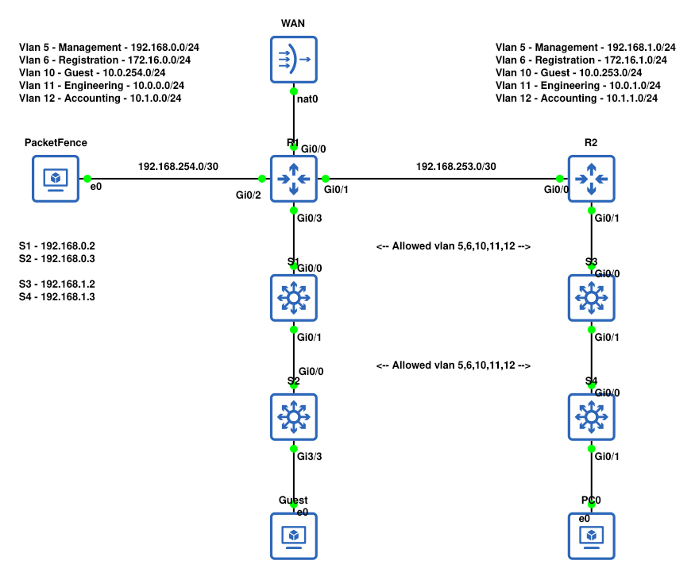

## Network Configuration
1. I configured Basic Networking (Vlans, Trunks, OSPF, Nat)
2. I configured DHCP, R1 and R2 handles DHCP for Guest, Engineering and Accounting. <br>
   But for Registration in both cases there is ip helper used to forward dhcp requests to packetfence.
   E.g 
   ```
   ip dhcp pool Guest
   network 10.0.254.0 255.255.255.0
   dns-server 8.8.8.8
   default-router 10.0.254.1
   domain-name testdomain.mytestnetwork
   ```
   And Config for ip helper
   ```
   interface GigabitEthernet0/3.6
   description Registration
   encapsulation dot1Q 6
   ip address 172.16.0.1 255.255.255.0
   ip access-group Registration in
   ip helper-address 192.168.254.2
   ip nat inside
   ip virtual-reassembly in
   ```
3. I configured switches to work with packetfence <br>
   ```
   dot1x system-auth-control
   aaa new-model
   aaa group server radius packetfence
    server name pfnac
   aaa authentication dot1x default group packetfence
   aaa authorization network default group packetfence
   aaa accounting dot1x default start-stop group packetfence
    
   radius server pfnac
     address ipv4 192.168.254.2 auth-port 1812 acct-port 1813
     key 0 Password1
     
   radius-server vsa send authentication
    
   aaa server radius dynamic-author
    client 192.168.254.2 server-key Password1
    port 3799
   ```
4. I configured Ports on each switch. 
   ```
    description DynamicAuthPort
    switchport mode access
    negotiation auto
    authentication open
    authentication order dot1x mab
    authentication priority dot1x mab
    authentication port-control auto
    authentication periodic
    authentication timer reauthenticate 10800
    authentication timer restart 10800
    mab
    no snmp trap link-status
    dot1x pae authenticator
    dot1x timeout quiet-period 2
    dot1x timeout tx-period 3
   ```
5. I configured ACL's accordingly <br>
    - Registration can only access packetfence, and forward dhcp requests (to packetfence)
    - Guests can only access internet
    - Engineering can access internet and ping other Engineering network
    - Accounting can access internet and ping other Accounting network
    - PacketFence administrative portal is only accessible via management networks
    
    Example for Engineering <br>
    ```
    ip access-list extended Engineering
    permit ip any 10.0.1.0 0.0.0.255
    permit ip any 10.0.0.0 0.0.0.255
    deny   ip any 10.0.0.0 0.255.255.255
    deny   ip any 172.16.0.0 0.15.255.255
    deny   ip any 192.168.0.0 0.0.255.255
    permit ip any any
    ```
   
At this point only PacketFence configuration is left.

## Installation of PacketFence
The installation was pretty much the same compared to previous network the difference being network interface config. <br>
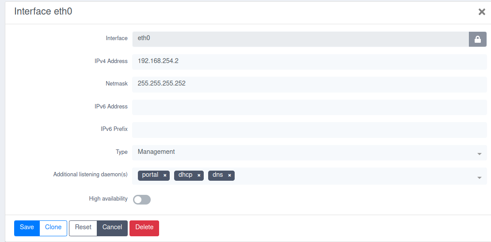

## Configuration of PacketFence
In this network I am not going to re-setup Windows Server rather than I am going to use inbuilt User system. 
1. Change Database Hashing type under "System Configuration > Main Configuration > Advanced" <br>
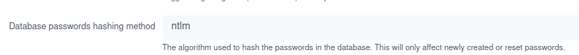
2. Allow Radius to authenticate against local database under "System Configuration > Radius Configuration > General" <br>
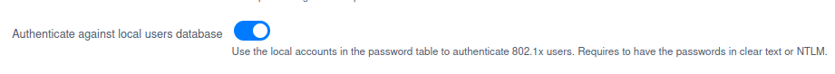
3. Create required roles under "Policies and Access Control > Roles" <br> 
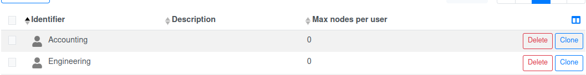
4. Create required users under "Users" tab <br>
   In my case I created one user for Engineering and Accounting. <br>
   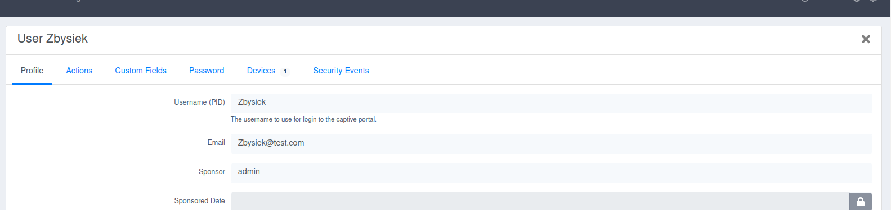 <br>
   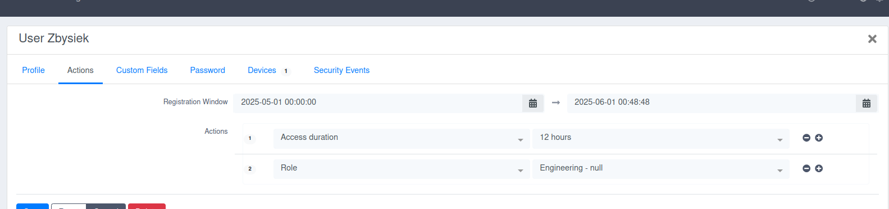
5. Create switch template under "Policies and Access Control > Network Devices > Switch Groups" <br>
    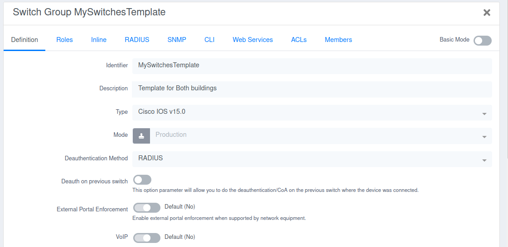 <br>
    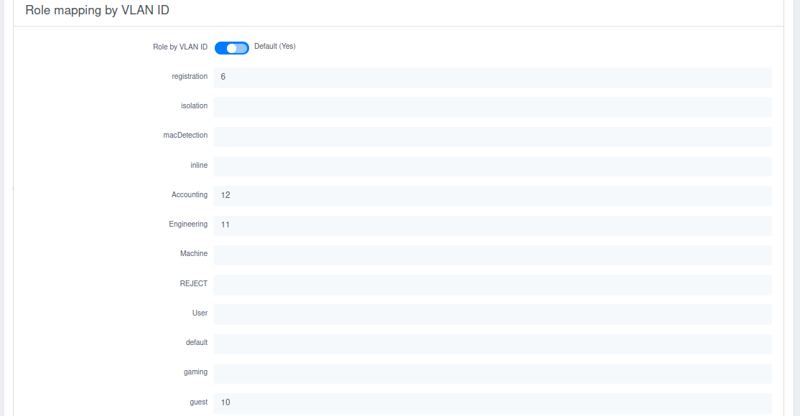 <br>
    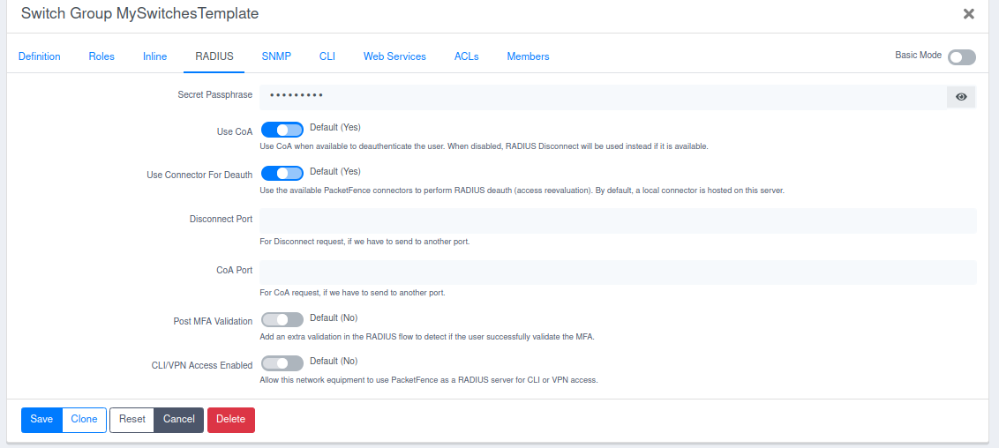
6. Add Switches from switch template under "Policies and Access Control > Network Devices > Switches" <br>
   In my case I used whole management subnets. <br>
   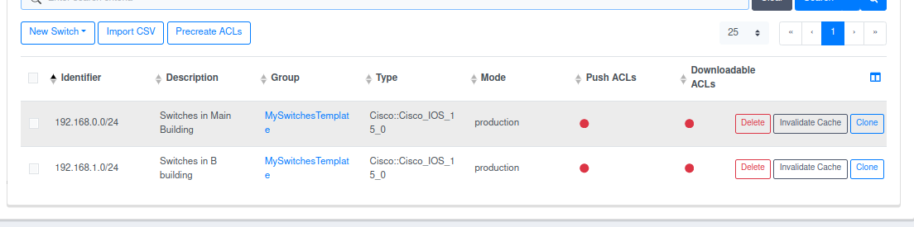
7. Configure routed networks under "Network Configuration > Networks > Interfaces" <br>
   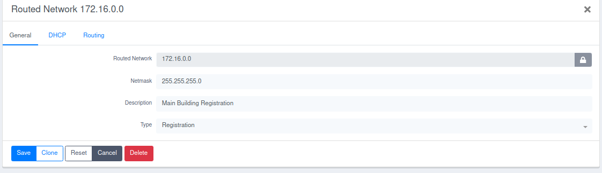 <br>
   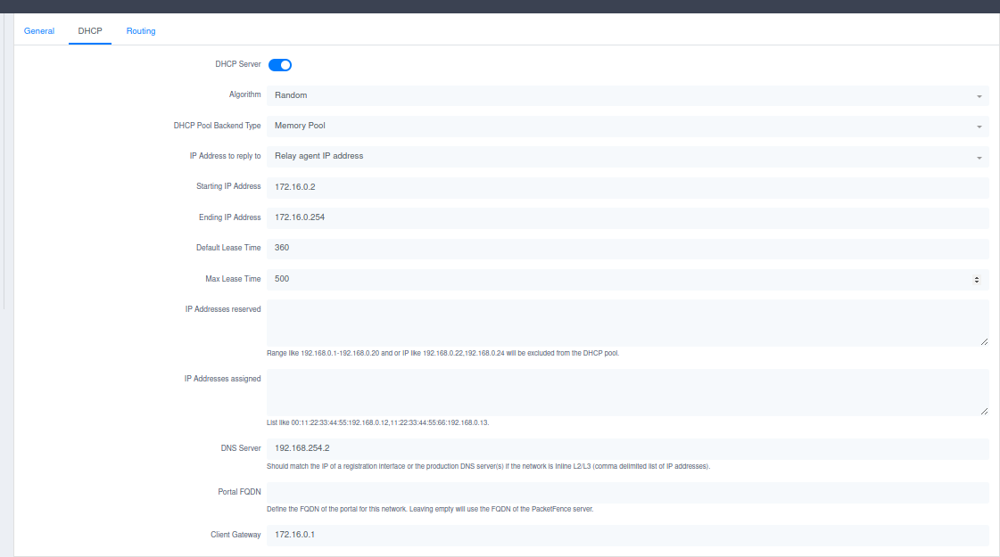 <br>
   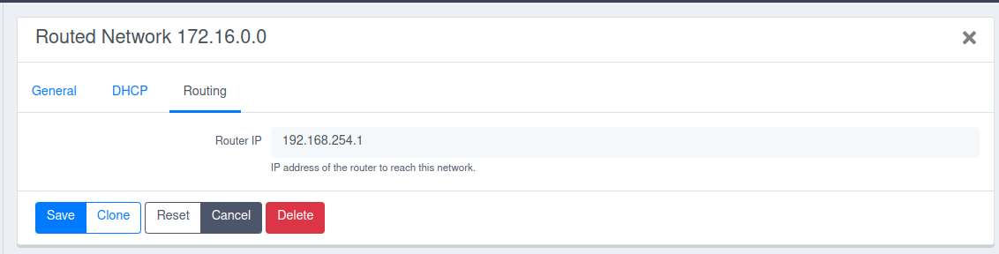 <br>
   I also did it for other Registration network. The end result should be looking like that <br>
   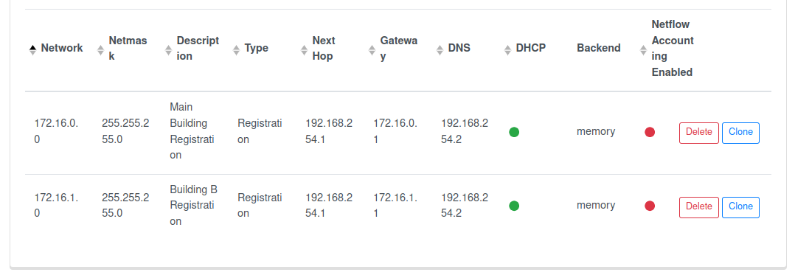
8. Configure Default Connection Profile under "Policies and Access Control > Connection Profiles" <br>
   Change the source to null <br>
   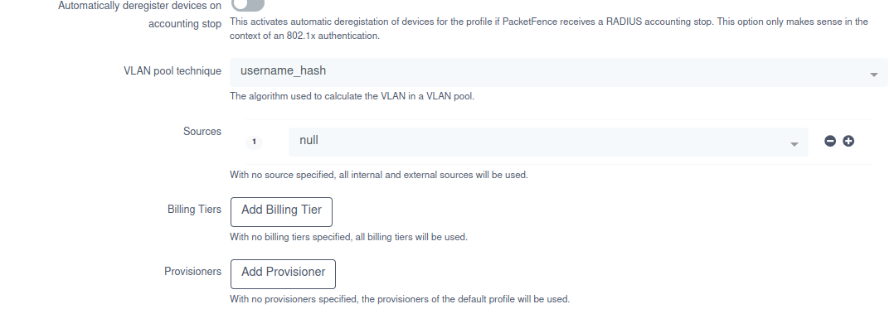 
9. Create new Connection profile for 802.1x <br>
   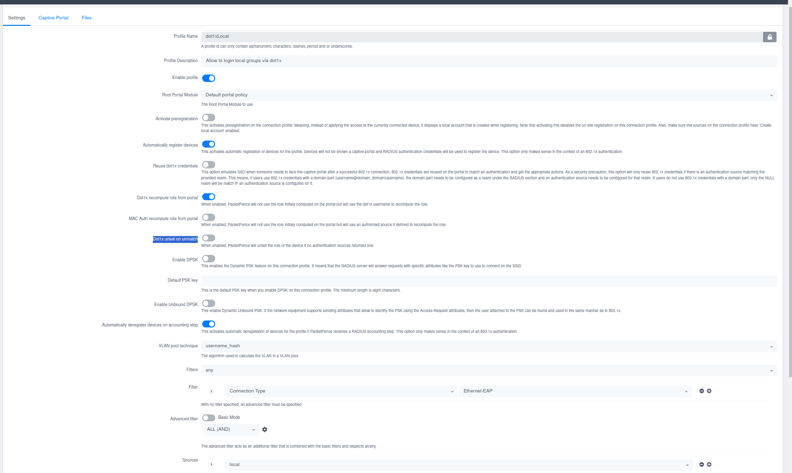 

## Windows Client Configuration for 802.1X
1. In Services mark "Wired Autoconfig" to automatic start and start the service <br>
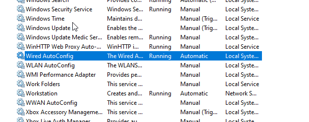
2. Configure Network Interface. <br>
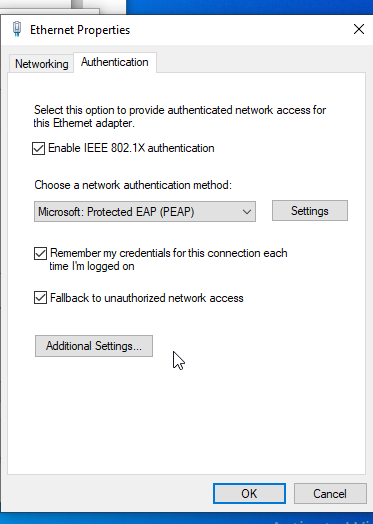 <br>
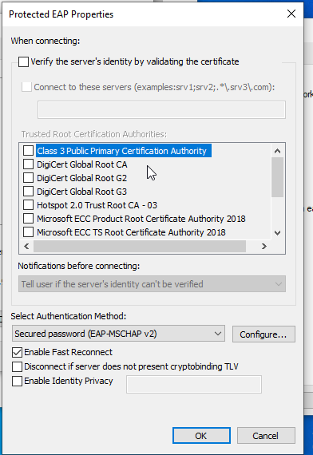 <br>
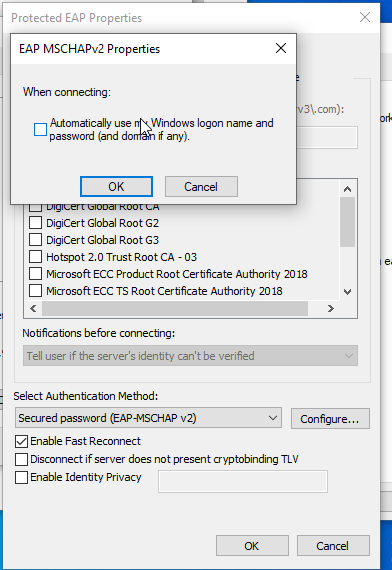 <br>
Here, you specify credentials, in my case i already specified them so my option is to "Replace Credentials". 
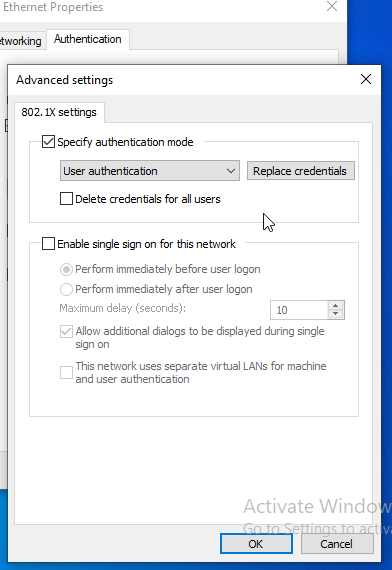 <br> 

## Testing
### Guest
Upon Connecting Guest I am greeted with Captive Portal. In Background it got moved to vlan 6 (Registration). Upon Confiriming in captive portal it moves me to vlan 10 (Guest) and I can access internet. <br>
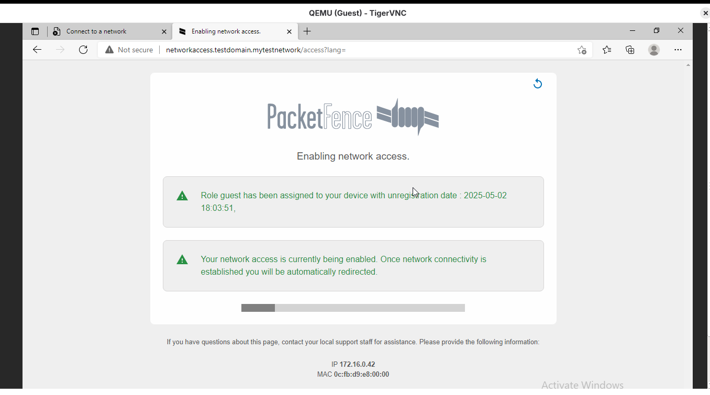 <br>
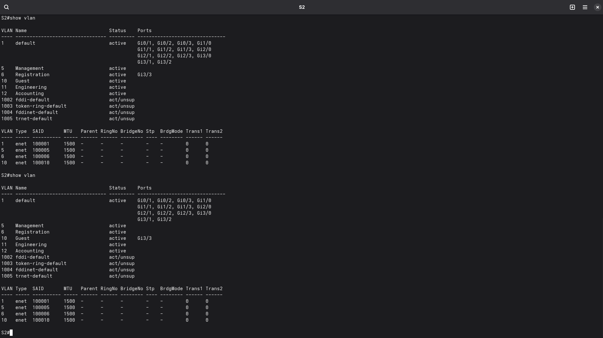
### PC0 (802.1x)
Upon Connecting to switch dot1x is successful and it puts me into correct vlan. <br>
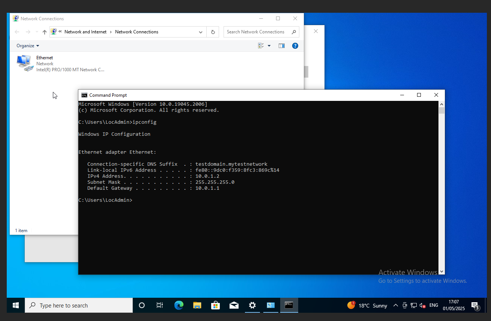 <br>
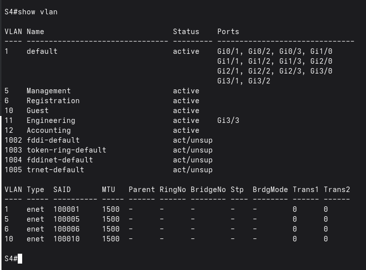
### Auth Logs
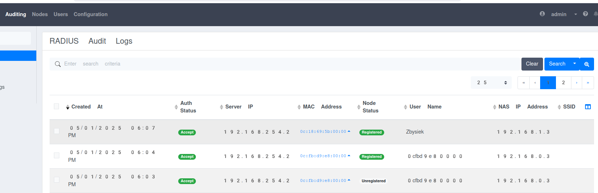 <br>
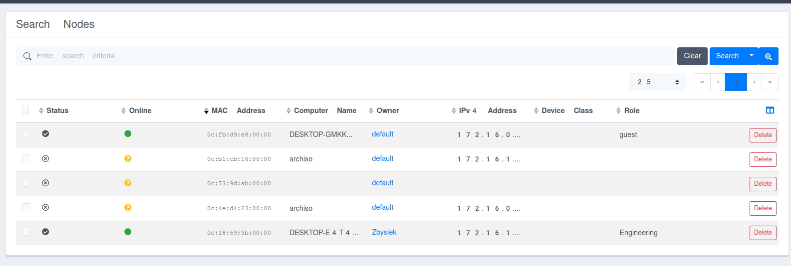