# PacketFenceNAC
While doing some research i stumbled upon packetfence. It picked up my interest. <br>
In this network I want to configure 
- Captive Portal for Guests, that is a separate vlan ✅
- Allow to login via ADDS with dot1x ✅
  - Separate groups should have different vlans ✅

## Notes
I think there is issue with cisco image I use for gns3, according to any documentation I read configuring authentication priority with time should mean if dot1x fails then mab starts however it didn't work for me. As a work around that shouldn't be used I used "authentication open" in port configurations.

## Topology
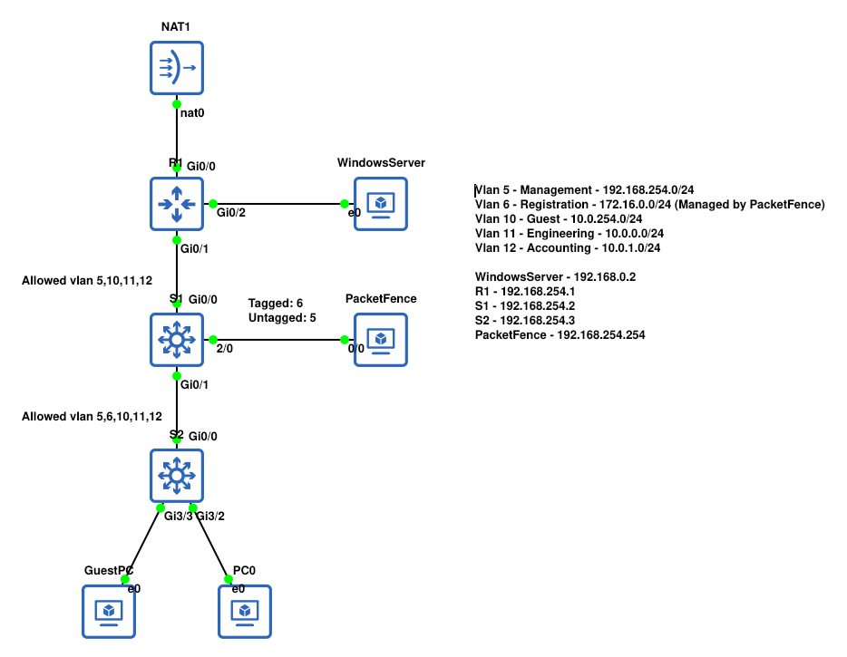

## Network Configuration
I started by configuring vlans, trunks, networking. <br>

Then I started to configure DHCP and ACL's. The tldr would be that Guests shouldn't have access to domain controller. (There is no reason to), and Staff (Enginerring, Accounting) should be able to.

<br> Hence some of the configuration below. The importantant thing there is that Guest pretty much can only access internet. Where Staff can access WindowsServer, have different DNS and access internet.

```ip dhcp pool Guest
 network 10.0.254.0 255.255.255.0
 dns-server 8.8.8.8
 default-router 10.0.254.1
 domain-name testdomain.mytestdomain
```

```
ip access-list extended Guest
 deny   ip any 10.0.0.0 0.0.1.255
 deny   ip any 192.168.254.0 0.0.0.255
 deny   ip any 192.168.0.0 0.0.0.3
 permit ip any host 10.0.254.1
 deny   ip any host 10.0.254.0
 permit ip any any
```

```
ip access-list extended Engineering
 deny   ip any 10.0.254.0 0.0.0.255
 deny   ip any 10.0.1.0 0.0.0.255
 deny   ip any 192.168.254.0 0.0.0.255
 permit ip any any
```

```
ip dhcp pool Engineering
 network 10.0.0.0 255.255.255.0
 domain-name testdomain.mytestdomain
 dns-server 192.168.0.2
 default-router 10.0.0.1
```
<br> (There is some more acl's I did please see R1 config if interested)
<br> At this point the network is working NAT, networking dhcp etc.. There is just no access control you would need to manually change vlans for users etc.
<br> To actually integrate with packetfence I followed their documentation which is available at https://www.packetfence.org/doc/PacketFence_Network_Devices_Configuration_Guide.html

```
dot1x system-auth-control
aaa new-model
aaa group server radius packetfence
 server name pfnac
aaa authentication dot1x default group packetfence
aaa authorization network default group packetfence

radius server pfnac
  address ipv4 192.168.254.254 auth-port 1812 acct-port 1813
  key 0 Password1
 
radius-server vsa send authentication

aaa server radius dynamic-author
 client 192.168.254.254 server-key Password1
 port 3799
```

<br> Per Port Configuration. 

```
 description DynamicAuthPort
 switchport mode access
 negotiation auto
 authentication open
 authentication order dot1x mab
 authentication priority dot1x mab
 authentication port-control auto
 authentication periodic
 authentication timer reauthenticate 10800
 authentication timer restart 10800
 mab
 no snmp trap link-status
 dot1x pae authenticator
 dot1x timeout quiet-period 2
 dot1x timeout tx-period 3
```

<br> With this configuration is pretty much complete anything else is left on packetfence side.

## Configuring Windows Server
I created domain and installed DNS. Then I created a new OU. <br>
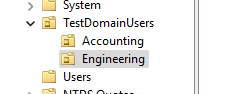 <br>
Additionally I created groups for both OU's <br>
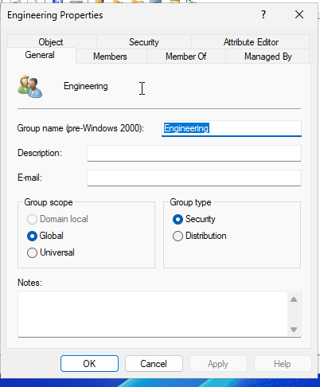 <br>

At this point packetfence configuration can begin. However, I tried it before and it didn't work. According to https://forum.netgate.com/topic/187453/ldap-authentication-with-active-directory-windows-server-2025-bind-fails/5. Something changed to LDAP in Windows Server 2025. <br>
Hence i applied those GPO's. <br>
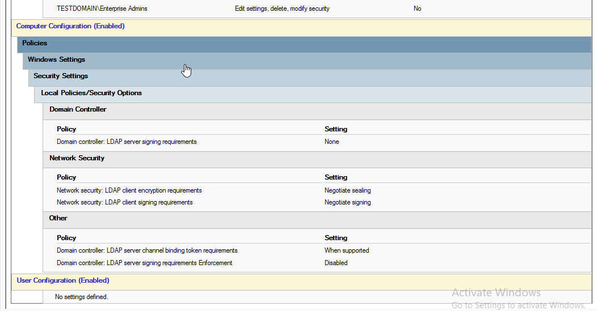

## Installation of PacketFence
I installed packetfence via iso. The initial configurator is very easy. After it boots we can access webpage of https://ip_of_packetfence:1443.
1. On first stage of installer we specify interfaces. In my case one was management and other was for device registration. Additionally, I pointed dns to my domain controller
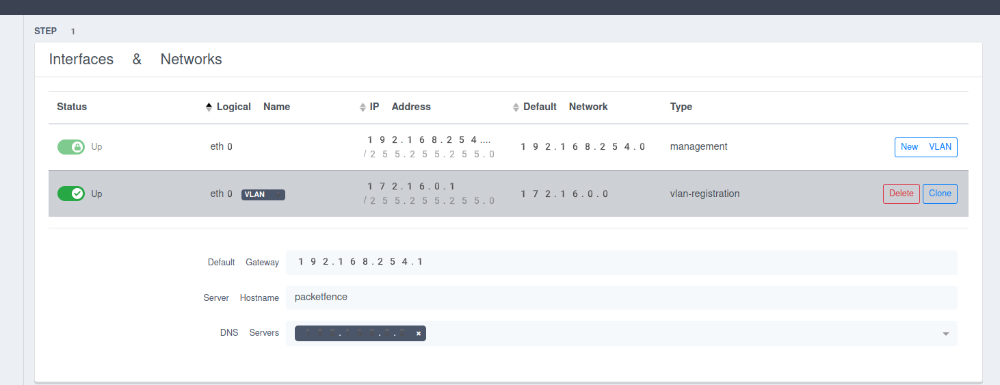 <br>
2. In the second step I configured domain name of packetfence, hostname, timezone and administrator password.
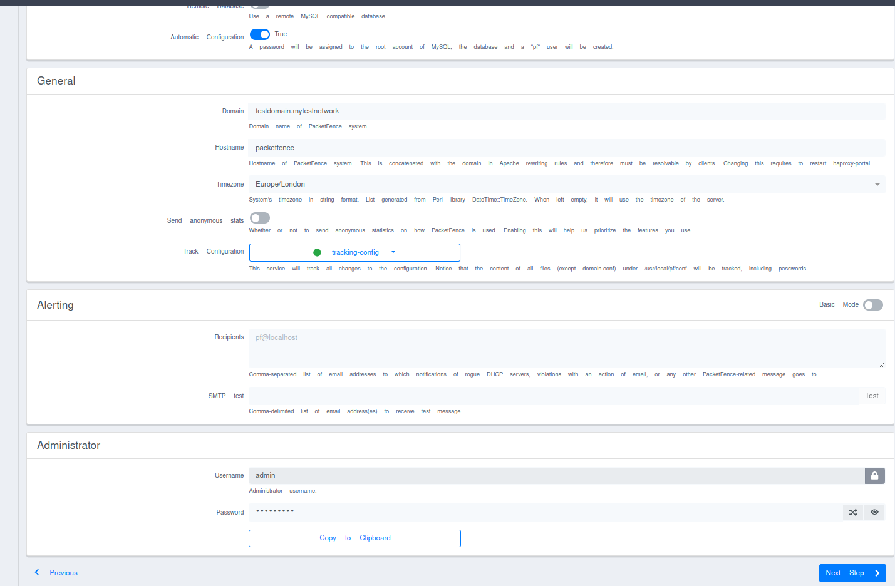
3. Click next and wait till it pops login page. On my PC it took 6 minutes.

### Configuration of PacketFence
For this part I followed packetfence documentation. https://www.packetfence.org/doc/PacketFence_Installation_Guide.html#_getting_started

1. Under "Policies and Access Control -> Roles" Create two roles <br>
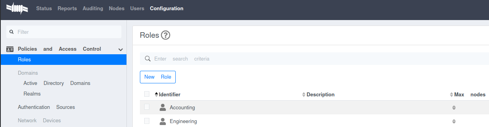
2. Under "Policies and Access Control -> Domains -> Active Directory Domains", create new domain. Fill in the required parts and create. <br>
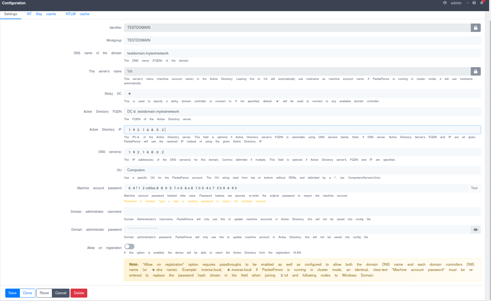 <br>
After successful creation the packetfence should pop up. <br>
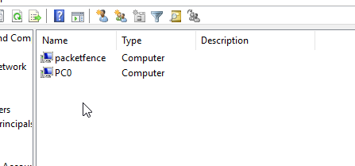
3. Under "Policies and Access Control -> Authentication Sources". Create new Internal Source of Active Directory. Fill in the required information. <br>
As an additional information Base DN is a Distininguised name of where packetfence will look for users in my case it was "OU=TestDomainUsers,DC=testdomain,DC=mytestnetwork". <br>
Bind DN is your domain administrator which will be peforming ldap authentication it must be domain admin in my case it was "CN=PaceketFenceAdmin,CN=Users,DC=testdomain,DC=mytestnetwork". <br>
You can test it if it's working by clicking button test. <br>
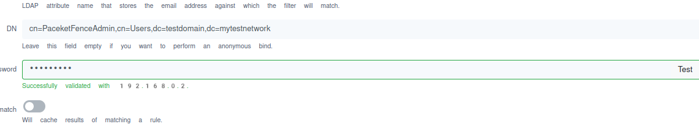 <br>
In my case I wanted to configure it in a way where if user is in group Engineering packetfence would assign the Engineering vlan to do this. We have to configure the "Authentication Rules" in this way <br>
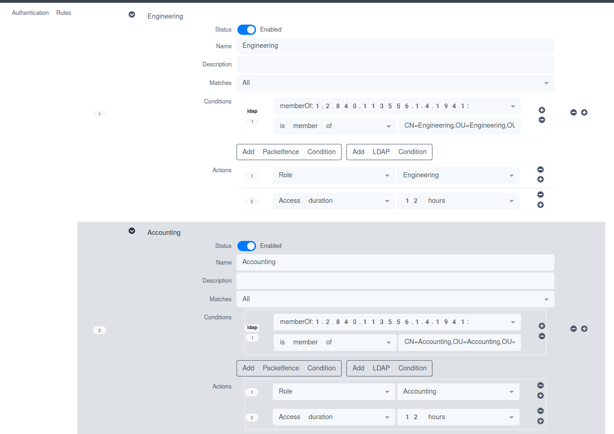 <br>
Whole configuration should look like that <br>
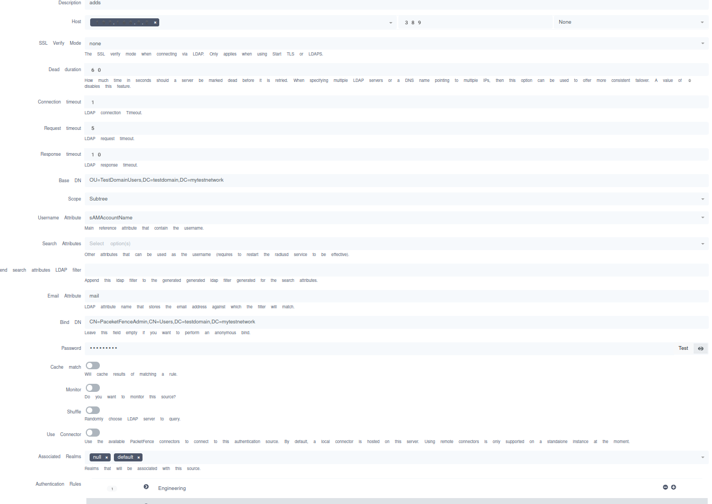
4. Under "Policies and Access Control -> Domains -> Realms", configure "DEFAULT" and "NULL" realm. 
 <br>
additionally configure stripping <br>
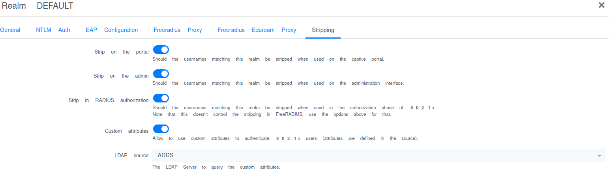 <br>
Remember to do that for BOTH of them.
5. Under "Policies and Access Control -> Connection Profiles" configure default profile to use "null" source. This will enable only Guest access on captive portal. <br>
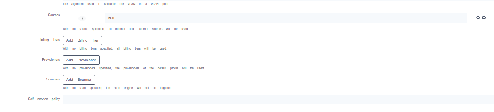
6. Create additional Connection profile that will allow only dot1x auth to use ADDS. <br>
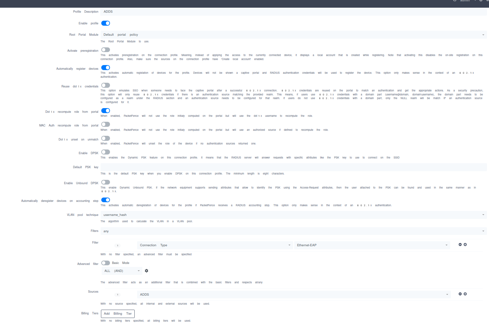 <br>
I additionally configured "Automatically deregister device on accounting stop" which will deregister device when user disconnects. Not allowing to authenticate the device via mab. (Better security). However, this is not perfect. <br>
7. Under "Policies and Access Control -> Switch Groups", I created a new group for my switches. <br>
Under definition tab I selected the device type of "Cisco IOS v15.0" <br>
 <br>
Under Roles tab i only filled in "VLAN ID" tab. It maps what vlans to assign to what roles. <br>
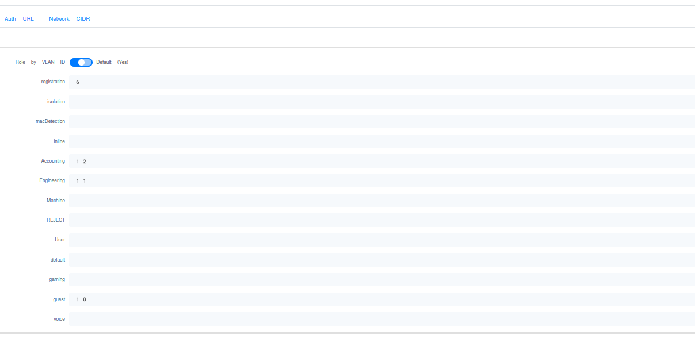 <br>
Additionally under RADIUS tab. I filled in only the password nothing else is required including SNMP. <br>
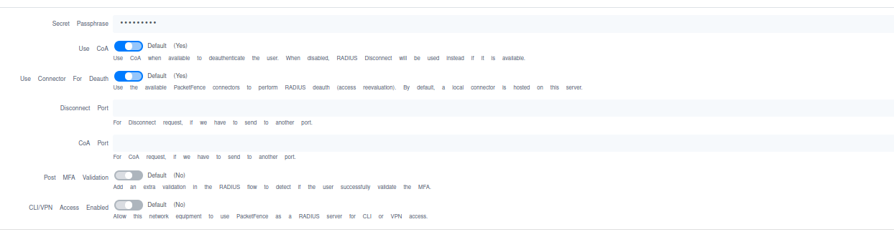 <br>
8. Under "Policies and Access Control -> Switches", create new switch. You can put whole subnet as a switch it will allow all switches from this subnet to connect, also select it to use template of the one that was previously created. 
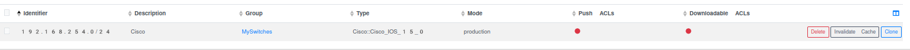 <br>

<br> At this point packet fence should be configured. 

### Configuring Staff PC
For purpose of this lab I won't do it via GPO. I will configure it so it just works.

1. Staff PC is already joined to domain.
2. Enable, and mark for automatic start "Wired AutoConfig" service.
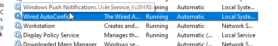
3. Configure the Authentication tab <br>
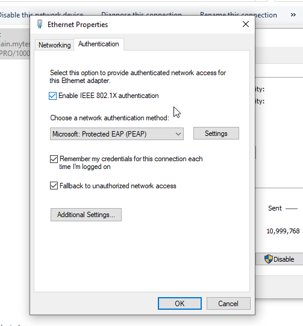 <br>
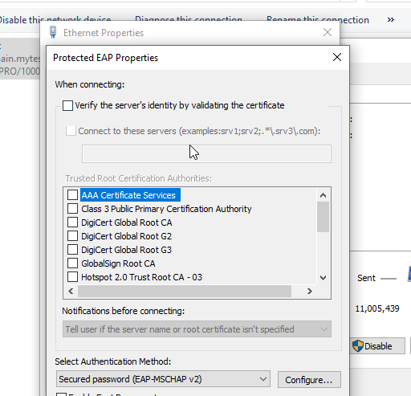 <br>
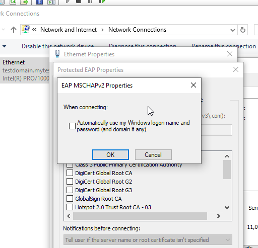 <br>
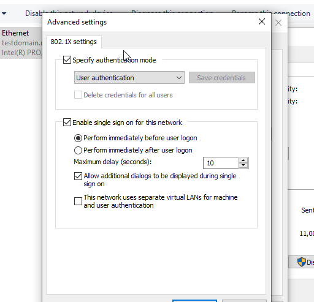 <br>

Now when you try to login you have to specify network credentials. It would be possible to configure it that it automatically pulls user login/password without need to type it twice however i would need to setup dot1x auth slightly differently which i will do however in different lab. <br>
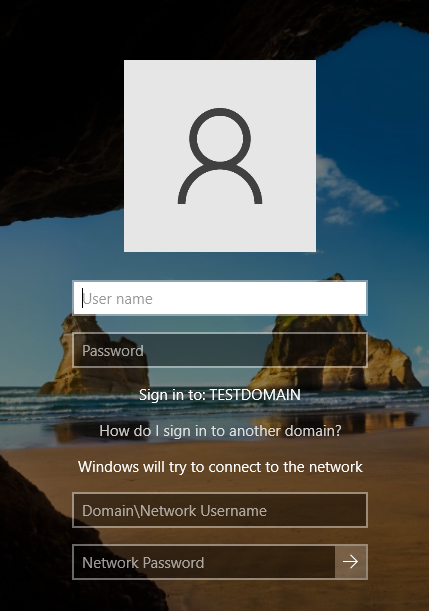


## Testing
### Not Dot1x
Upon connecting any PC without configured DOT1X. What happens is MAB fails because the device is not registered. Packetfence puts the device in vlan 6 (Registration). Then I am greeted with captive portal. <br>
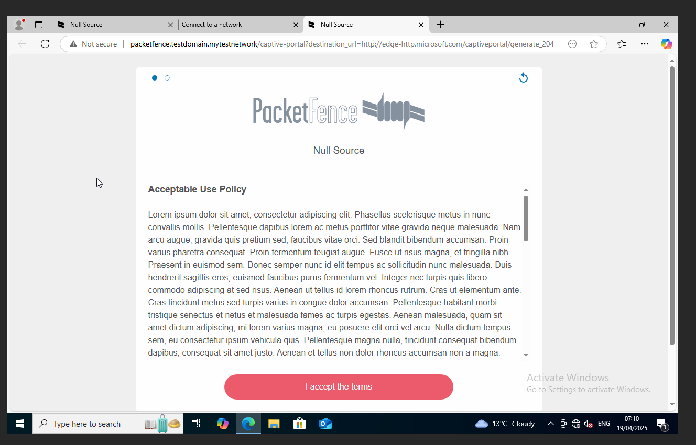 <br>
Upon accepting the terms. I am being switched to vlan 10 (Guest). <br>
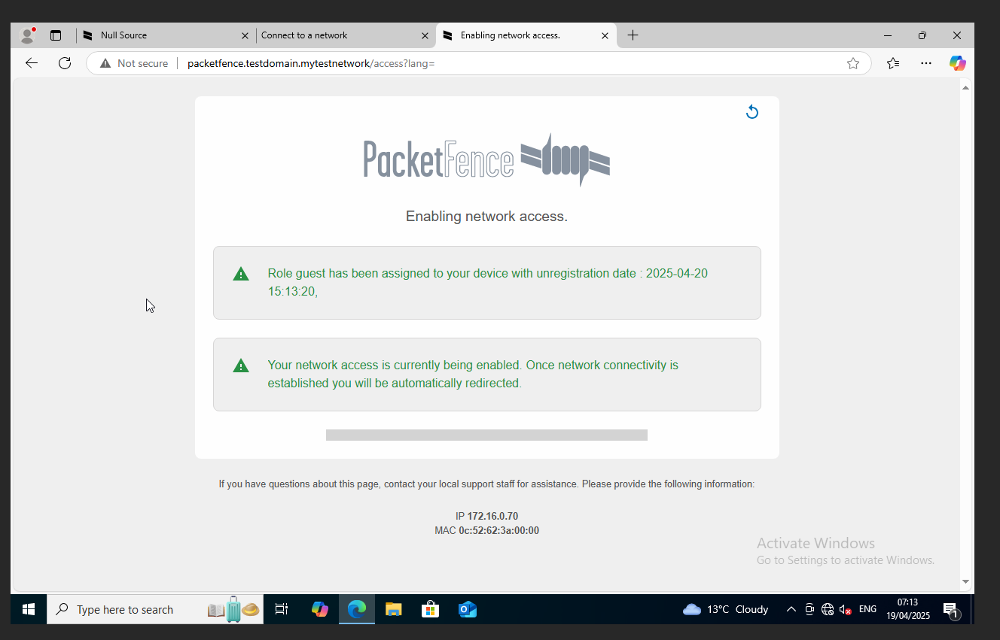 <br>
 <br>
Upon disconnection, and reconnection the device is automatically assigned to vlan 10 (because packetfence has it as registered and access duration of 12 hours as i configured it).
### Dot1x
Upon connecting a device, if the authentication is successful packet fence will register the device and assign it to the correct vlan. If it fails it will still show captive portal. Upon disconnecting the device will be deregistered from captive portal making it only possible to auth via dot1x. Which for my network is what i wanted.
### Auth Logs
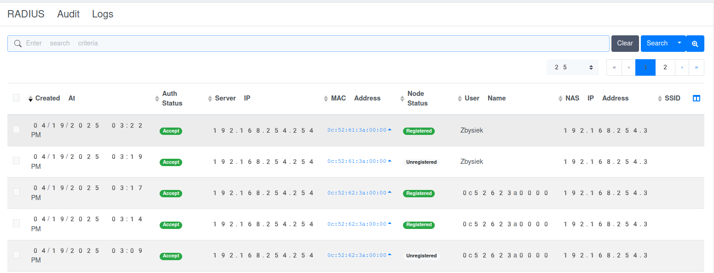