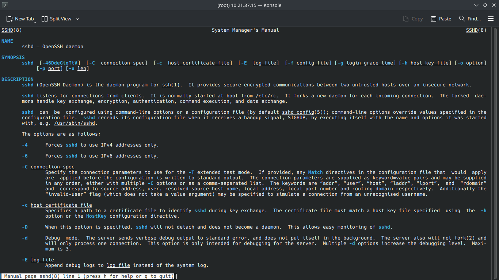

# Chapter 12: System Documentation

## Man Pages
If you don't know something, man comes to help <br>
You can type ``man (command or service)`` <br>
And you will be shown some information <br>
 <br>

Note: This is useful for exams where you can't google, and you forgot a bit

## --help option
Almost all, not if all commands come with ``--help`` argument <br>
```
root@server ~]# ls --help
Usage: ls [OPTION]... [FILE]...
List information about the FILEs (the current directory by default).
Sort entries alphabetically if none of -cftuvSUX nor --sort is specified.

Mandatory arguments to long options are mandatory for short options too.
  -a, --all                  do not ignore entries starting with .
  -A, --almost-all           do not list implied . and ..
      --author               with -l, print the author of each file
  -b, --escape               print C-style escapes for nongraphic characters
```
This is useful because it provides you information what you can do indepth with a tool <br>

## Documentation in /usr/share/doc
Directory ``/usr/share/doc/`` might contain additional information if it's not in ``man`` anyway <br>
```
[root@server xz]# pwd
/usr/share/doc/xz
[root@server xz]# ls
api  AUTHORS  COPYING  COPYING.0BSD  COPYING.GPLv2  examples  faq.txt  history.txt  lzma-file-format.txt  NEWS  README  THANKS  xz-file-format.txt
[root@server xz]# 
```
In this case I am checking out xz utility, there multiple files, one of them is even the format of ``.xz`` with technical implementation <br> 
```
The .xz File Format
===================
Version 1.2.1 (2024-04-08)
        0. Preface
           0.1. Notices and Acknowledgements
           0.2. Getting the Latest Version
           0.3. Version History
        1. Conventions
           1.1. Byte and Its Representation
           1.2. Multibyte Integers
...
```

Cool <br>

## GNU Info
GNU info is basically ``man`` on steroids <br>
You type ``info sshd`` or just ``info``. It provides you something like a wikipedia page where you can check sublinks what it exactly does etc. <br>

## Summary
This chapter was about, how you can check what tools do, what are your options and how you can find them. This is kinda it