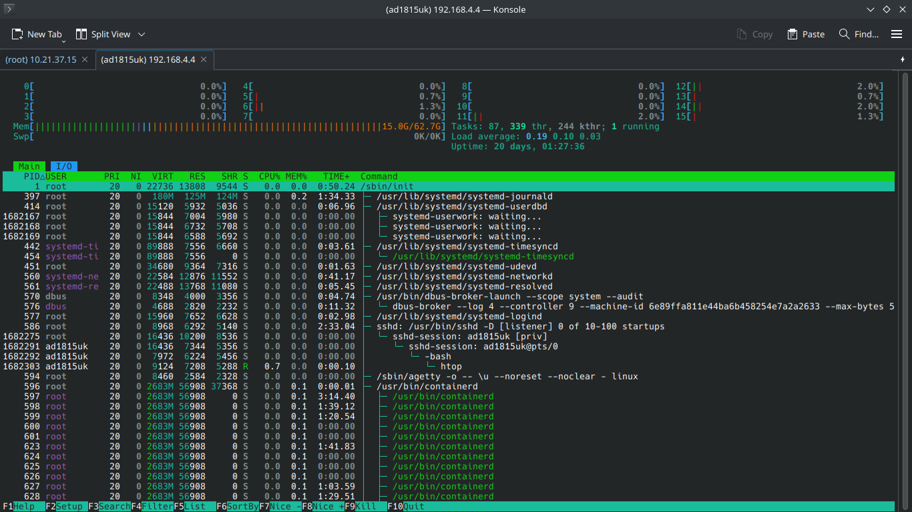

# Chapter 14: Integrity and Availability
## Reporting Processors Statistics
There are multiple tools that we can use to view cpu usage, we can use ``top``, ``htop``, ``atop`` and a lot more<br>
 <br>
I would compare ``htop`` to task manager on windows, trying to explain it is kinda pointless <br>
You can see processes, ram usage, cpu usage <br>

My study guide suggests to use ``mpstat`` which more detailed cpu usage tool <br>

We can use ``mpstat -P ALL -u 2 3`` <br>
Where ``-P ALL`` means to monitor all CPU's, you can put there ``0`` to monitor cpu 0 or ``0-3,5,6`` to monitor cpu's 0,1,2,3,5,6 <br>
``-u`` to report cpu utilization <br> 
``2`` is a report interval in seconds <br>
``3`` is number of reports <br>

Which looks like that <br>
```
[root@server grub.d]# mpstat -P ALL -u 2 3 
Linux 6.15.4-arch2-1 (server)   07/16/2025      _x86_64_        (4 CPU)

10:47:22 PM  CPU    %usr   %nice    %sys %iowait    %irq   %soft  %steal  %guest  %gnice   %idle
10:47:24 PM  all    0.00    0.00    0.12    0.00    0.12    0.12    0.00    0.00    0.00   99.63
10:47:24 PM    0    0.00    0.00    0.00    0.00    0.00    0.00    0.00    0.00    0.00  100.00
10:47:24 PM    1    0.00    0.00    0.00    0.00    0.00    0.00    0.00    0.00    0.00  100.00
10:47:24 PM    2    0.00    0.00    0.50    0.00    0.50    0.50    0.00    0.00    0.00   98.51
10:47:24 PM    3    0.00    0.00    0.00    0.00    0.00    0.00    0.00    0.00    0.00  100.00

10:47:24 PM  CPU    %usr   %nice    %sys %iowait    %irq   %soft  %steal  %guest  %gnice   %idle
10:47:26 PM  all    0.00    0.00    0.12    0.00    0.00    0.00    0.00    0.00    0.00   99.88
10:47:26 PM    0    0.00    0.00    0.50    0.00    0.00    0.00    0.00    0.00    0.00   99.50
10:47:26 PM    1    0.00    0.00    0.00    0.00    0.00    0.00    0.00    0.00    0.00  100.00
10:47:26 PM    2    0.00    0.00    0.00    0.00    0.00    0.00    0.00    0.00    0.00  100.00
10:47:26 PM    3    0.00    0.00    0.00    0.00    0.00    0.00    0.00    0.00    0.00  100.00

10:47:26 PM  CPU    %usr   %nice    %sys %iowait    %irq   %soft  %steal  %guest  %gnice   %idle
10:47:28 PM  all    0.00    0.00    0.00    0.00    0.00    0.00    0.00    0.00    0.00  100.00
10:47:28 PM    0    0.00    0.00    0.00    0.00    0.00    0.00    0.00    0.00    0.00  100.00
10:47:28 PM    1    0.00    0.00    0.00    0.00    0.00    0.00    0.00    0.00    0.00  100.00
10:47:28 PM    2    0.00    0.00    0.00    0.00    0.00    0.00    0.00    0.00    0.00  100.00
10:47:28 PM    3    0.00    0.00    0.00    0.00    0.00    0.00    0.00    0.00    0.00  100.00
```

Let's go with table to explain what we see <br>

| What    | Description                                                                                                                                    |
|---------|------------------------------------------------------------------------------------------------------------------------------------------------|
| CPU     | Specific cpu core, (In case of all it takes an average of all cpus)                                                                            |
| %usr    | Percentage of CPU utilization while running user level applications                                                                            |
| %nice   | Same as %usr but with nice priority                                                                                                            |
| %sys    | Percentage of CPU utilization that occurred while executing kernel applications                                                                |
| %iowait | Percentage of time when CPU was idle to wait for i/o                                                                                           |
| %irq    | Percentage of time spent servicing hardware interrupts                                                                                         |
| %soft   | Same as %irq but with software interrupts                                                                                                      |
| %steal  | Percentage of time spent in involuntary wait as a virtual machine to get hypervisor attention to perform an action (think of overprovisioning) |
| %guest  | Percentage of time spent running a virtual processor                                                                                           |
| %idle   | Percentage of time where processor was not doing anything, low number means high cpu load                                                      |

## Reporting Processes
We can use htop and list processes by cpu usage <br>
Or we can use ``ps`` which lists processes with arguments <br>
```
[root@ArchVisor ~]# ps -eo pid,ppid,cmd,%cpu,%mem --sort=-%cpu
    PID    PPID CMD                         %CPU %MEM
1293489   52781 /usr/bin/qemu-system-x86_64  3.1  4.5
1041674   52781 /usr/bin/qemu-system-x86_64  2.1  6.5
   1632    1631 java @user_jvm_args.txt @li  1.6 11.0
1683786       1 /usr/lib/systemd/systemd --  0.3  0.0
 707211   52781 /usr/bin/dynamips -N1 -l dy  0.1  0.0
1683796 1683780 sshd-session: ad1815uk@pts/  0.1  0.0
    596       1 /usr/bin/containerd          0.0  0.0
  52781   52673 /usr/bin/python /usr/bin/gn  0.0  0.2
    126       2 [kcompactd0]                 0.0  0.0
```
We can clearly see that the most cpu usage  is from ``qemu-system`` <br>
Which make sense as I am running two vm's that are idling <br>
We can also sort by memory usage <br>
```
[root@ArchVisor ~]# ps -eo pid,ppid,cmd,%cpu,%mem --sort=-%mem
    PID    PPID CMD                         %CPU %MEM
   1632    1631 java @user_jvm_args.txt @li  1.6 11.0
1041674   52781 /usr/bin/qemu-system-x86_64  2.1  6.5
1293489   52781 /usr/bin/qemu-system-x86_64  3.1  4.5
   1331    1306 /bin/ollama serve            0.0  0.3
  52781   52673 /usr/bin/python /usr/bin/gn  0.0  0.2
    397       1 /usr/lib/systemd/systemd-jo  0.0  0.1
```
On top this time I have minecraft server which takes 11% of memory <br>
After we have those two vm's <br>

If we get the PID we can check additional statistics <br>
Under ``/proc/(PID)/io`` <br>
```
[root@ArchVisor ~]# cat /proc/1632/io 
rchar: 617779719
wchar: 10468172676
syscr: 17462006
syscw: 6279942
read_bytes: 393297920
write_bytes: 13461061632
cancelled_write_bytes: 0
```
We will have io information about certain process <br>
Under ``/proc/(PID)/attr/current`` we can check current SELinux security attributes <br>
Under ``/proc/(PID)/cgroup`` we can check to what cgroups the process belongs to <br>
With cgroups you can manage limits such as cpu usage, disk usage, ram usage and more <br>
Under ``/proc/(PID)/fd/`` which is a directory we will have symbolic links for file descriptors that process has opened <br>

Note: There are 54 files like that which have a specific function I mentioned only 4 of them <br>
My study guide mentioned them, so I guess it was worth repeating but going through everything one is infeasible but anyway it is interesting <br>
```
[root@ArchVisor ~]# ls /proc/1632/ | wc -l
54
```

## Setting Resource Limits on a Per-User Basis
By default, users can create unlimited number of processes it means users can create a fork bomb <br>
Additionally one user could load whole cpu leading to our system being slow, maybe we have some processes that should be on higher priority but users processes might have higher nice priority resulting in our high important tasks not finishing in time <br>
Currently when I run ``:() { :| :& };:`` which is a fork bomb, the system becomes unresponsive, and it dies <br>

We can configure options like that and more in ``/etc/security/limits.conf`` <br>

We can add line with <br>
```
* hard nproc 10
```
Which will limit processes to 10 for all users, instead of ``*`` we can type a user which will apply to only specific user <br>
We can also specify groups with ``%*`` or ``%groupname`` <br>

Now when I try to fork bomb it <br>
```
[testuser@server ~]$ :() { : | :& }; :
[1] 492
[testuser@server ~]$ -bash: fork: retry: Resource temporarily unavailable
-bash: fork: retry: Resource temporarily unavailable
-bash: fork: retry: Resource temporarily unavailable
-bash: fork: retry: Resource temporarily unavailable
-bash: fork: retry: Resource temporarily unavailable
-bash: fork: retry: Resource temporarily unavailable
-bash: fork: retry: Resource temporarily unavailable
```
System is still responsive as it's limits users to 10 processes <br>

Note: We can modify process nice level using <br>
```
renice [-n] <new priority> <UID, GID, PGID, or empty> identifier
```
We can also kill processes using ``kill (PID)`` command <br>
Kill has multiple options such as <br>

| Argument  | Description                                        |
|-----------|----------------------------------------------------|
| -9        | Kills process in most violent way possible         |
| -G 1000   | Kills processes which owner is a group of GID 1000 |
| -P (PPID) | Kills Parent Process                               |

Note: There are many more options available <br>

## Running Tasks Through Cron and Verifying Completion of Scheduled Jobs
We can schedule commands with cron, alternatively with systemd timers but crontab is easier and LFCS exam requires to know crontab <br>
Here is how cron task is structured <br>
```
(minute) (hour) (day of the month) (month) (week) (path to command or script)
```
With some examples <br>

| Example      | Description                                              |
|--------------|----------------------------------------------------------|
| * * * * *    | Executes every minute                                    |
| 59 * * * *   | Executes every hour at 59th minute (13:59, 14:59, 15:59) |
| * 1-3 * * *  | Executes every minute from 01:00 to 03:00                |
| 5 4 * * sun  | Executes at 04:05 on sunday                              |
| 0 14 * * *   | Executes at 14 every single day                          |
| 0 14 * * 1-5 | Executes at 14 from monday to friday                     |
| 0 14 * 1-3 * | Executes at 14 every day from January to March           |

Note: https://crontab.guru/ is pretty good tool to calculate crontab entries <br>

Additionally, you can use specific operators such as <br>
- @reboot - Run when system boots
- @yearly
- @monthly
- @weekly
- @daily
- @hourly

Crontab has two configurations, one that is for whole system which is under ``/etc/crontab`` <br>
One is for your current user which can be edited using ``crontab -e`` command <br>
You can view crontab tasks for your current user using ``crontab -l`` command <br>