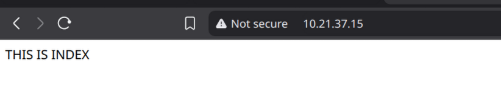
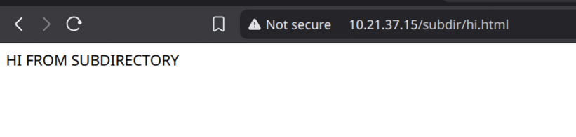
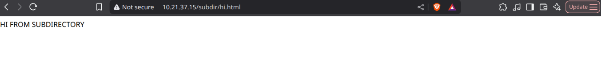
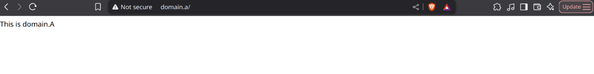
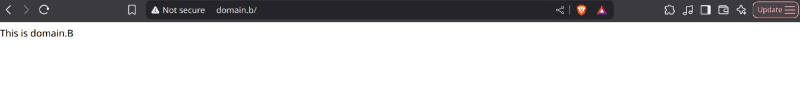

# Chapter 23: The Apache Web Server
Let's start by installing apache package (note It could be named differently aka ``apache2``, ``httpd`` depending on distribution) <br>
```
[root@server ~]# pacman -S apache
```
The configuration file is located under ``/etc/httpd/conf/httpd.conf`` <br>

## Serving Pages in a Standalone Web Server
This is the most basic usage of Apache to serve webpages in a standalone server <br>
You can check what is ``DocumentRoot`` in the configuration file <br>
```
DocumentRoot "/srv/http"
```
In my case it's ``/srv/http/`` all this option means is it will pull webpages from this directory <br>
We can create a simple test to see if it's working, I will create two html files one in a subdirectory, and we will see what will happen <br>
```
[root@server http]# find .
.
./subdir
./subdir/hi.html
./index.html
[root@server http]# cat index.html 
THIS IS INDEX
[root@server http]# cat subdir/hi.html 
HI FROM SUBDIRECTORY
[root@server http]# 
```
Now when we start the service we should be able to access those <br>
```
[root@server ~]# systemctl start httpd
[root@server ~]# 
```
 <br>
 <br>
We can access the files exactly as we created them on filesystem <br>

Note: If you create a symbolic link to file outside of ``/srv/http/`` it will work, If you have SELinux configured it would not work <br>
Additionally you have logs from ``httpd`` service under ``/var/log/httpd/``, in there you have access log (who accessed what page and when) and error log (which is self-explanatory) <br>
```
[root@server httpd]# pwd
/var/log/httpd
[root@server httpd]# ls
access_log  error_log
[root@server httpd]# cat error_log 
AH00558: httpd: Could not reliably determine the server's fully qualified domain name, using fe80::ec7:79ff:fe40:0%ens3. Set the 'ServerName' directive globally to suppress this message
[Tue Jul 22 21:45:03.502509 2025] [mpm_event:notice] [pid 33384:tid 33384] AH00489: Apache/2.4.63 (Unix) configured -- resuming normal operations
[Tue Jul 22 21:45:03.502573 2025] [core:notice] [pid 33384:tid 33384] AH00094: Command line: '/usr/bin/httpd -D FOREGROUND'
[root@server httpd]# cat access_log 
10.21.37.1 - - [22/Jul/2025:21:45:53 +0000] "GET / HTTP/1.1" 200 481
10.21.37.1 - - [22/Jul/2025:21:45:53 +0000] "GET /icons/blank.gif HTTP/1.1" 200 148
10.21.37.1 - - [22/Jul/2025:21:45:53 +0000] "GET /favicon.ico HTTP/1.1" 404 1098
10.21.37.1 - - [22/Jul/2025:21:45:55 +0000] "GET /?C=N;O=D HTTP/1.1" 200 481
10.21.37.1 - - [22/Jul/2025:21:45:55 +0000] "GET /?C=M;O=A HTTP/1.1" 200 481
10.21.37.1 - - [22/Jul/2025:21:55:46 +0000] "GET / HTTP/1.1" 200 14
10.21.37.1 - - [22/Jul/2025:21:56:30 +0000] "GET /subdir/hi.html HTTP/1.1" 200 21
10.21.37.1 - - [22/Jul/2025:21:58:06 +0000] "GET / HTTP/1.1" 304 -
10.21.37.1 - - [22/Jul/2025:22:02:21 +0000] "GET /test.html HTTP/1.1" 200 11
[root@server httpd]# 
```
Note2: Logs can be customized in the configuration file <br>
```
LogFormat "%h %l %u %t \"%r\" %>s %b" common
CustomLog "/var/log/httpd/access_log" common
```
I am pretty sure you can make multiple log files contain different logs, One could be for ips, one for access logs which we have seen already, definitely cool <br>
We can use following options in our log <br>

| Option         | Description                                 |
|----------------|---------------------------------------------|
| %h             | Remote hostname or IP address (client)      |
| %l             | Remote log name                             |
| %u             | Remote user if the request is authenticated |
| %t             | Date and time of the request                |
| %r             | First line of request to the server         |
| %>s            | Final status of the request                 |
| %b             | Size of the response [bytes]                |
| %{User-Agent}% | User Agent                                  |
| %{Referer}%    | Referring website                           |

Note: Damn there is a lot of options https://httpd.apache.org/docs/2.4/mod/mod_log_config.html#formats <br>

## Restrict Access to a Web Page With Apache
If we want to restrict access to a webpage we can ask user to authenticate which is pretty cool I did not know about it <br>

To do this first we have to create users and their password with the ``htpasswd`` command <br>
```
[root@server httpd]# htpasswd -c /etc/httpd/.creds zbysiek
New password: 
Re-type new password: 
Adding password for user zbysiek
[root@server httpd]# 
```
Note: ``-c`` option is used to create the ``/etc/httpd/.creds`` file. If you want to add more users to this file remove the ``-c`` option (but keep the path to ``.creds`` file) <br>

Let's assign correct permissions to the .creds file <br>
```
chmod 640 /etc/httpd/.creds
chgrp http /etc/httpd/.creds
```

Now we can append this to the config file <br>
```
<Directory "/srv/http/subdir">
  AuthType Basic
  AuthName "This is a restricted directory"
  AuthBasicProvider file  
  AuthUserFile "/etc/httpd/.creds"
  Require valid-user
</Directory>
```
Which should restrict access to our ``/srv/http/subdir`` directory <br>
Ofcourse restart the service <br>
 <br>
<br>
And yes we are asked for username and password, upon providing the correct details I am able to access the webpage cool <br>
Note: We can use instead of ``Directory`` option ``Files`` which will work for a file rather than directory <br>

## Setting up Name-Based Virtual Hosts
We can have multiple domains on one apache instance, following configuration will make apache provide content relevant to its domain <br>

I start with creation of a structure where each domain has its own directory and index.html <br>
```
[root@server http]# find .
.
./domain.a
./domain.a/index.html
./domain.b
./domain.b/index.html
[root@server http]# cat domain.a/index.html 
This is domain.a
[root@server http]# cat domain.b/index.html 
This is domain.b
[root@server http]# 
```
Then we make configuration for each domain <br>
```
<VirtualHost *:80>
  ServerAdmin admin@domain.a
  DocumentRoot /srv/http/domain.a/
  ServerName domain.a
  ServerAlias www.domain.a domain.a
  ErrorLog /var/log/httpd/domain.a/error.log
  LogFormat "%v %l %u %t \"%r\" %>s %b" myvhost
  CustomLog /var/log/httpd/domain.a/access.log myvhost
</VirtualHost>
<VirtualHost *:80>
  ServerAdmin admin@domain.b
  DocumentRoot /srv/http/domain.b/
  ServerName domain.b
  ServerAlias www.domain.b domain.b
  ErrorLog /var/log/httpd/domain.b/error.log
  LogFormat "%v %l %u %t \"%r\" %>s %b" myvhost
  CustomLog /var/log/httpd/domain.b/access.log myvhost
</VirtualHost>
```
Note: We can either paste the config into the ``httpd.conf`` or make dedicated .conf files for each domain which is much more manageable <br>
Imagine one big configuration file for 1000 domains, that will not go well <br>

We can do this by creating .conf files under ``/etc/httpd/conf/conf.d/`` directory (which is configurable in main config file) <br>
```
[root@server conf.d]# pwd
/etc/httpd/conf/conf.d
[root@server conf.d]# ls
domain.a.conf  domain.b.conf
[root@server conf.d]# 
```

Note: This can differ on distribution

For the purpose of this lab (I will not buy domain or configure dns server just for that) <br>
We need to change ```/etc/hosts``` file or on windows ``C:\Windows\System32\drivers\etc\hosts`` <br>
It's because browser needs to know what domain we want request <br>
So we append that to the ``/etc/hosts``
```
10.21.37.15      domain.a   
10.21.37.15      domain.b 
```
And the result is <br>
```
[root@MateuszLaptop mateusz]# ping domain.a
PING domain.a (10.21.37.15) 56(84) bytes of data.
64 bytes from domain.a (10.21.37.15): icmp_seq=1 ttl=62 time=0.918 ms
^C
--- domain.a ping statistics ---
1 packets transmitted, 1 received, 0% packet loss, time 0ms
rtt min/avg/max/mdev = 0.918/0.918/0.918/0.000 ms
[root@MateuszLaptop mateusz]# ping domain.b
PING domain.b (10.21.37.15) 56(84) bytes of data.
64 bytes from domain.a (10.21.37.15): icmp_seq=1 ttl=62 time=0.748 ms
64 bytes from domain.a (10.21.37.15): icmp_seq=2 ttl=62 time=0.805 ms
^C
--- domain.b ping statistics ---
2 packets transmitted, 2 received, 0% packet loss, time 1064ms
rtt min/avg/max/mdev = 0.748/0.776/0.805/0.028 ms
[root@MateuszLaptop mateusz]# 
```
Now when we restart service, it will die. Because we have to create the log directories (it doesn't create them for us) <br>
After that we can successfully access each domain, and it's "website" <br>
 <br>
 <br>

## Installing and Configuring SSL With Apache
Note: For the purpose of this lab we will use self-signed certificate <br>

Let's start with creating a directory where our certificates will be stored <br>
```
[root@server http]# mkdir /etc/httpd/ssl-certs
```
Now let's create a certificate <br>
```
[root@server http]# openssl req -x509 -nodes -days 365 -newkey rsa:2048 -keyout /etc/httpd/ssl-certs/apache.key -out /etc/httpd/ssl-certs/apache.crt
...+.+........+.......+..+++++++++++++++++++++++++++++++++++++++*...........+......+...+..+++++++++++++++++++++++++++++++++++++++*.....+..+...+.........+...+......................+...+............+..+..........+.....+...+......+.+.....+..........+.....+......+.......+.....+.+...........+....++++++
.........+.+.....+....+.....+.+..+...+.........+.+......+..................+++++++++++++++++++++++++++++++++++++++*.+..+...+....+.....+.+.....+.+++++++++++++++++++++++++++++++++++++++*......+....................+...+.+..............+....+..+.............+..+...+.....................+.+........+......+.........+.............+..+......+............+...+....+...+..+.+......+...........+....+......+..+...+...+....+.................+....+..+...+.+...+...+..+......+...............+......+....+...........+...+................+..+.......+..+...+.+......+.....+.+..+.+.....+.+...+..................+...+............+..+.+..+....+.....+.............+.....+.............+..+.............+.....+...+............+.........+....+..+.......+..+....+..+.............+..+............+...+.......+...+...+......+........+.............+.........+...+...++++++
-----
You are about to be asked to enter information that will be incorporated
into your certificate request.
What you are about to enter is what is called a Distinguished Name or a DN.
There are quite a few fields but you can leave some blank
For some fields there will be a default value,
If you enter '.', the field will be left blank.
-----
Country Name (2 letter code) [AU]:GB
State or Province Name (full name) [Some-State]:
Locality Name (eg, city) []:
Organization Name (eg, company) [Internet Widgits Pty Ltd]:
Organizational Unit Name (eg, section) []:
Common Name (e.g. server FQDN or YOUR name) []:
Email Address []:
[root@server http]# 
```
For the purpose of this lab filling of the options such as ``Country Name (2 letter code) [AU]:`` is not required <br>
Also here is a brief explanation of the options <br>

| Option           | Description                                      |
|------------------|--------------------------------------------------|
| req -X509        | Option to create X509 certificate                |
| -nodes           | Don't encrypt the key                            |
| -days 365        | number of days that the certificate is valid for |
| -newkey rsa:2048 | creates a 2048-bit RSA key for this certificate  |
| -keyout /etc/... | absolute path of the RSA key                     |
| -out  /etc/...   | absolute path of the certificate                 |

Now in our ``httpd.conf`` we change those lines <br>
```
Listen 443
LoadModule ssl_module modules/mod_ssl.so
LoadModule socache_shmcb_module modules/mod_socache_shmcb.so
...
SSLEngine on
SSLCertificateFile /etc/httpd/ssl-certs/apache.crt
SSLCertificateKeyFile /etc/httpd/ssl-certs/apache.key
```
Restart the service <br>
Now when we access the website, we can see that our certificate is there. The website is saying it's ``Not Secure`` because our certificate is not trusted <br>
We can either add this certificate to our local machine and the website will show as secure, or we can use a certificate signing 3rd party which will validate our website, and it will show as secure <br>
Note: This is not tutorial for certificates <br>
Note2: Most of the options mentioned there could be used with virtual hosts, for example instead of making changes to ``httpd.conf`` globally <br>
Note3: Just because it says it's ``Not Secure`` it just means it doesn't trust the certificate but the traffic is encrypted 
We could do something like <br>
```
<VirtualHost *:443>
  ServerAdmin admin@domain.b
  DocumentRoot /srv/http/domain.b/
  SSLEngine on 
  SSLCertificateFile /etc/httpd/ssl-certs/apache.crt
  SSLCertificateKeyFile /etc/httpd/ssl-certs/apache.key
  ...
```
Which would enable encryption and certificate only for domain.b while domain.a would stay without certificate and encryption <br>
