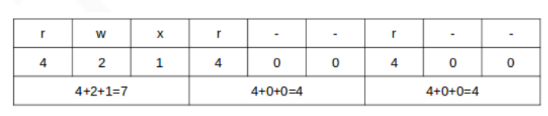

# Chapter 3: Archiving and Compression Tools with File Basic Permissions and Attributes

## Archiving and Compression Tools
Tar is a versatile tool that bundles files or directories into a single file that can be additionally compressed. Originally was written to work with tape drives. (damn this is old) <br>

Example of tarball without compression
```
[root@ArchVisor root]# ls
ciscos  randomMC
[root@ArchVisor root]# tar -cf archive.tar randomMC/
[root@ArchVisor root]# file archive.tar 
archive.tar: POSIX tar archive (GNU)
[root@ArchVisor root]# 
[root@ArchVisor root]# du -sm randomMC/
471     randomMC/
[root@ArchVisor root]# du -sm archive.tar 
470     archive.tar
[root@ArchVisor root]# 
```

Tar supports different compression algorithms <br>
```
  -j, --bzip2                filter the archive through bzip2
  -J, --xz                   filter the archive through xz
      --lzip                 filter the archive through lzip
      --lzma                 filter the archive through lzma
      --lzop                 filter the archive through lzop
      --zstd                 filter the archive through zstd
  -z, --gzip, --gunzip, --ungzip   filter the archive through gzip
```
To bundle the files and compress them you have to specify additional flag. <br>
```
[root@ArchVisor root]# ls
archive.tar  ciscos  randomMC
[root@ArchVisor root]# tar -czf archive.tar.gz randomMC/
[root@ArchVisor root]# tar -cjf archive.tar.bz2 randomMC/
[root@ArchVisor root]# tar -cJf archive.tar.xz randomMC/
[root@ArchVisor root]# file archive.tar.gz 
archive.tar.gz: gzip compressed data, from Unix, original size modulo 2^32 492052480 gzip compressed data, unknown method, ASCII, has CRC, was "", encrypted, from FAT filesystem (MS-DOS, OS/2, NT), original size modulo 2^32 492052480
[root@ArchVisor root]# file archive.tar.bz2 
archive.tar.bz2: bzip2 compressed data, block size = 900k
[root@ArchVisor root]# file archive.tar.xz
archive.tar.xz: XZ compressed data, checksum CRC64
[root@ArchVisor root]# du -sm archive.tar*
470     archive.tar
370     archive.tar.bz2
369     archive.tar.gz
356     archive.tar.xz
[root@ArchVisor root]# 
```
To decompress you can use "tar -xpvf archive.tar.XXX" it will automatically detect compression type and extract the files <br>
```
[root@ArchVisor root]# ls
archive.tar.bz2  archive.tar.gz  archive.tar.xz  ciscos  watwat
[root@ArchVisor root]# tar -xpvf archive.tar.bz2 
randomMC/
randomMC/cache/
randomMC/cache/mojang_1.21.4.jar
...
[root@ArchVisor root]# ^C
[root@ArchVisor root]# ^C
[root@ArchVisor root]# tar -xpvf archive.tar.xz 
randomMC/
randomMC/cache/
randomMC/cache/mojang_1.21.4.jar
...
[root@ArchVisor root]# ^C
[root@ArchVisor root]# tar -xpvf archive.tar.gz 
randomMC/
randomMC/cache/
randomMC/cache/mojang_1.21.4.jar
...
[root@ArchVisor root]# 
```
Optionally you can use associated program such as xz to decompress the xz archive into just a tarball <br>
```
[root@ArchVisor root]# ls
archive.tar.bz2  archive.tar.gz  archive.tar.xz  ciscos  randomMC
[root@ArchVisor root]# xz -d archive.tar.xz 
[root@ArchVisor root]# ls
archive.tar  archive.tar.bz2  archive.tar.gz  ciscos  randomMC
[root@ArchVisor root]# file archive.tar
archive.tar: POSIX tar archive (GNU)
[root@ArchVisor root]# 
```
You can do a lot with tar tool. For example, we can exclude .jar files from our tarball. 
```
[root@ArchVisor root]# tar -cvzf archive.tar.gz --exclude='*.jar' randomMC/         

randomMC/
randomMC/cache/
randomMC/commands.yml
randomMC/usercache.json
randomMC/whitelist.json
randomMC/eula.txt
randomMC/version_history.json
randomMC/server.properties
... no jars there
```
Or we can manipulate the tarball itself by removing or adding individual files/folders <br>
```
[root@ArchVisor root]# tar --list --file archive.tar | grep randomMC/commands.yml
randomMC/commands.yml
[root@ArchVisor root]# tar --delete --file archive.tar randomMC/commands.yml
[root@ArchVisor root]# tar --list --file archive.tar | grep randomMC/commands.yml
[root@ArchVisor root]# tar --update --file archive.tar randomMC/commands.yml
[root@ArchVisor root]# tar --list --file archive.tar | grep randomMC/commands.yml
randomMC/commands.yml
[root@ArchVisor root]# 
```

## Using Find to Search for Files
find is a useful program that allows you to search for files. <br>
It has many options including searching files with permissions, modification date, size, only directories, only files, by who owns the file. <br>
Covering everything is infeasible but here is a small example <br>

```
#Files size less than 10mb
[root@ArchVisor root]# find randomMC/ -size -10M | wc -l
657
#Files size more than 10mb
[root@ArchVisor root]# find randomMC/ -size +10M | wc -l
6
#Files created by root 
[root@ArchVisor root]# find randomMC/ -user root | wc -l
665
#Directories only
[root@ArchVisor root]# find randomMC/ -type d | wc -l
352
#Files only
[root@ArchVisor root]# find randomMC/ -type f | wc -l
313
[root@ArchVisor root]# 
```

## File Permissions and Basic Attributes
Each file,directory,block device etc. has permissions <br>
Permissions are split into 9 characters or 3 numbers depending on how you view them but mean the same thing <br>
Each file has a permission for user who owns the file, group associated with the file and everyone else. You can adjust those separately <br>

| User | Group | Everyone |
|------|-------|----------|
| rwx  | r-x   | r-x      |

Calculating those permissions is really easy. <br>


We can change permissions using "chmod" command. We can use both letter format or integer format. 
```
[root@ArchVisor root]# ls -l archive.tar 
---------- 1 root root 253552640 Jul  3 21:31 archive.tar
[root@ArchVisor root]# chmod u+rwx archive.tar 
[root@ArchVisor root]# chmod g+rwx archive.tar 
[root@ArchVisor root]# ls -l archive.tar 
-rwxrwx--- 1 root root 253552640 Jul  3 21:31 archive.tar
[root@ArchVisor root]# chmod 770 archive.tar 
[root@ArchVisor root]# ls -l archive.tar 
-rwxrwx--- 1 root root 253552640 Jul  3 21:31 archive.tar
[root@ArchVisor root]# 
```
To change who owns the file we can use "chown" <br>
Remember that we can do it for directories too, and you might need to use "-r" option for recursive changes. <br>
```
[root@ArchVisor root]# ls -l archive.tar 
-rwxrwx--- 1 root root 253552640 Jul  3 21:31 archive.tar
[root@ArchVisor root]# chown ad1815uk archive.tar 
[root@ArchVisor root]# ls -l archive.tar 
-rwxrwx--- 1 ad1815uk root 253552640 Jul  3 21:31 archive.tar
[root@ArchVisor root]# 
```
We can additionally change the group to which file or directory belongs to <br>
```
[root@ArchVisor root]# ls -l archive.tar 
-rwxrwx--- 1 ad1815uk root 253552640 Jul  3 21:31 archive.tar
[root@ArchVisor root]# chgrp nobody archive.tar 
[root@ArchVisor root]# ls -l archive.tar 
-rwxrwx--- 1 ad1815uk nobody 253552640 Jul  3 21:31 archive.tar
[root@ArchVisor root]# 
```
Note: Group nobody exists, you can see all groups on your system in ``/etc/groups``