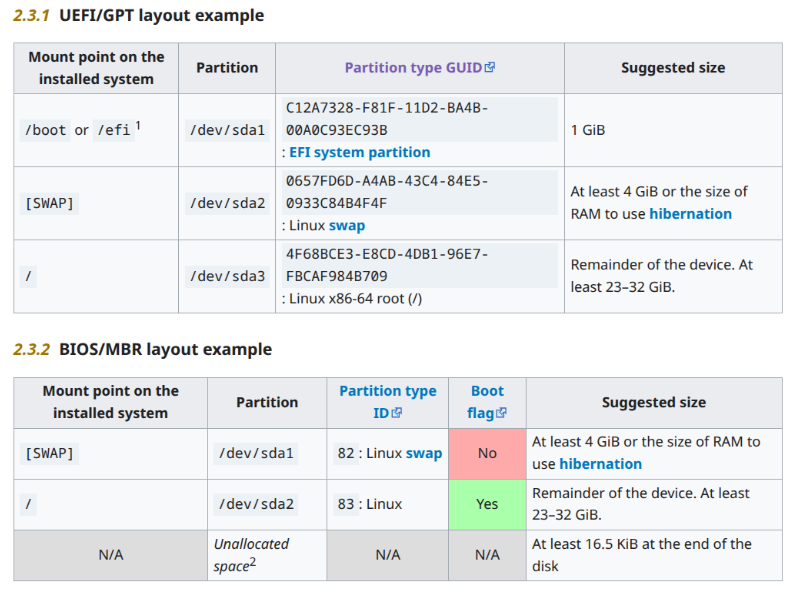

# Chapter 4: Partitioning Storage Devices, Formatting Filesystems, and Configuring Swap Partitions

## Partitioning Storage Devices
I installed arch linux manually multiple times hence I will not cover fdisk, gdisk and gparted. Additionally, all of the tools are really similar to each other. I will only summarize this topic <br>

- MBR - Legacy, maximum disk size 2TB, limited to only 4 partitions, doesn't support uefi
- GPT - Newer, maximum disk size astronomically high, max 128 partitions, supports uefi

Here is an example layout of partitions for linux system. You can of course adjust it. Additionally, when formatting with fdisk or other tools you might need to specify special flags such as if partition is efi, or bootable <br>
 <br>
On the fun fact side you can install linux straight on disk without partitions. This is only possible on installation without uefi. 

## Formatting Filesystems
By running ``ls /bin/mkfs.*`` you can check what file systems you can format your partition with <br>
```
root@archiso ~ # ls /bin/mkfs.*
/bin/mkfs.bcachefs  /bin/mkfs.btrfs   /bin/mkfs.exfat  /bin/mkfs.ext3  /bin/mkfs.f2fs  /bin/mkfs.fuse.bcachefs  /bin/mkfs.minix  /bin/mkfs.nilfs2  /bin/mkfs.udf   /bin/mkfs.xfs
/bin/mkfs.bfs       /bin/mkfs.cramfs  /bin/mkfs.ext2   /bin/mkfs.ext4  /bin/mkfs.fat   /bin/mkfs.jfs            /bin/mkfs.msdos  /bin/mkfs.ntfs    /bin/mkfs.vfat
root@archiso ~ # 
```

By running one of those mentioned above and providing partition (or disk) you can create file system on your target <br>
```
root@archiso ~ # mkfs.ext4 /dev/sda1 
mke2fs 1.47.2 (1-Jan-2025)
Discarding device blocks: done                            
Creating filesystem with 52428544 4k blocks and 13107200 inodes
Filesystem UUID: 02fc9c44-69c5-4e14-b40c-f1c4ee027817
Superblock backups stored on blocks: 
        32768, 98304, 163840, 229376, 294912, 819200, 884736, 1605632, 2654208, 
        4096000, 7962624, 11239424, 20480000, 23887872

Allocating group tables: done                            
Writing inode tables: done                            
Creating journal (262144 blocks): done
Writing superblocks and filesystem accounting information: done     

root@archiso ~ #
```
Now you can mount the drive and use it <br>
```
root@archiso ~ # mount /dev/sda1 /mnt
root@archiso ~ # cd /mnt
root@archiso /mnt # mkdir myfolder
root@archiso /mnt #
```

Note: Each file system has its own quirks. Covering everything is impossible. Some of the examples <br>
Btrfs - Cool set of features, but if something breaks have fun recovering data <br>
NTFS - Used in windows, really slow if you handle lots of small files <br>
Ext4 - Default for Linux, fast simple (highly recommended) <br>

## Creating and Using Swap Partitions
When your system doesn't have more memory left. Either it will crash or will try to use swap as memory which is significantly slower. <br>
My study guide tells me that: <br>
```
Swap should usually equal 2x physical RAM for up to 2 GB of physical RAM, and then an
additional 1x physical RAM for any amount above 2 GB, but never less than 32 MB.
```
It will be probably on exam. <br>
Aside of that you know how to create a partition, now to create a swap partition and use it, you do it like that <br>
```
root@archiso / # mkswap /dev/sda1 
Setting up swapspace version 1, size = 200 GiB (214747312128 bytes)
no label, UUID=0c3560e5-ff08-440d-a99d-730557f4c323
root@archiso / # swapon /dev/sda1
root@archiso / # 
```

You can check information about your swap with command ``cat /proc/swaps`` <br>
```
root@archiso / # cat /proc/swaps
Filename                                Type            Size            Used            Priority
/dev/sda1                               partition       209714172       0               -2
root@archiso / # 
```

To make it persistent across reboots you need to add it to ``/etc/fstab`` <br>
```
/dev/sdc1 swap swap sw 0 0
```
To deactivate swap you use command ``swapoff /dev/sdc1``