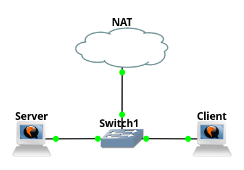
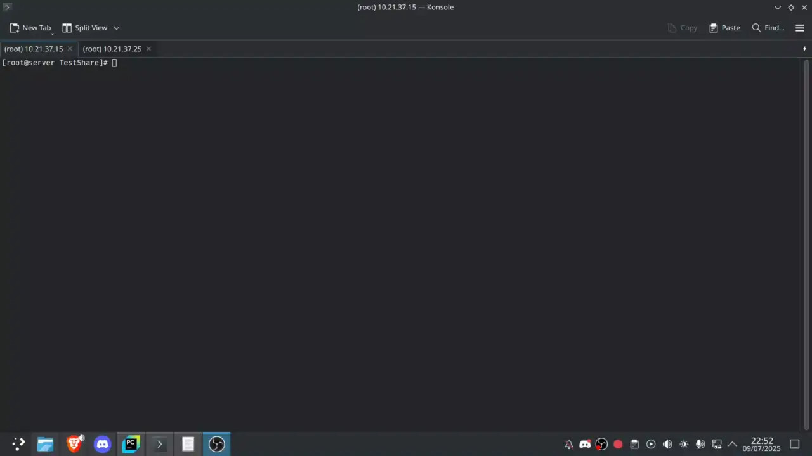
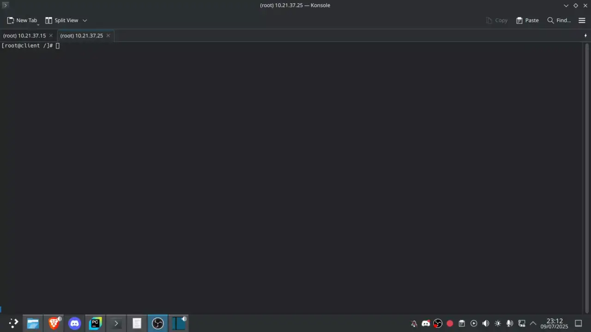

# Chapter 5: Mounting and Using Filesystems
For the purpose of this chapter I set up samba and nfs server <br>

## Lab setup
 <br>

### Samba
```
/etc/samba/smb.conf
[global]
workgroup = WORKGROUP
security=user
map to guest = Bad User

[TestShare]
path=/opt/TestShare
force user = smbuser
create mask = 0664
force create mode = 0664
directory mask = 0775
force directory mode = 0775
writable = yes
```

### nfs
```
/etc/exports
#yes literary just that
/opt/nfs 10.21.37.0/24(rw)
```

### Finishing commands
```
systemctl start smb
useradd -m smbuser
passwd smbuser
smbpasswd -a smbuser
mkdir /opt/TestShare
mkdir /opt/nfs
chown -R smbuser TestShare/
systemctl start nfs-server
```

## Actual Content
Once you create a filesystem. You have to mount it <br>
The "mount" command without any arguments shows currently mounted filesystems <br>
```
[root@client ~]# mount
proc on /proc type proc (rw,nosuid,nodev,noexec,relatime)
sys on /sys type sysfs (rw,nosuid,nodev,noexec,relatime)
dev on /dev type devtmpfs (rw,nosuid,relatime,size=1989640k,nr_inodes=497410,mode=755,inode64)
run on /run type tmpfs (rw,nosuid,nodev,relatime,mode=755,inode64)
...
```
You can use command "lsblk" to show where block devices are mounted <br>
```
[root@client ~]# lsblk
NAME   MAJ:MIN RM  SIZE RO TYPE MOUNTPOINTS
fd0      2:0    1    4K  0 disk 
sda      8:0    0  200G  0 disk 
├─sda1   8:1    0    1G  0 part /boot
└─sda2   8:2    0  199G  0 part /
sdb      8:16   0   50G  0 disk 
sr0     11:0    1 1024M  0 rom 
```
In my case sda2 partition is mounted as root and sda1 is mounted in /boot <br>

To mount a filesystem you have two options, use command "mount" or edit "/etc/fstab" <br> 
The command mount is not persistent and after reboot you will have to mount it again <br>
The most basic way to use mount is to provide block device followed by a directory <br>
```
[root@client ~]# lsblk
NAME   MAJ:MIN RM  SIZE RO TYPE MOUNTPOINTS
fd0      2:0    1    4K  0 disk 
sda      8:0    0  200G  0 disk 
├─sda1   8:1    0    1G  0 part /boot
└─sda2   8:2    0  199G  0 part /
sdb      8:16   0   50G  0 disk 
sr0     11:0    1 1024M  0 rom  
[root@client ~]# mount /dev/sdb /mnt
[root@client ~]# lsblk
NAME   MAJ:MIN RM  SIZE RO TYPE MOUNTPOINTS
fd0      2:0    1    4K  0 disk 
sda      8:0    0  200G  0 disk 
├─sda1   8:1    0    1G  0 part /boot
└─sda2   8:2    0  199G  0 part /
sdb      8:16   0   50G  0 disk /mnt
sr0     11:0    1 1024M  0 rom  
[root@client ~]# 
```
Alternatively you do it by "/etc/fstab". Which will mount disk automatically on reboot. So it's persistent <br>
```
#(what device) (mount directory) (file system) (options) (dump) (pass)
UUID=fc207422-0994-44f0-9bae-c4016556ac3d /mnt ext4 rw 0 2
```
Note: You can specify disk by "/dev/something" or by UUID's, lables and some more options. <br>
In this example I got UUID of disk from command "blkid" <br>
```
[root@client mnt]# blkid
/dev/sdb: UUID="fc207422-0994-44f0-9bae-c4016556ac3d" BLOCK_SIZE="4096" TYPE="ext4"
/dev/sda2: UUID="4e45d3c1-6576-43ab-af84-cdc5b32e5abe" BLOCK_SIZE="4096" TYPE="ext4" PARTUUID="7d2d39fc-0d3e-47cf-aa62-87db46b32f6f"
/dev/sda1: UUID="50C4-3705" BLOCK_SIZE="512" TYPE="vfat" PARTUUID="6f34f141-6822-4812-9dc5-462c573a05c6"
[root@client mnt]# 
```

Additionally, if you have disk specified in "/etc/fstab". You can just provide disk in mount command, and it will use options used in fstab. <br>
```
[root@client ~]# lsblk
NAME   MAJ:MIN RM  SIZE RO TYPE MOUNTPOINTS
fd0      2:0    1    4K  0 disk 
sda      8:0    0  200G  0 disk 
├─sda1   8:1    0    1G  0 part /boot
└─sda2   8:2    0  199G  0 part /
sdb      8:16   0   50G  0 disk 
sr0     11:0    1 1024M  0 rom  
[root@client ~]# mount /dev/sdb 
[root@client ~]# lsblk
NAME   MAJ:MIN RM  SIZE RO TYPE MOUNTPOINTS
fd0      2:0    1    4K  0 disk 
sda      8:0    0  200G  0 disk 
├─sda1   8:1    0    1G  0 part /boot
└─sda2   8:2    0  199G  0 part /
sdb      8:16   0   50G  0 disk /mnt
sr0     11:0    1 1024M  0 rom  
[root@client ~]# 
```

While most of the arguments are self-explanatory. Two of them I didn't know fully here is brief explanation from my study guide <br>
- Dump: You will most likely leave this to 0 (otherwise set it to 1) to disable the dump utility to back up the filesystem upon boot (The dump program was once a common backup tool, but it is much less popular today.)
- Pass: This column specifies whether the integrity of the filesystem should be checked at boot time with fsck. A 0 means that fsck should not check a filesystem

Coming back to filesystem options. There are multiple options and covering everything is infeasible. <br>
With filesystem options you can do a lot as there is lots of them for example:
- Mount the file system as read only 
  ```
  [root@client ~]# mount /dev/sdb /mnt -o ro
  [root@client ~]# mkdir /mnt/test
  mkdir: cannot create directory ‘/mnt/test’: Read-only file system
  [root@client ~]#
  ```
- Prevent execution of any executables
  ```
  [root@client ~]# mount /dev/sdb /mnt -o noexec
  [root@client ~]# echo "echo hi" >> /mnt/test.sh
  [root@client ~]# chmod +x /mnt/test.sh 
  [root@client ~]# /mnt/test.sh
  -bash: ./test.sh: Permission denied
  [root@client ~]#
  ```
Note: "man mount" command provides list of all options. Additionally, some of the filesystems have their options for example btrfs, if it dies you can use option like "recovery" to try to mount it. Or mount only specific subvolume etc. <br>

To unmount disk. You just use "unmount" command. You can provide either where disk is mounted or the block device itself. <br>
```
[root@client ~]# lsblk
NAME   MAJ:MIN RM  SIZE RO TYPE MOUNTPOINTS
fd0      2:0    1    4K  0 disk 
sda      8:0    0  200G  0 disk 
├─sda1   8:1    0    1G  0 part /boot
└─sda2   8:2    0  199G  0 part /
sdb      8:16   0   50G  0 disk /mnt
sr0     11:0    1 1024M  0 rom  
[root@client ~]# umount /mnt
# or umount /dev/sdb
```
If any program is using your disk you will be prevented from unmounting it. (Including you being in the directory in the console) <br>
You can check what is happening with handy command "lsof" <br>
```
[root@client mnt]# lsof /mnt
COMMAND  PID USER  FD   TYPE DEVICE SIZE/OFF NODE NAME
bash    1314 root cwd    DIR   8,16     4096    2 /mnt
lsof    1842 root cwd    DIR   8,16     4096    2 /mnt
lsof    1843 root cwd    DIR   8,16     4096    2 /mnt
[root@client mnt]# umount /mnt
umount: /mnt: target is busy.
[root@client mnt]# cd ..
[root@client /]# lsof /mnt
[root@client /]# umount /mnt
[root@client /]# 
```

### Networked Filesystems
My study guide covers SMB and NFS as they are most popular. I've shown how I set it up at the top. <br>
Additionally it will be covered later on more properly. (Server setup wise) <br>

#### SMB
1. Install smbclient
2. Create a file containing credentials <br>
   ```
   /etc/sambaCredentials
   username=smbuser
   password=Password1
   ```
3. Make file readable only to owner <br>
   ```
   [root@client etc]# chmod 600 /etc/sambaCredentials
   ```
4. Add it to /etc/fstab <br>
   ```
   //10.21.37.15/TestShare /mnt/ cifs credentials=/etc/sambaCredentials,defaults 0 0
   ```
Now you can mount it via ``mount //10.21.37.15/TestShare`` <br>
Alternatively you can just use mount with specific options <br>
```
[root@client /]# mount //10.21.37.15/TestShare /mnt -t cifs -o credentials=/etc/sambaCredentials,defaults
```
Or bypass the credentials file fully <br>
```
[root@client /]# mount //10.21.37.15/TestShare /mnt -t cifs -o username=smbuser,password=Password1,defaults
```
At this point it's working, cool. <br>


#### NFS
The process of mounting nfs is really similar to smb. I will not bullet point it <br>
```
/etc/fstab
10.21.37.15:/opt/nfs/ /mnt nfs defaults 0 0
```
Or 
```
[root@client /]# mount -t nfs 10.21.37.15:/opt/nfs /mnt
```
And again, it's working cool <br>
