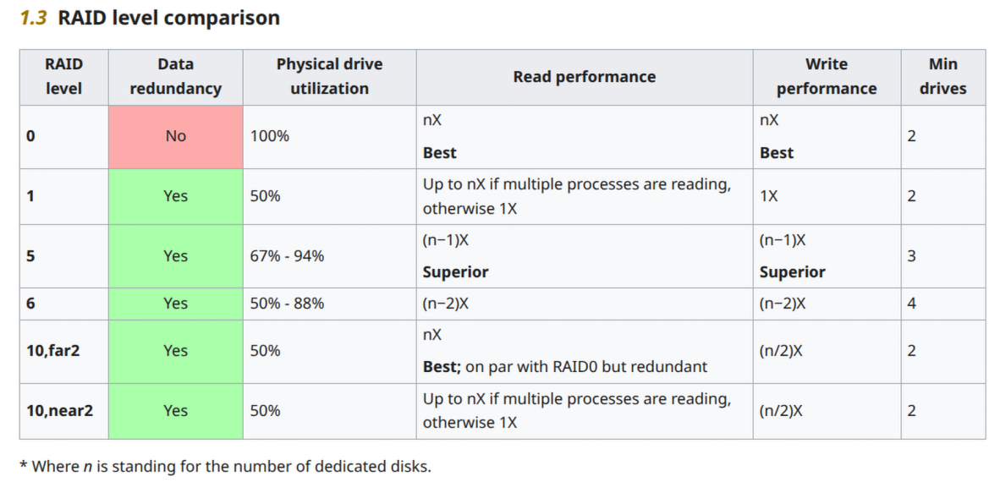

# Chapter 6: RAIDs and Backups
Finally, something interesting which I didn't do before. <br>
For the purpose of this chapter I have a vm with 3 disks attached, so I can test different raid levels. <br>
```
[root@server ~]# lsblk
NAME   MAJ:MIN RM  SIZE RO TYPE MOUNTPOINTS
fd0      2:0    1    4K  0 disk 
sda      8:0    0  200G  0 disk 
├─sda1   8:1    0    1G  0 part /boot
└─sda2   8:2    0  199G  0 part /
sdb      8:16   0   50G  0 disk 
sdc      8:32   0   50G  0 disk 
sdd      8:48   0   50G  0 disk 
```

## RAID Devices
There are multiple raid levels, each one with its own benefits and drawbacks <br>
I will briefly bullet point it, but this video is actually pretty good https://youtu.be/U-OCdTeZLac <br>
- RAID 0 - Assuming you have disk sda, sdb your data will be split 50%, 50% between those two (or more) disks. You get improved read and write speeds. But is not safe for data
- RAID 1 - Assuming you have 4 disks. With this setup you store data on 2 and 2 are for redundancy. (Data is most safe on this level, but is expensive)
- RAID 5 - This level requires at least 3 disks. If one disk fails you can recover it. (Watch video linked above)
- RAID 6 - Similar to RAID 5 but two disks can fail. (Of course at cost of less data available as more parity is stored)

It's also important to mention that RAID should be setup on disks with the same size. If you try to set up for example RAID 0 on disks which do not have equal size the max RAID size is of smallest disk. <br>
Note: I like this table from arch wiki <br>


## Creation of RAID
Note: Between tests I had to stop the array in order to overwrite it with other RAID level. <br>
```
[root@server ~]# mdadm --stop /dev/md/testraid0 
mdadm: stopped /dev/md/testraid0
```
You can additionally use ``mdadm --misc --zero-superblock /dev/drive`` to remove RAID metadata on a disks used in RAID array. Which will make the disk look like it was never part of any array.
### RAID 0
```
[root@server ~]# mdadm --create --verbose --level=stripe --raid-devices=2 /dev/md/testraid0 /dev/sdb /dev/sdc
mdadm: chunk size defaults to 512K
mdadm: Defaulting to version 1.2 metadata
mdadm: array /dev/md/testraid0 started.
[root@server ~]# lsblk
NAME    MAJ:MIN RM  SIZE RO TYPE  MOUNTPOINTS
fd0       2:0    1    4K  0 disk  
sda       8:0    0  200G  0 disk  
├─sda1    8:1    0    1G  0 part  /boot
└─sda2    8:2    0  199G  0 part  /
sdb       8:16   0   50G  0 disk  
└─md127   9:127  0 99.9G  0 raid0 
sdc       8:32   0   50G  0 disk  
└─md127   9:127  0 99.9G  0 raid0 
sdd       8:48   0   50G  0 disk  
[root@server ~]# mkfs.ext4 /dev/md/testraid0 
mke2fs 1.47.2 (1-Jan-2025)
Discarding device blocks: done                            
Creating filesystem with 26197504 4k blocks and 6553600 inodes
Filesystem UUID: 47007c4f-0a77-47a4-a653-b5637b56acd5
Superblock backups stored on blocks: 
        32768, 98304, 163840, 229376, 294912, 819200, 884736, 1605632, 2654208, 
        4096000, 7962624, 11239424, 20480000, 23887872

Allocating group tables: done                            
Writing inode tables: done                            
Creating journal (131072 blocks): done
Writing superblocks and filesystem accounting information: done   

[root@server ~]# mount /dev/md/testraid0 /mnt
```
Successfully created array size is 100Gb's which is 2x50. Expected from RAID 0. 
### RAID 1
```
[root@server ~]# mdadm --create --verbose --level=1 --raid-devices=2 /dev/md/testraid1 /dev/sdb /dev/sdc
To optimalize recovery speed, it is recommended to enable write-indent bitmap, do you want to enable it now? [y/N]? y
mdadm: Note: this array has metadata at the start and
    may not be suitable as a boot device.  If you plan to
    store '/boot' on this device please ensure that
    your boot-loader understands md/v1.x metadata, or use
    --metadata=0.90
mdadm: size set to 52395008K
Continue creating array [y/N]? y
mdadm: Defaulting to version 1.2 metadata
mdadm: array /dev/md/testraid1 started.
[root@server ~]# lsblk
NAME    MAJ:MIN RM  SIZE RO TYPE  MOUNTPOINTS
fd0       2:0    1    4K  0 disk  
sda       8:0    0  200G  0 disk  
├─sda1    8:1    0    1G  0 part  /boot
└─sda2    8:2    0  199G  0 part  /
sdb       8:16   0   50G  0 disk  
└─md127   9:127  0   50G  0 raid1 
sdc       8:32   0   50G  0 disk  
└─md127   9:127  0   50G  0 raid1 
sdd       8:48   0   50G  0 disk  
[root@server ~]# mkfs.ext4 /dev/md/testraid1 
mke2fs 1.47.2 (1-Jan-2025)
/dev/md/testraid1 contains a ext4 file system
        last mounted on Thu Jul 10 21:38:42 2025
Proceed anyway? (y,N) y
Discarding device blocks: done                            
Creating filesystem with 13098752 4k blocks and 3276800 inodes
Filesystem UUID: dba2df7c-0d13-4e69-a6b5-12b72c992822
Superblock backups stored on blocks: 
        32768, 98304, 163840, 229376, 294912, 819200, 884736, 1605632, 2654208, 
        4096000, 7962624, 11239424

Allocating group tables: done                            
Writing inode tables: done                            
Creating journal (65536 blocks): done
Writing superblocks and filesystem accounting information: done   
[root@server ~]# mount /dev/md/testraid1 /mnt
```
Successfully created, one disk is used for data and other for redundancy. (50Gb usable)
### RAID 5
```
[root@server ~]# mdadm --create --verbose --level=5 --raid-devices=3 /dev/md/testraid5 /dev/sdb /dev/sdc /dev/sdd
To optimalize recovery speed, it is recommended to enable write-indent bitmap, do you want to enable it now? [y/N]? y
mdadm: layout defaults to left-symmetric
mdadm: layout defaults to left-symmetric
mdadm: chunk size defaults to 512K
mdadm: size set to 52395008K
mdadm: Defaulting to version 1.2 metadata
mdadm: array /dev/md/testraid5 started.
[root@server ~]# lsblk
NAME    MAJ:MIN RM  SIZE RO TYPE  MOUNTPOINTS
fd0       2:0    1    4K  0 disk  
sda       8:0    0  200G  0 disk  
├─sda1    8:1    0    1G  0 part  /boot
└─sda2    8:2    0  199G  0 part  /
sdb       8:16   0   50G  0 disk  
└─md127   9:127  0 99.9G  0 raid5 
sdc       8:32   0   50G  0 disk  
└─md127   9:127  0 99.9G  0 raid5 
sdd       8:48   0   50G  0 disk  
└─md127   9:127  0 99.9G  0 raid5 
#Pointless to show ext4 formatting and mouting again.
```
Successfully created, 100Gb's available which make sense as 1/3 is used for parity data. <br>
Note: ``--spare-devices=1 /dev/sde`` could be used which marks particular device to be used well as spare. If one disk dies it will automatically be added to array and rebuild data. It does not actively participate in the array <br>
### RAID 6
Because I created my test VM under GNS3 and I can only add 3 disks. I mounted a file, so I can use it as "pseudo-disk". <br>
```
[root@server ~]# fallocate -l 50G pseudodisk.img
[root@server ~]# losetup -P /dev/loop0 pseudodisk.img 
[root@server ~]# 
```

```
[root@server ~]# mdadm --create --verbose --level=6 --raid-devices=4 /dev/md/testraid6 /dev/sdb /dev/sdc /dev/sdd /dev/loop0
To optimalize recovery speed, it is recommended to enable write-indent bitmap, do you want to enable it now? [y/N]? y
mdadm: layout defaults to left-symmetric
mdadm: layout defaults to left-symmetric
mdadm: chunk size defaults to 512K
mdadm: size set to 52395008K
mdadm: Defaulting to version 1.2 metadata
mdadm: array /dev/md/testraid6 started.
[root@server ~]# lsblk
NAME    MAJ:MIN RM  SIZE RO TYPE  MOUNTPOINTS
fd0       2:0    1    4K  0 disk  
loop0     7:0    0   50G  0 loop  
└─md127   9:127  0 99.9G  0 raid6 
sda       8:0    0  200G  0 disk  
├─sda1    8:1    0    1G  0 part  /boot
└─sda2    8:2    0  199G  0 part  /
sdb       8:16   0   50G  0 disk  
└─md127   9:127  0 99.9G  0 raid6 
sdc       8:32   0   50G  0 disk  
└─md127   9:127  0 99.9G  0 raid6 
sdd       8:48   0   50G  0 disk  
└─md127   9:127  0 99.9G  0 raid6 
[root@server ~]# 
```
Successfully created, I added one disk, but RAID 6 stores more parity data so two disks can fail, and we have the same available space as RAID 5 even with one more disk. <br>
Note: ``--spare-devices`` option is available there, I explained it above

### RAID 1+0 
```
[root@server ~]# mdadm --create --verbose --level=10 --raid-devices=4 /dev/md/testraid10 /dev/sdb /dev/sdc /dev/sdd /dev/loop0
To optimalize recovery speed, it is recommended to enable write-indent bitmap, do you want to enable it now? [y/N]? y
mdadm: layout defaults to n2
mdadm: layout defaults to n2
mdadm: chunk size defaults to 512K
mdadm: Defaulting to version 1.2 metadata
mdadm: array /dev/md/testraid10 started.
[root@server ~]# lsblk
NAME    MAJ:MIN RM  SIZE RO TYPE   MOUNTPOINTS
fd0       2:0    1    4K  0 disk   
loop0     7:0    0   50G  0 loop   
└─md127   9:127  0 99.9G  0 raid10 
sda       8:0    0  200G  0 disk   
├─sda1    8:1    0    1G  0 part   /boot
└─sda2    8:2    0  199G  0 part   /
sdb       8:16   0   50G  0 disk   
└─md127   9:127  0 99.9G  0 raid10 
sdc       8:32   0   50G  0 disk   
└─md127   9:127  0 99.9G  0 raid10 
sdd       8:48   0   50G  0 disk   
└─md127   9:127  0 99.9G  0 raid10 
```
Successfully created, 2 disks redundancy + 2 disks for data = 100Gb usable space <br> 
Note: ``--spare-devices`` option is available there, I explained it above <br>

Also arch wiki says that some additional configuration might be required for optimal performance over raid <br>
https://wiki.archlinux.org/title/RAID#Format_the_RAID_filesystem 

## Management of RAID
You can view status of your RAID by using <br>
```
[root@server ~]# cat /proc/mdstat 
Personalities : [raid0] [raid1] [raid4] [raid5] [raid6] [raid10] 
md127 : active raid10 loop0[3] sdd[2] sdc[1] sdb[0]
      104790016 blocks super 1.2 512K chunks 2 near-copies [4/4] [UUUU]
      [============>........]  resync = 60.7% (63691136/104790016) finish=3.4min speed=200033K/sec
      bitmap: 1/1 pages [4KB], 65536KB chunk

unused devices: <none>
[root@server ~]# 
```
Or more detailed with <br>
```
[root@server ~]# mdadm --detail /dev/md/testraid10
/dev/md/testraid10:
           Version : 1.2
     Creation Time : Thu Jul 10 22:40:50 2025
        Raid Level : raid10
        Array Size : 104790016 (99.94 GiB 107.30 GB)
     Used Dev Size : 52395008 (49.97 GiB 53.65 GB)
      Raid Devices : 4
     Total Devices : 4
       Persistence : Superblock is persistent

     Intent Bitmap : Internal

       Update Time : Thu Jul 10 22:48:37 2025
             State : clean, resyncing 
    Active Devices : 4
   Working Devices : 4
    Failed Devices : 0
     Spare Devices : 0

            Layout : near=2
        Chunk Size : 512K

Consistency Policy : bitmap

     Resync Status : 89% complete

              Name : server:testraid10  (local to host server)
              UUID : 47901a79:c2325f9c:b4fbc25f:b2cbdb36
            Events : 93

    Number   Major   Minor   RaidDevice State
       0       8       16        0      active sync set-A   /dev/sdb
       1       8       32        1      active sync set-B   /dev/sdc
       2       8       48        2      active sync set-A   /dev/sdd
       3       7        0        3      active sync set-B   /dev/loop0
[root@server ~]# 
```
Note: You can configure `mdmonitor.service` to send email if something is happening with your array. From what I see that's it. And my study guide kinda covers it and kinda not (i just know it exists). 

We can add devices to array by ``mdadm /dev/md0 --add /dev/sdX``. It should also automatically start rebuilding data if disk failed on raid 5 or other raid level <br>
You can remove device from array by <br>
```
mdadm -stop /dev/md0 # Stop the array
mdadm -remove /dev/md0 # Remove the RAID device
mdadm -zero-superblock /dev/sdX1 # Overwrite the existing md
superblock with zeroes
```

## Creating and Managing System Backups
Backups are important. I will not try to argue or explain it. Imagine a bank without backup and all databases getting deleted or something along those lines <br>
I know a 3-2-1 rule <br>
3 Copies of data, On 2 different media and 1 copy being off-site <br>
Additionally my study guide actually asks good questions <br>
1) What do you use your system for?(Desktop or server?If the latter case applies, what are the most critical services - whose configuration would be a real pain to lose?)
2) How often do you need to take backups of your system?
3) What is the data (e.g. files / directories / database dumps) that you want to back up? You may also want to consider if you really need to back up huge files (such as audio or video files).

### Method 1
Cloning whole disk <br>
``dd if=/dev/sda of=/system_images/sda.img``
Alternatively you can also compress it <br>
``dd if=/dev/sda | gzip -c > /system_images/sda.img.gz ``
Additionally, you can use other compression such as xz, zstd etc. Depending on what are your needs. <br>

Then when you need to recover you can do <br>
``dd if=/system_images/sda.img of=/dev/sda``
Or if you used gzip compression <br>
``gzip -dc /system_images/sda.img.gz | dd of=/dev/sda``

### Method 2
Backup only specific directories with tar which was covered in Chapter 3 <br>

### Method 3
Use rsync to copy directories locally <br>
``rsync -av source_directory destination_directory``
Or to remote server <br>
``rsync -avzhe ssh backups root@remote_host:/remote_directory/``
To pull files back you just inverse the directories <br>
Note: Following options slightly explained: 
- a: recurse into subdirectories (if they exist), preserve symbolic links, timestamps,
permissions, and original owner / group
- v: verbose, shows what files are copied at the moment what is exactly happening. 
- h: shows file sized in human readable format 
- e: specifies what protocol to use e.g ssh to send the files. 

### Method XYZ
My study guide doesn't mention everything and perhaps this is impossible. For example above methods might not be the best for backing up databases. There might be some property program that you manage that require different backup method etc. So you have to pick what backup method suits you best and perhaps do some additional research <br>


### Last Notes
I am surprised that my study guide doesn't mention backup types such as incremental, full, differential <br>
Here is a good video to watch https://youtu.be/o-83E6levzM that explains types of backups <br>
Additionally nothing was mentioned about security of the backups, it would be good so those are encrypted and if someone would access it the data is still safe