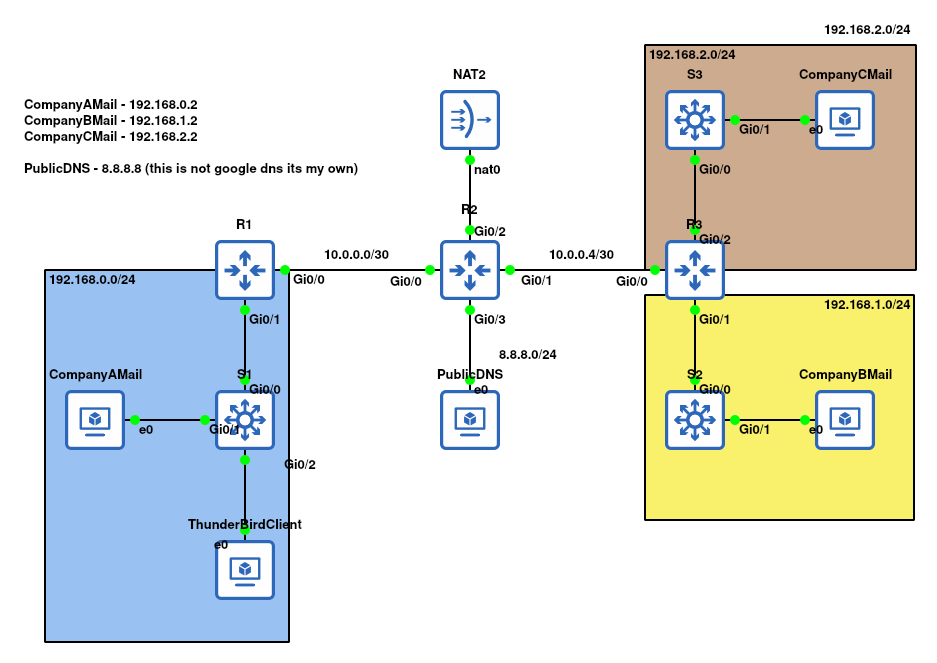
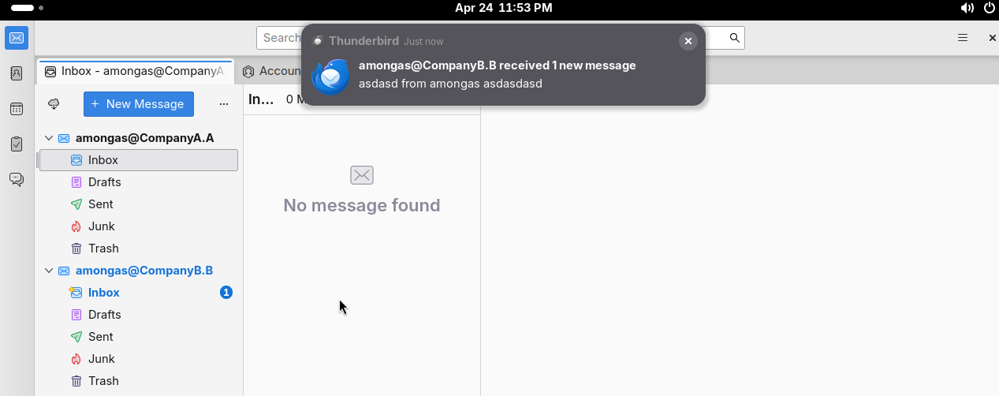
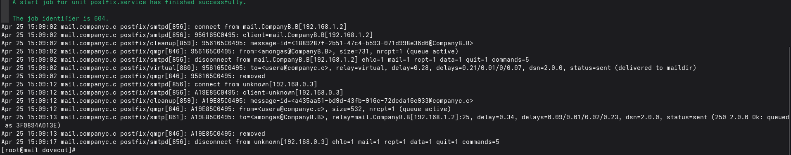
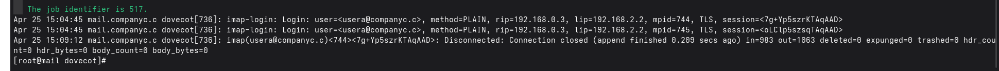
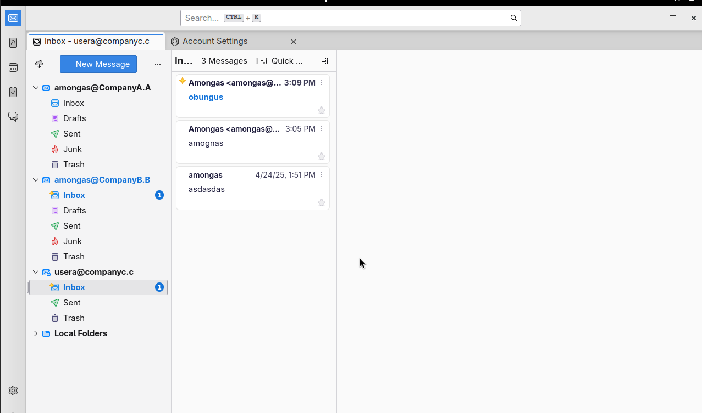
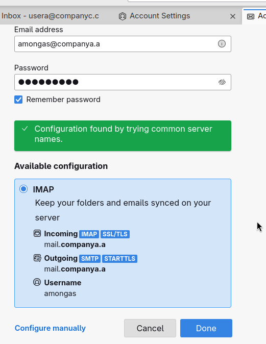
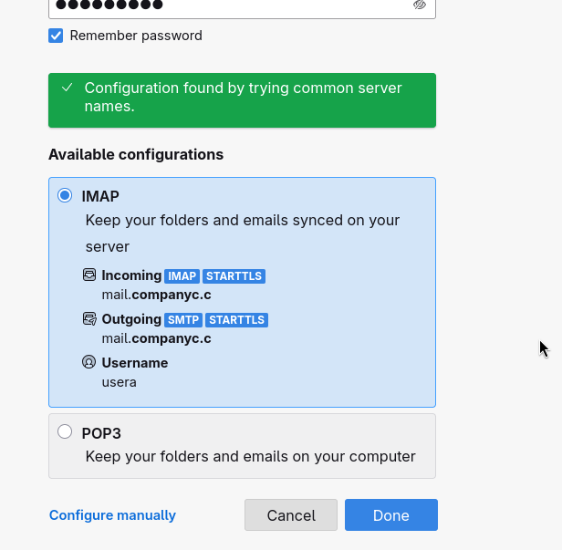
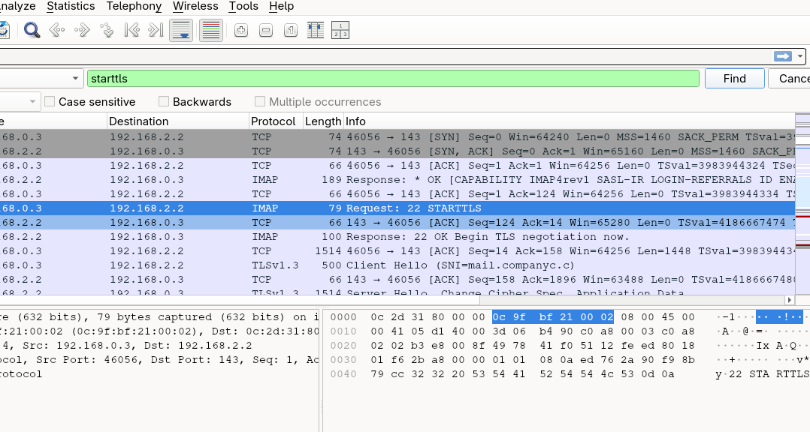

# MailServers
I needed mail server for packetfence, then I realised I never did it. <br>
There is no particular scenario rather milestones. <br>
It's because I started configuring it and then after 2 days I kinda was not progressing anywhere. <br>

## Milestones
1. Configure basic mail no authentication no encryption it must just work ✅
2. Configure virtual users ✅
3. Configure sasl authentication ✅
4. Reconfigure everything so it actually supports encryption and is safe to use ✅
5. Configure a nice solution https://wiki.archlinux.org/title/Virtual_user_mail_system_with_Postfix,_Dovecot_and_Roundcube (Won't be done in foreseeable future) ❌ 

## Network Topology
 <br>
1. There is no reason why ThunderBirdClient is where it is (it just needs to access all MailServers)
2. This network only provides routing, so I can test dns and mail servers correctly the network design behind this is non-existent.                 

## DNS Configuration
1. First device added to this network was DNS. This is plain arch linux running "named" dns server.
2. For each domain used (CompanyA.A, CompanyB.B, CompanyC.C). I created a forward zone and reverse zone in /etc/named.conf <br>
    ```
    zone "CompanyA.A" {
        type master;
        file "CompanyA.A.zone";
    };
    
    zone "0.168.192.in-addr.arpa" IN {
        type master;
        file "192.168.0.zone";
    };
    ```
3. For each domain I then created the zone files. Forward zone required A, NS and MX record. (Each domain was the same config just different ip addresses) <br>
    ```
   $TTL 604800
    @       IN      SOA     ns.CompanyA.A. admin.CompanyA.A. (
                            2024052001     ; Serial
                            3600           ; Refresh
                            1800           ; Retry
                            604800         ; Expire
                            86400          ; Minimum TTL
    )
    
    @       IN      NS      ns.CompanyA.A.
    ns      IN      A       8.8.8.8
    @       IN      MX      10         mail.CompanyA.A.
    mail    IN      A       192.168.0.2
   ```
4. Additionally for reverse zone it looks like that. <br>
    ```
   $TTL 604800
    @   IN  SOA  ns.CompanyA.A. admin.CompanyA.A. (
                    2024052001 ; Serial
                    3600       ; Refresh
                    1800       ; Retry
                    604800     ; Expire
                    86400      ; Minimum TTL
    )
    
    @       IN  NS  ns.CompanyA.A.
    2     IN  PTR mail.CompanyA.A.
   ```
5. Sample Dig records for CompanyA.A are available in MailServers/DigSamples.txt (170 lines there would mess this document) <br>


Additionally, I could configure this as "CompanyA.com" or "CompanyB.com" but I chose "CompanyA.A" there is no reason why I did this way, I just rolled with it <br>
Also while progressing and researching that somewhat recently it's required to have SPF and some more additional txt records in DNS. If you don't have that gmail could mark emails as spam. <br>
This is good to know however for the purpose of this lab this is N/A. <br>
https://gist.github.com/howyay/57982e6ba9eedd3a5662c518f1b985c7 <br>
https://docker-mailserver.github.io/docker-mailserver/latest/usage/

## Milestone 1
While setting this up I had no idea what to do. So I cheated and I used docker (I needed a known good configuration, so I can debug what I am doing). <br>
CompanyA.A and CompanyB.B are running https://docker-mailserver.github.io/docker-mailserver/latest/ <br>
This configuration is still invalid as I believe end-to-end encryption is not enabled and this is bare minimum configuration (which is insecure). <br>
In milestone 4 I will reconfigure it so it would be "production ready". However, to just test my configuration it's good enough.

1. I installed arch for CompanyA and CompanyB, configured addressing installed docker, not interesting stuff.
2. Copy compose.yaml from their github. I provide mine in MailServers/Milestone1. The only thing i changed is hostname to mail.CompanyA.A (and mail.CompanyB.B) for B <br>
3. Again copy mailserver.env from their github. I didn't do anything to it.
4. Run "docker compose up -d"
5. Run "docker exec -it (container name) setup email add (user@domain) (password)"

At this point you can connect with thunderbird or other email client with the credentials you just put. <br>
Additionally sending emails between CompanyA.A and CompanyB.B works. <br>
 <br>

----
Yea at this point starts manual configuration of postfix and dovecot. Took me some time to understand how this works. <br>
It's again important to mention that this configuration is insecure and I will configure it in future to be secure.
1. Installed fresh arch linux configured it with hostname mail.CompanyC.C etc. installed postfix dovecot 
2. Configure postfix. <br>
    `/etc/postfix/main.cf`
    ```
    # This is where emails are saved, this will be located in user linux home directory. If it's file all emails are saved to one file
    # If it's directory everything is nicely split into directories. (Dovecot supports both formats, it's important to configure dovecot to read this folder file as otherwise you might be able to send email and receive but it won't be visible in your mailbox)
    home_mailbox = MailDir/
   
    #Those are variables
    myhostname = mail.companyc.c
    mydomain = companyc.c
    
    #Origin of email for example this server could receive from CompanyA.A and CompanyB.B however it will respond with $mydomain domain
    myorigin = $mydomain
    
    #This is actually what emails it will handle for example removing $mydomain (which evaluates to companyc.c) means it just wont handle @companyc.c domains.
    mydestination = $myhostname localhost.$mydomain localhost $mydomain
    
    #on what interfaces to listen
    inet_interfaces = all
    
    #This setting is big security risk it's essentially authentication. It allows hosts from certain networks to use our server
    #However by using 0.0.0.0/0 it means everyone can use this server to forward email which is not particularly great (For initial configuration and lack of my understanding it was good)
    #Later on this is disabled and SASL authentication handles whether host can send mail or not
    mynetworks = 0.0.0.0/0

    # This setting is responsible for forwarding mail. In this case it only forwards mails to my domain. Which is a secure option
    relay_domains = $mydomain
    # Specifies whether other host is responbile for forwarding our mail, with this setting our current server handles forwards
    relayhost =
    ```
3. For dovecot, I followed all steps from https://wiki.archlinux.org/title/Dovecot. From 2.2 to 2.5  <br>
    - Create TLS certificate (This means that accessing mailbox is encrypted, but it doesn't mean the sending or receiving is, as postfix needs to be configured for that, neither it's end-to-end encrypted) <br>
        ``cp /usr/share/doc/dovecot/dovecot-openssl.cnf /etc/ssl/dovecot-openssl.cnf`` <br>
        Edit ``/etc/ssl/dovecot-openssl.cnf`` <br>
        This actually generates the TLS certificate <br>
        ``./usr/lib/dovecot/mkcert.sh`` <br>
        ``cp /etc/ssl/certs/dovecot.pem /etc/ca-certificates/trust-source/anchors/dovecot.crt`` <br>
        Updates system certificates <br>
        ``trust extract-compat``
    - Copy default dovecot configurations <br>
        ``mkdir /etc/dovecot`` <br>
        ``cp /usr/share/doc/dovecot/example-config/dovecot.conf /etc/dovecot/dovecot.conf`` <br>
        ``cp -r /usr/share/doc/dovecot/example-config/conf.d /etc/dovecot``
    - Generate DH Key <br>
        ``openssl dhparam -out /etc/dovecot/dh.pem 4096`` <br>
        and configure <br>
        ``/etc/dovecot/conf.d/10-ssl.conf`` <br>
        with line <br>
        ``ssl_dh = </etc/dovecot/dh.pem``
4. Configure Mail Dir (For postfix default format is file, but I changed it to dir this needs to reflect dovecot) <br>
    Edit ``/etc/dovecot/conf.d/10-mail.conf`` <br>
    And place config <br>
    ``mail_location = maildir:~/Maildir``
5. Configure PAM authentication <br>
    Edit ``/etc/dovecot/conf.d/auth-system.conf.ext`` <br>
    And place/uncomment <br>
    ```
   passdb {
      driver = pam
      # [session=yes] [setcred=yes] [failure_show_msg=yes] [max_requests=<n>]
      # [cache_key=<key>] [<service name>]
      args = session=yes dovecot
    }
    ```
   
At this point when you create user <br>
``useradd -m amongas`` <br>
``passwd amongas`` <br>
You will be able to log in via thunderbird or other email client and send and receive emails. <br>
The problem is that there is no security however for milestone one it was good enough.
    
## Milestone 2
Assume you have lots of users. Having to do linux user for each one of them is slightly inconvenient. Hence, I found about the virtual users. <br>
At first I had massive issues configuring them. But here we go <br>
For this documentation I have been using those sources: <br>
https://wiki.archlinux.org/title/Virtual_user_mail_system_with_Postfix,_Dovecot_and_Roundcube <br>
https://doc.dovecot.org/2.3/configuration_manual/virtual_users/ <br>
https://www.postfix.org/VIRTUAL_README.html <br>
### Postfix 
1. Verify (or create) you have vmail user and group. <br>
    ```
    groupadd -g 5000 vmail
    useradd -u 5000 -g vmail -s /usr/bin/nologin -d /home/vmail -m vmail
    ```
2. Config for ``/etc/postfix/main.cf``
    ```
    #explained Milestone 1
    myhostname = mail.companyc.c
    mydomain = companyc.c
    myorigin = $mydomain
    mydestination = localhost
    inet_interfaces = all
    mynetworks = 0.0.0.0/0
    relayhost =
    
    #What domains to handle similar to myorigin
    virtual_mailbox_domains = companyc.c
   
    #Base directory of where virtual users's emails will be written to 
    virtual_mailbox_base = /var/mail/vhosts
   
    #This is location where you define virtual users and their location
    virtual_mailbox_maps = lmdb:/etc/postfix/vmailbox
   
    #No idea it's in documentation tho
    virtual_minimum_uid = 5000
   
    #uid and guid of your vmail user
    virtual_uid_maps = static:5000
    virtual_gid_maps = static:5000
   
    #This is used to define email aliases for example info@companyc.c can be pointed to hr@companyc.c it's like redirect
    virtual_alias_maps = lmdb:/etc/postfix/virtual
    ```
3. Sample of files
   - /etc/postfix/vmailbox
   ```
    usera@companyc.c companyc.c/usera/
    ```
   - /etc/postfix/virtual (is empty, but exist)
4. Generate lmdb files using ``postmap /etc/postfix/vmailbox`` and ``postmap /etc/postfix/virtual``
5. Create required directory ``/var/mail/vhosts/companyc.c/``
6. Assign correct permissions ``chown -R vmail:vmail /var/mail/vhosts/``

At this point you should be able to receive email. When received email it will create a directory (``/var/mail/vhosts/companyc.c/usera``) and you should be able to see email inside.  <br>
Dovecot needs separate configuration. So no login via email client yet.  

### Dovecot
Like mentioned above postfix and dovecot are separate software. Postfix only provides mailbox for usera@companyc.c however that is about it. <br>
We have to recreate this user in dovecot and point to correct directories <br>
1. Generate password using ``doveadm pw -s SHA512-CRYPT``
2. Create ``/etc/dovecot/users`` <br>
   Here is my sample <br>
   user@domain:password::(email user) vmail:(email group) vmail::path to user mailbox 
   ```
    usera@companyc.c:{SHA512-CRYPT}$6$mXv1/NW9ryFn/0eJ$LJMmesleTWHGkDNu4lSWYerhJuqWvio016diLuTiU8EPFdIAvnK3lRcWFkoFkch0NdNAWmO7.uxPUoMqsUMwh.::vmail:vmail::/var/mail/vhosts/companyc.c/usera
   ```
3. Under ``/etc/dovecot/conf.d/10-auth.conf`` <br>
   I commented because i don't want PAM authentication enabled
   ```#!include auth-system.conf.ext``` <br> 
   And i uncommented <br>
   ```!include auth-passwdfile.conf.ext``` 
4. Config for ``/etc/dovecot/conf.d/auth-passwdfile.conf.ext`` <br>
   I changed default_fields and the source files for the databases <br>
   ```
   passdb {
   driver = passwd-file
   args = scheme=CRYPT username_format=%u /etc/dovecot/users
   }
   userdb {
   driver = passwd-file
   args = username_format=%u /etc/dovecot/users
      default_fields = uid=vmail gid=vmail
    }
   ```
5. Additionally under ```/etc/dovecot/conf.d/10-mail.conf``` <br>
    I added line ``mail_location = maildir:/var/spool/mail/vhosts/%d/%n`` <br>
    %d - evaluates to domain e.g companyc.c <br>
    %n - evaluates to user only without domain e.g usera <br>
6. I also repeated steps from Milestone1 with TLS certificate  (``conf.d/10-ssl.conf``) <br>
   ```
   ssl_cert = </etc/ssl/certs/dovecot.pem  # Milestone1 covers that
   ssl_key = </etc/ssl/private/dovecot.pem # Milestone1 covers that
   ssl_dh = </etc/dovecot/dh.pem # Milestone1 covers that
   ```

At this point you should be able to log in. Send receive email via virtual user. <br>
 <br>
 <br>
 <br>

## Milestone 3
This one was surprisingly easy. <br>
I followed https://doc.dovecot.org/2.3/configuration_manual/howto/postfix_and_dovecot_sasl/ <br>

1. Configure ``/etc/dovecot/conf.d/10-master.conf`` <br>
    ```
    service auth {
        unix_listener /var/mail/postfix/private/auth {
        mode = 0660
        # Assuming the default Postfix user and group
        user = postfix
        group = postfix
       }
    }
    ```
2. Configure ``/etc/postfix/main.cf`` <br>
    ```
    smtpd_sasl_auth_enable = yes
    smtpd_sasl_security_options = noanonymous
    smtpd_sasl_type = dovecot
    smtpd_sasl_path = private/auth
    #Additionally I set mynetworks to nothing as we want to authenticate each user that sends mail
    mynetworks = 
   ```
At this point sasl should be working <br>
```
May 09 12:27:41 mail.companyc.c postfix/smtpd[6195]: DFD775C04BC: client=unknown[192.168.0.3], sasl_method=PLAIN, sasl_username=usera@companyc.c
```
## Milestone 4
I started with configuring docker mailserver as it will provide me baseline to test if I configured encryption correctly. <br>
I followed https://docker-mailserver.github.io/docker-mailserver/latest/config/security/ssl/#self-signed-certificates and https://docker-mailserver.github.io/docker-mailserver/latest/config/best-practices/dkim_dmarc_spf/ <br>
For lab environment I chose to use self-signed certificates <br>
1. Configure ``mailserver.env`` <br>
   ``SSL_TYPE=self-signed``
2. Generate certificates <br>
    I could edit the names of certificates, but I didn't <br>
   ```
    mkdir -p demoCA

    step-cli certificate create "Smallstep Root CA" "demoCA/cacert.pem" "demoCA/cakey.pem" \
      --no-password --insecure \
      --profile root-ca \
      --not-before "2021-01-01T00:00:00+00:00" \
      --not-after "2031-01-01T00:00:00+00:00" \
      --san "companya.a" \
      --san "mail.companya.a" \
      --kty RSA --size 2048
    
    step-cli certificate create "Smallstep Leaf" mail.companya.a-cert.pem mail.companya.a-key.pem \
      --no-password --insecure \
      --profile leaf \
      --ca "demoCA/cacert.pem" \
      --ca-key "demoCA/cakey.pem" \
      --not-before "2021-01-01T00:00:00+00:00" \
      --not-after "2031-01-01T00:00:00+00:00" \
      --san "companya.a" \
      --san "mail.companya.a" \
      --kty RSA --size 2048
   ```
3. Move the certificates <br>
    ```
    [root@mail ssl]# pwd
    /root/MailDocker/docker-data/dms/config/ssl
    [root@mail ssl]# find .
    .
    ./mail.CompanyA.A-cert.pem
    ./demoCA
    ./demoCA/cacert.pem
    ./demoCA/cakey.pem
    ./mail.CompanyA.A-key.pem
    [root@mail ssl]#
   ```
4. Configure DNS <br>
   ```
   docker exec -it <CONTAINER NAME> setup config dkim
   ```
   There will be file named mail.txt. <br>
   ```
     [root@mail companya.a]# pwd
     /root/MailDocker/docker-data/dms/config/opendkim/keys/companya.a
     [root@mail companya.a]# cat mail.txt 
     mail._domainkey	IN	TXT	( "v=DKIM1; h=sha256; k=rsa; "
	 \"p=MIIBIjANBgkqhkiG9w0BAQEFAAOCAQ8AMIIBCgKCAQEAxtK78ROIB1qBMRZ453UzNeB3267Omx8C/pVfxb86cSHy6mNZ4uT16Jc8o7Exssn46Mu61ywICNs4lXzO7vNQBYOwkwLA/vrzmKL9PLp94Jk5WUKm9W4MuoAeWlWh4DlZ3ilcIHC0aDNHoUyOjTbRFWlBxW/8da9wE7oY4osmv4ufRif+i9tKVF41o4im+s8oY1ldWLe10YKDT7"
	 \"v9Dq2n9CHjN+QXue1h0rkvx7py2G4S4ZmDdVMTtC1dEc4omr6AxEkTqYBVGh86xGvOHMOr5Qj+hz/HniyTRYxXP4Rc1B7CXcJ1La9BfXPsPK1TLIjhpIDyuCqwv/hhlFKjL4bcBQIDAQAB" )  ; ----- DKIM key mail for companya.a
   ```
   You have to paste that to your DNS zone. <br>
   Additionally configure DMARC and SPF
   ```
    _dmarc.companya.a. IN TXT "v=DMARC1; p=none; sp=none; fo=0; adkim=r; aspf=r; pct=100; rf=afrf; ri=86400; rua=mailto:dmarc.report@companya.a; ruf=mailto:dmarc.report@companya.a"
    companya.a. IN TXT "v=spf1 mx ~all"
   ```
    The whole zone for CompanyA.A should look like that. 
    ```
   $TTL 604800
    @       IN      SOA     ns.CompanyA.A. admin.CompanyA.A. (
                            2024052001     ; Serial
                            3600           ; Refresh
                            1800           ; Retry
                            604800         ; Expire
                            86400          ; Minimum TTL
    )
    
    @       IN      NS      ns.CompanyA.A.
    ns      IN      A       8.8.8.8
    @       IN      MX      10         mail.CompanyA.A.
    mail    IN      A       192.168.0.2
    mail._domainkey IN      TXT     ( "v=DKIM1; h=sha256; k=rsa; "
              "p=MIIBIjANBgkqhkiG9w0BAQEFAAOCAQ8AMIIBCgKCAQEAxtK78ROIB1qBMRZ453UzNeB3267Omx8C/pVfxb86cSHy6mNZ4uT16Jc8o7Exssn46Mu61ywICNs4lXzO7vNQBYOwkwLA/vrzmKL9PLp94Jk5WUKm9W4MuoAeWlWh4DlZ3ilcIHC0aDNHoUyOjTbRFWlBxW>
              "v9Dq2n9CHjN+QXue1h0rkvx7py2G4S4ZmDdVMTtC1dEc4omr6AxEkTqYBVGh86xGvOHMOr5Qj+hz/HniyTRYxXP4Rc1B7CXcJ1La9BfXPsPK1TLIjhpIDyuCqwv/hhlFKjL4bcBQIDAQAB" )  ; ----- DKIM key mail for companya.a
    _dmarc.companya.a. IN TXT "v=DMARC1; p=none; sp=none; fo=0; adkim=r; aspf=r; pct=100; rf=afrf; ri=86400; rua=mailto:dmarc.report@companya.a; ruf=mailto:dmarc.report@companya.a"
    companya.a. IN TXT "v=spf1 mx ~all"
   ```
5. Import certificates. <br>
   Because this is a lab, and I am using self-signed certificates. Upon sending mail at this point you will get error that certificate is unknown. <br>
   You need to import CA certificate from CompanyA.A to CompanyB.B and opposite. <br>
   Copy cert to ``/etc/ssl/certs`` <br>
   And run ``update-ca-trust`` <br>
6. Do above tasks for other mailserver. 

Now when trying to connect via thunderbird I can see that Incoming and Outgoing mail are using encryption <br>
 <br>
I additionally checked with wireshark. I can see that starttls occurs and encrypted data follows. <br>
I also checked for email content and user login information. It looks like it's encrypted as I was unable to find it. (Where previosuely it was going without encryption and I was able to find it). <br>
The wireshark capture is available in ``Milestone4/CompanyA.A.pcapng`` <br>

Now to configure CompanyC.C. <br>
1. Generate Certificates (It was above)
2. Configure postfix. <br>
    I used tls configuration from the docker-mailserver. As this is known good configuration. <br>
    ```
        # TLS parameters
        # These [snakeoil files actually exist](https://askubuntu.com/questions/396120/what-is-the-purpose-of-the-ssl-cert-snakeoil-key), but shouldn't ever >
        # If no `SSL_TYPE` env is set, "plaintext" is configured, but still accepts SSL with these:
        smtpd_tls_chain_files = /etc/postfix/mail.CompanyC.C-key.pem /etc/postfix/mail.CompanyC.C-cert.pem
        smtpd_tls_CAfile = /etc/postfix/cacert.pem
        smtp_tls_CAfile = /etc/postfix/cacert.pem
        smtpd_tls_security_level = may
        smtpd_tls_loglevel = 1
        smtp_tls_security_level = may
        smtp_tls_loglevel = 1
        
        # Reduces CPU overhead with `NO_COMPRESSION`, SMTP not at risk of CRIME attack (see git blame for details)
        # Reduce opportunities for a potential CPU exhaustion attack with `NO_RENEGOTIATION`
        tls_ssl_options = NO_COMPRESSION, NO_RENEGOTIATION
        
        tls_high_cipherlist = ECDHE-ECDSA-AES128-GCM-SHA256:ECDHE-RSA-AES128-GCM-SHA256:ECDHE-ECDSA-AES256-GCM-SHA384:ECDHE-RSA-AES256-GCM-SHA384:ECDHE-ECDSA>
        tls_preempt_cipherlist = yes
        smtpd_tls_protocols = !SSLv2,!SSLv3,!TLSv1,!TLSv1.1
        smtp_tls_protocols = !SSLv2,!SSLv3,!TLSv1,!TLSv1.1
        smtpd_tls_mandatory_ciphers = high
        smtpd_tls_mandatory_protocols = !SSLv2,!SSLv3,!TLSv1,!TLSv1.1
        smtpd_tls_exclude_ciphers = aNULL, SEED, CAMELLIA, RSA+AES, SHA1
        smtpd_tls_CApath = /etc/ssl/certs
        smtp_tls_CApath = /etc/ssl/certs
   ```
3. Configure OpenDKIM <br>
   Run ``opendkim-genkey -r -s mail companyc.c`` <br>
   It will generate the mail.txt that we paste to DNS. <br>
   ```
   mail._domainkey IN      TXT     ( "v=DKIM1; k=rsa; s=email; "
          "p=MIGfMA0GCSqGSIb3DQEBAQUAA4GNADCBiQKBgQDOnKJ+UI4eqDqCQSy2uDNb6iPou9rZmN5zcDcZX5Ip2EyK49v1qH5aVDg/9Mb3ldK4hxNl+AFwvj9NVWKFmIW4Om0f0TQ9nVb1usbPwATTCk3pZ6FJ2d1jHJEGaChsK8xBtRbzjdx+uhB4SpBjeYTbfJN/guYTGhT
    yjGMEVj1JBwIDAQAB" )  ;
   ```
   Additionally configure ``/etc/opendkim/opendkim.conf`` <br>
   I tried to configure it with archlinux wiki, but it resulted with error. So I checked with docker-mailserver config. <br>
   ```
    Domain                  companyc.c
    KeyFile                 /etc/opendkim/mail.private
    Selector                myselector
    Socket                  inet:8891@localhost
    UserID                  opendkim
    Canonicalization        relaxed/simple
    
    #Contains two lines
    #127.0.0.1
    #localhost
    ExternalIgnoreList      refile:/etc/opendkim/TrustedHosts
    InternalHosts           refile:/etc/opendkim/TrustedHosts
    #Contains one line "mail._domainkey.companyc.c companyc.c:mail:/etc/opendkim/mail.private"
    KeyTable                /etc/opendkim/KeyTable
    #Contains one line "*@companyc.c mail._domainkey.companyc.c"
    SigningTable            refile:/etc/opendkim/SigningTable
    ```
    Additionally add this to ``/etc/postfix/main.cf`` <br>
    ```
    smtpd_milters = inet:localhost:8891
    non_smtpd_milters = $smtpd_milters
    milter_default_action = accept
   ```
4. Dovecot Configuration <br>
    When I was configuring Dovecot in milestone 1 or 2. I followed wiki documentation which by default used tls. So it was only postfix that was unencrypted. 

Now, when trying to connect with thunderbird. Thunderbird says that the connection is encrypted incoming and outgoing <br>
 <br>
 <br>
Additionally upon checking with wireshark. I can see starttls and encrypted data follows. I also checked for plain text data that I send (username, password, email content). I am providing a wireshark dump in Milestone4 folder. <br>

## Summary
I've managed to accomplish what I wanted. However, I believe there is some kind of misconfiguration somewhere. (To the CompanyC.C which I fully configured manually) <br>
In real world scenario I would use the docker container as they have good documentation, they have 320 contributors and almost 3000 commits. The docker version is definitely more secure than me setting it up.