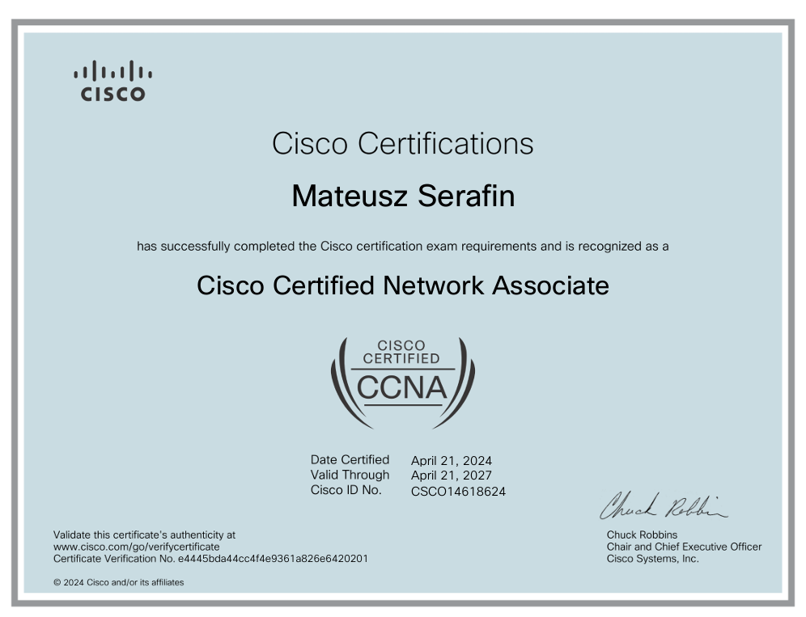

# GNS3_Networks
This repo contains anything I do with Networking / Windows / Linux / GNS3 etc.  

Currently Complete:
- CCNP
    - PacketFenceL3 (Advanced NAC setup with routed networks and Active Directory integration)
    - PacketFenceL2 (Basic NAC with Captive Portal and Guest Network)
- CCNA
    - Certificate
    - All labs
    - My first bigger network
- LFCS
    - Chapter 1: Processing Text Streams in Linux
    - Chapter 2: Edit Files Using VI/Vim Editor
    - Chapter 3: Archiving and Compression Tools with File Basic Permissions and Attributes
    - Chapter 4: Partitioning Storage Devices, Formatting Filesystems, and Configuring Swap Partitions
    - Chapter 5: Mounting and Using Filesystems
    - Chapter 6: RAIDs and Backups
    - Chapter 7: Managing the Startup Process and Related Services
    - Chapter 8: User Management, Special Attributes, and PAM
    - Chapter 9: Package Management
    - Chapter 10: Terminals, Shells, and Filesystem Troubleshooting
    - Chapter 11: Logical Volume Management
    - Chapter 12: System Documentation
    - Chapter 13: The Grand Unified Bootloader (GRUB)
    - Chapter 14: Integrity and Availability
    - Chapter 15: Kernel Runtime Parameters
    - Chapter 16: SELinux and AppArmor
    - Chapter 17: Access Control Lists (ACLs) and Quotas
    - Chapter 18: Setting up Network Services
    - Chapter 19: The File Transfer Protocol (FTP)
    - Chapter 20: Setting up a Caching DNS Server
    - Chapter 21: Configuring a Database Server
    - Chapter 22: Configuring an NFS Server
    - Chapter 23: The Apache Web Server
    - Chapter 24: The Firewall
    - Chapter 25: Static and Dynamic Routing
    - Chapter 26: Encrypted Filesystems and Swap Space
    - Chapter 27: System Usage, Utilization, and Troubleshooting
    - Chapter 28: Setting up a Network Repository
    - Chapter 29: Network Performance, Security, and Troubleshooting
- LinuxSandbox
    - MailServers (Manual configuration of postfix, dovecot, dns and testing with ready to go dockerized version of it)
- WindowsSandbox
    - SCCM (Installation of SCCM and deployment of software and unattended installation with domain join)
    - MDT Deployment (Unattended installation with domain join)
    - WDS Deployment (Unattended installation with domain join)
    - UnattendedIso (Unattended installation)

