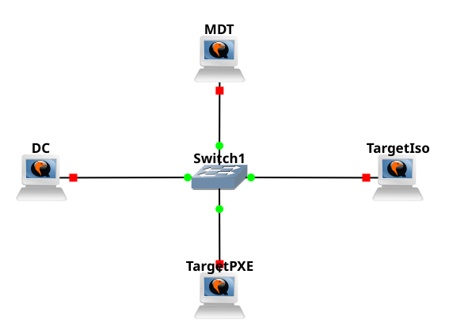
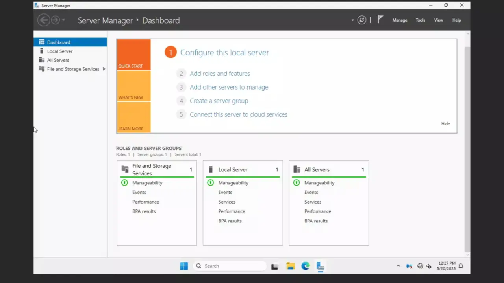
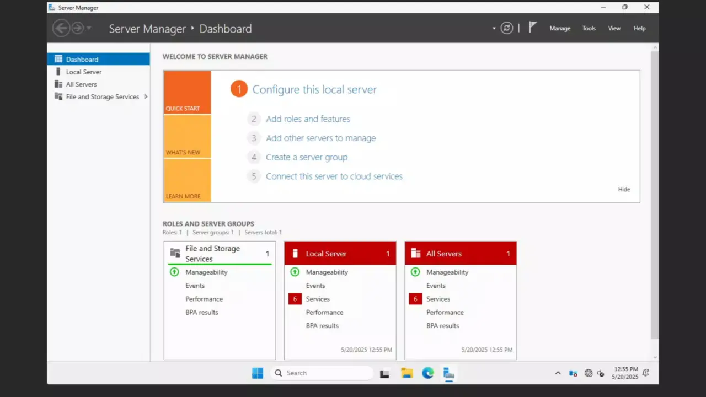
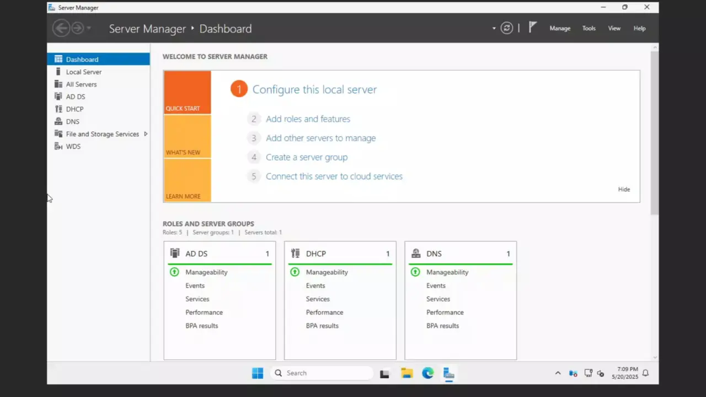

# MDT
In this example I am going to automatically deploy Windows 10 and join it to domain using MDT.

## Lab Setup
  
NOTE: On DC there is ADDS, DNS, DHCP, WDS this is good enough for purpose of lab.  

## Configuration Of DC
1. Configure ADDS  

2. Configure DHCP + WDS  

3. Create a secure domain user to join the domain  
When we generate the image this user will be stored in plain text we do not want to provide administrator there.  
Here is a good configuration of this type of user. 

## Configuration of MDT
1. Join the domain with MDT  

2. Install MDT and Required Dependencies  
   - ADK
   - ADK WinPE addon
   - And MDT itself
   
3. Configure MDT  
    - Create New Share
    - Import Image
    - Configure Rules and Boostrap.ini
    - Create Task Sequence
    - Generate the Image
    - Make sure that share is accessible to our secure user with read only permissions

There is some configuration however I've managed to do in one take, it's quite easy 
  
After all of it the iso file will be under ``C:\DeploymentShare\Boot\LiteTouchPE_x64.iso``

## Deployment via iso
The iso file that was generated is a fully valid installation medium. We can put on pendrive for example.  

## Deployment via PXE
To do this we need to just import it to WDS  
  
And the installation process looks like that  
