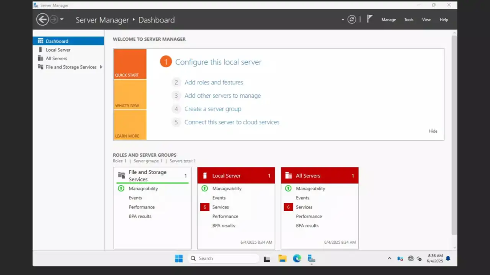
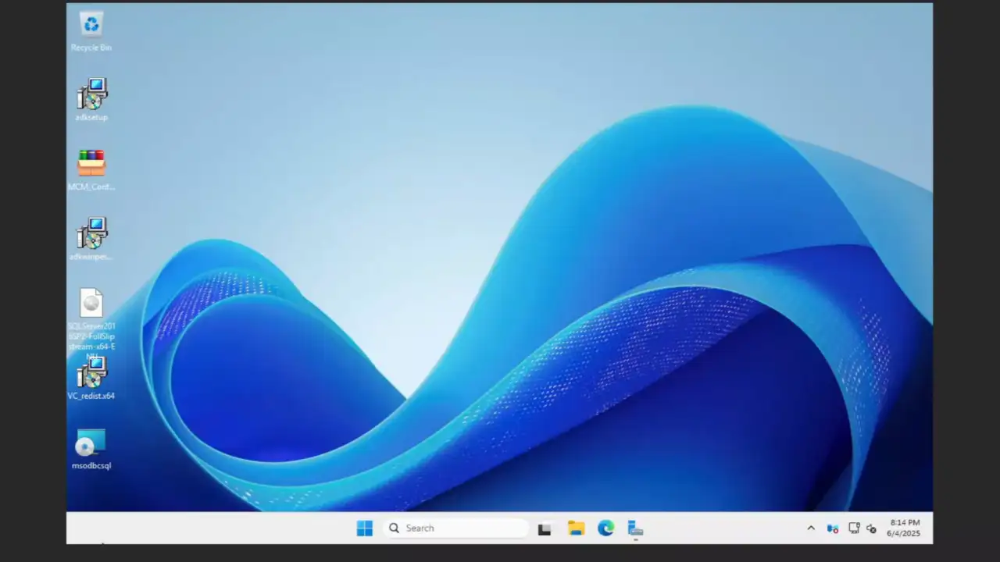

# SCCM
In this lab I am going to:  
- Install SCCM
- Deploy Windows with SCCM
- Deploy 
  - PyCharm to Engineering Computers
  - LibreOffice to Accounting Computers
  - WinRAR with Phased Deployment

## Lab Setup
  
Make sure for this lab internet access is configured properly otherwise there are issues client side. Don't ask me how I know

## Configuration of DC0
1. Install ADDS
   - Configure Network Interface
   - Change Computer Name
   - Reboot
   - Install ADDS and DNS
   - Configure ADDS then DNS
   
    
2. Configure DHCP
   - Install DHCP
   - Commit DHCP
   - Configure Scope (Make sure to configure option 66)
   
   
3.  Create a secure domain user to join the domain  
    When we create the task sequence this user will be stored in plain text we do not want to provide administrator there  
    Here is a good configuration of this type of user  
    
4. Create Users and Organizational Units (Engineering and Accounting for my Lab)  
   

## Installation of SCCM
1. Initial Configuration
   - Configure Network Interface
   - Change Computer Name
   - Reboot
   - Join To Domain
   
   
2. Install SQL Server 2016  
   - Install Features "Database Engine Services" and "Reporting Services - Native"
   - Additionally, change default user that is running the database to "NT Authority\Network Service"

   
3. Install required Features and Roles
   - Roles
      - WSUS
   - Features
      - .NET Framework 3.5 Features
      - Background Intelligent Transfer Services (BITS)
      - Remote Differential Compression

   
4. Install required external dependencies  
    - Microsoft Visual C++ Redistributable
    - Microsoft ODBC Driver 18 for SQL Server
    - ADK 
    - ADK WinPE plugin

   
5. Finally Install SCCM
    - Extract SCCM Installer
    - Extend schema
    - Install

   

## Deployment of Windows
1. Configure Boundaries  
   
2. Enable PXE on Distribution Share and import your windows image  
   
3. Create a Package containing Unattended.xml  
   You need Unattened file in order to skip OOBE  

   
4. Create Task Sequence 
   - Specify user that will join the PC to domain
   - Edit task sequence and specify package and file name for unattended xml
   
   
5. Deploy the task sequence  
   

At this point everything is configured.  
When you are going to boot up with PXE there will be a prompt, you specify the task sequence, and it will install and join to the domain  

## Deployment of Software
1. Create User and Device groups 
   - Enable User and System Discovery Method
   - Create Accounting/Engineering groups for Users and PCs

   
2. Import applications  
   - Create a network share that is accessible to everyone 
   - Put your installers into that share
   - Import the applications
   - Distribute Content 
   
     
   Note: It's important to mention that there are two types of installs.  
      - System, will run with different account (machine account) and is privileged. It's intended to install software that require privileges to install and usually would install for all users. 
      - User, will run install as a current user, This is intended for apps where you install just for one user. And does not require additional admin privileges 
   
   All 3 apps I used were installed with System option as they did not have option to install only for current user.  
   The same thing cannot be said about "ShotCut" for example. You can install it either for only one user OR install it system-wide. Choosing your install type and context switches is important. 
     
   Additionally, .msi installers already have information specified in them and are easiest to deploy  
   To deploy .exe files, you need to find context switches which are usually on website or by running something like "installer.exe /help"  
   Also you need to specify a method on how SCCM determines if an app is successfully installed, In my example I am checking if Uninstall.exe exists in a directory.  
   This is not a perfect approach, but it works. From my previous experience you need to look for apps that are installed as a User and can do auto-update which could result in app being updated match detection being failed, and it results in being reinstalled to old version. (In a loop)  
3. Normal Deployment  
     
   Note: It's good to mention that deploying to Users means that the User will be able to download this particular app on any PC.  
   Where deploying to computer means any User will be able to download app on this particular computer.  
   In my case I deployed to computers only. 
   
   Additionally, deploying as Available means that a User will be able to download the app. If it's deployed as Required SCCM will install it to a computer without asking user. (User cannot remove it)
   
4. Phased Deployment  
   Phased Deployment is really similar to regular deployment the difference being it's just split into two deployments.  
   Good example would be you have test machines, and you first deploy it there, once it successfully deployed it will automatically deploy to second group which could be all of your systems.  
   In my case I phase deployed WinRAR to EngineeringPC's and then to AccountingPC's  

   

## Testing of App Deployment
- PyCharm
   
- LibreOffice
  
- WinRAR  
   Note: Phased Deployment is slow. I left it for 1 hour and it installed.  
   You can check if phased deployment correctly deployed on SCCM  
     
     
   