# SCCM SCENARIO
In this scenario i want to accomplish some things.
1. Management Gets thunderbird deployed ✅
2. Developers get VSCode deployed ✅
    - Additionally i want to deploy VSCode as phased deployment to see how it works ✅
3. I want to have an application with two different versions available in software center. ✅❌ <- Partially check almost at the end for more information
4. Additionally check how dependencies work ✅

## Lab Setup
1. In [InstallingSCCM.md](InstallingSCCM.md) I checked how to install agent on clients, so i prepared just that.
2. I created some groups for devices 
  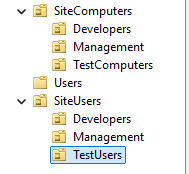
  Additionally I created some Collections that i deem will be useful later
  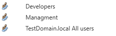
  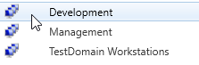
  To actually create them it was quite easy, When creating collections it asks you for rules, you add query rule and then you need to select System/User Resource and then User OU or System OU. 
  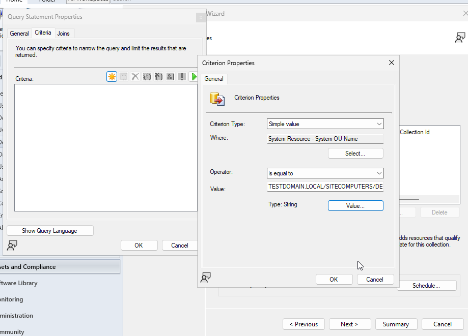
3. I pushed client to my Computers upon checking it installed without issues. 

## Deploying exe
Originally i wanted to write my self like a tutorial how to deploy things however I had really weird shenanigans occurring.
  While testing Thunderbird i deployed it, and it was constantly redeploying it was because it was updating and then the version did not match.
  For VSCode i checked the detection method i manually triggered update, but it required administrator privileges. So in this case detection method could be left as it is.
  However  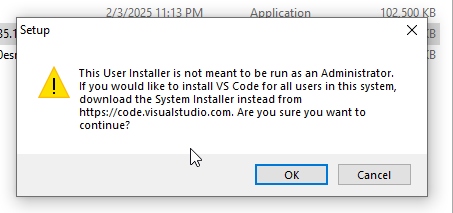   I am assuming if i would use the user binary. The user would be able to perform an upgrade and the same problem as in Thunderbird could occur. 
  Therefore before deploying I would test some of the things
1. Where the app installs is it machine install or user install. (VSCode has two different versions)
2. How updates are handled, in vscode system version it requires admin privileges so i can leave the detection method to version equals to but in case Thunderbird it updates itself without needing administrator rights hence the Detection method I chose was Greater or equals to
3. Also, manually check context switches, on another machine make sure that you are able to install/uninstall and get the parameters

Okay so assuming you did the above bullet points. It's really easy, I kinda failed first time but i am in shape now to do it correctly
1. Create application, and choose option to "Manually specify the application information"
 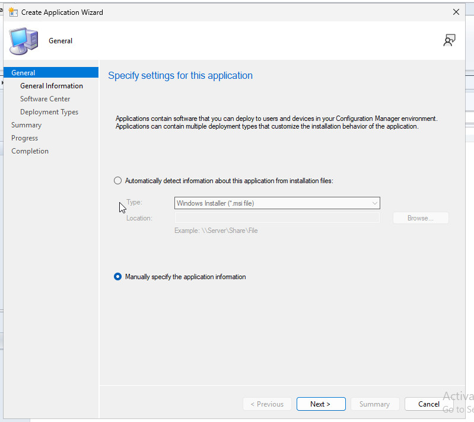
2. Provide basic information about the application. 
  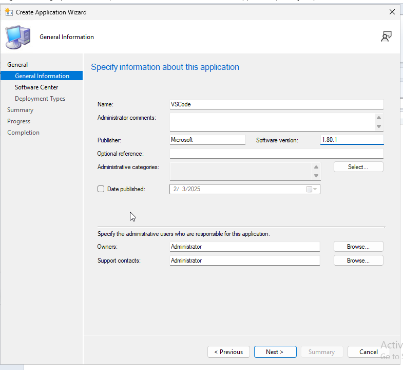
3. Provide information that will show up in the Software Center, "User categories" will allow users to filter application by categories, "Keywords" allows user to search for it. (I have outdated screenshot)
  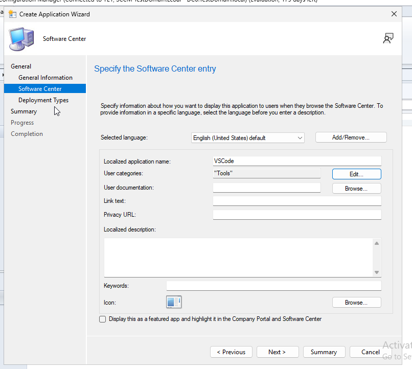
4. Under "Deployment Types" you can either click add now or do it later. I clicked to do it now. Make sure to select Script Installer
  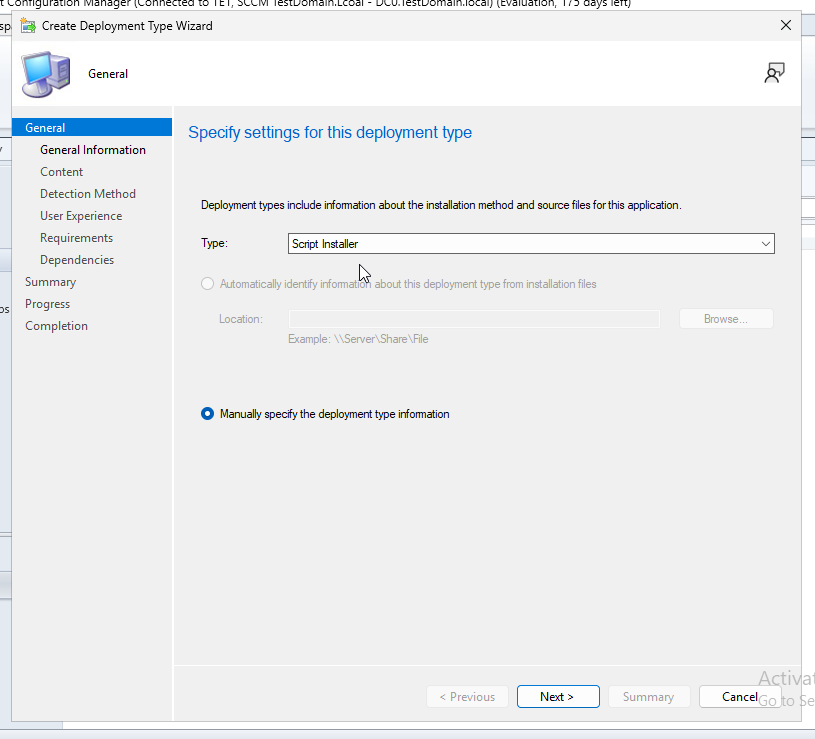
5. Content Location is your network share with application.   Installation program is your actual setup. so in my case it looks something like "VSCodeSetup1.80.1.exe" /VERYSILENT /NORESTART /MERGETASKS=!runcode, those arguments are switches for the installer so it installs in background. I just googled for switches, for thunderbird i tried using setup.exe /? but it did not provide anything and i found information on their website. 
  Uninstall Program is similar, however you specify path to uninstaller after it was installed in case of vscode it was %programfiles%\Microsoft VS Code\unis000.exe /VERYSILENT /NORESTART, if your program would install under user folder then it would require chaning to %appdata%\something\something. 
  <mark>Like i mentioned above this is per program basis and likely requiring some adjustments make sure you test properly</mark> 
  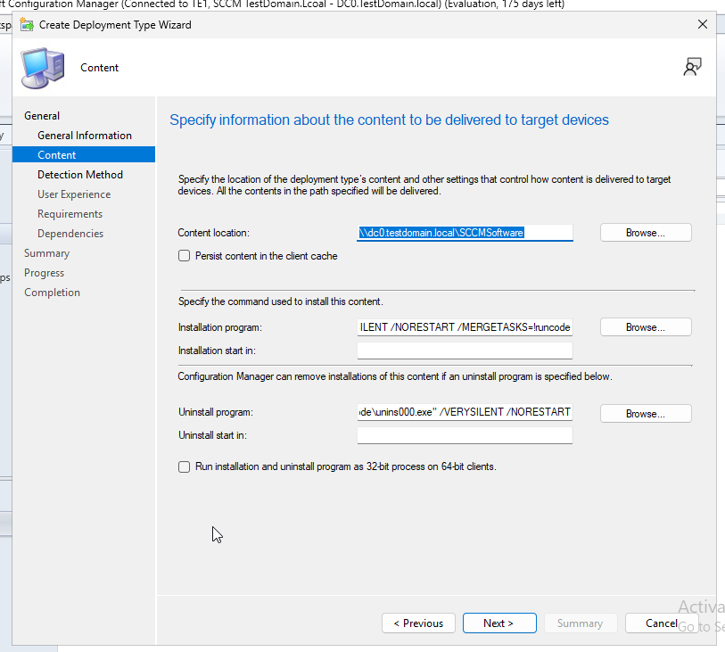
6. For detection rules make sure to get this right otherwise while deploying it could say that it failed to install while in fact it installed. 
  Make sure to check how updates are handled by a program, in my case thunderbird caused issues as non-privileged users were able to update it so the operator "equals" would be evaluated to false after update and trigger installation because it thinks it failed. In that case I chose "Greater than or equal to" and it did not cause issues. 
  For VSCode i would get away with equals operator because users are unable to update it however the VSCode user version might cause issues because i think it would install under user folder allowing user to update it.
  Aside of that i mentioned to have other machine for testing in my case if you go to this directory on screenshot below and check "Code.exe" file version it will be "1.80.1.0" make sure to use the file version and not the Program version as SCCM uses the first one.
  Additionally there are other detection methods. File seams somewhat reasonable but i was wondering if registry or perhaps script would not be better in some cases. Is it this case?
  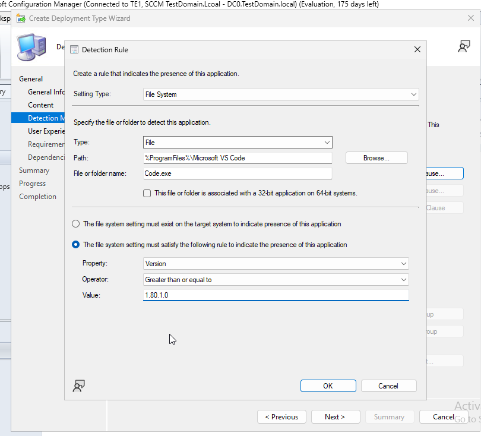
7.  In user experience make sure to select the correct option. Some apps require to be installed as system and some apps can be installed in user mode. This will also depend relies on context switches you chose.
  Maximum allowed run time will restrict on how long the installer will be allowed to run, and estimated installation time is just information for users.
  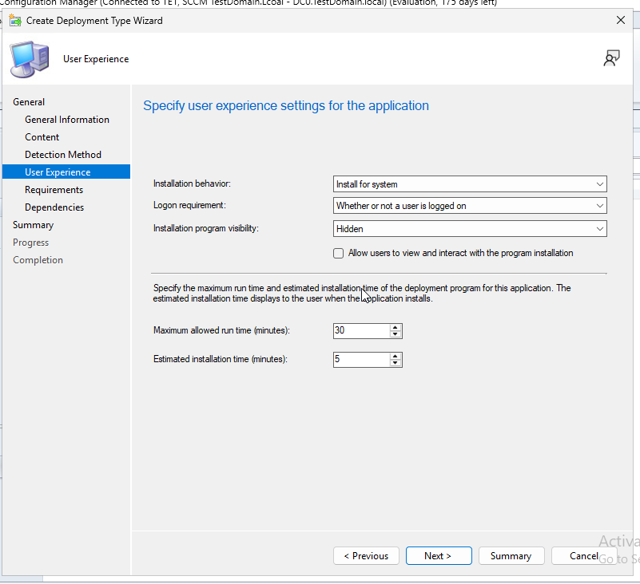
8. Distribute the deployment and Deploy. In my case i deployed to test work station
  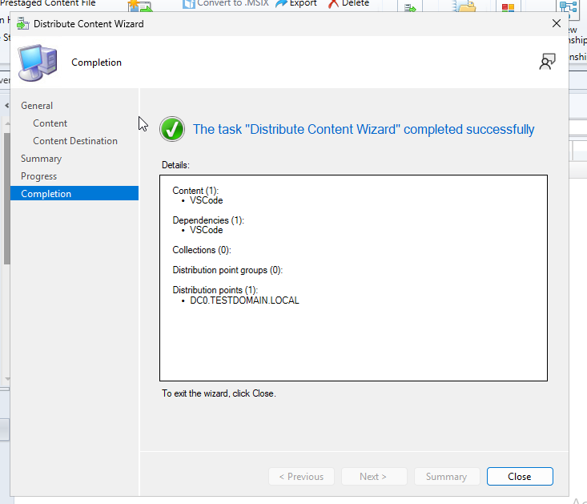
9. Success (i also tested uninstallation by deploying removal)
  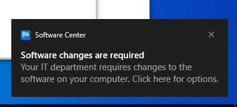
  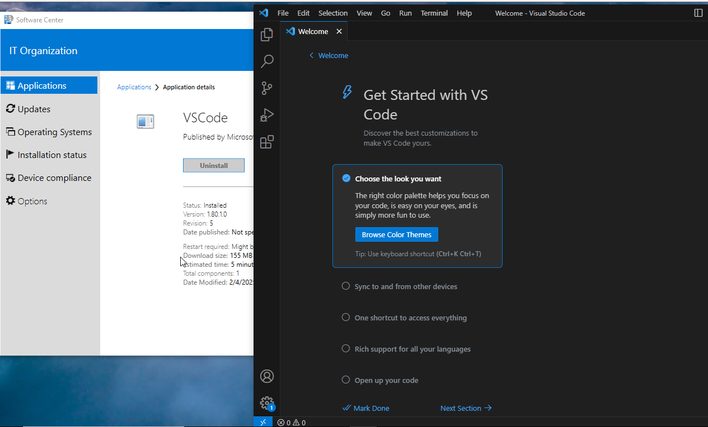

## Phased Deployment
1. Click on the app, and click "Create Phased Deployment"
  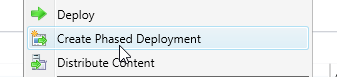 
2. For general tab I only named the deployment. The First Collection is your target test machines which will be used for testing, second collection is your target deployment machines.
  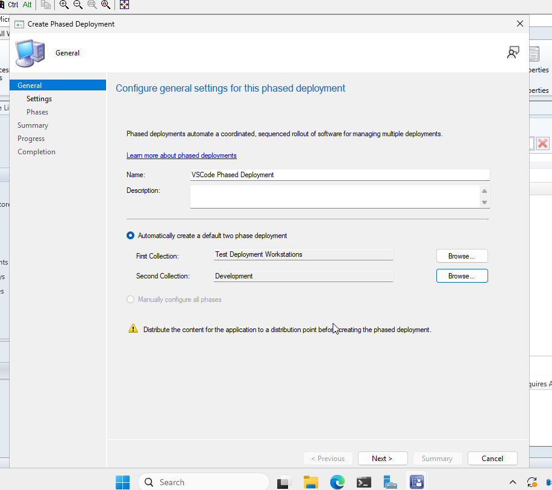
3.  In next tab I selected to automatically begin second phase, I also set it to 0 days as i don't really want to wait. It's pretty easy you need to just adjust to your needs
  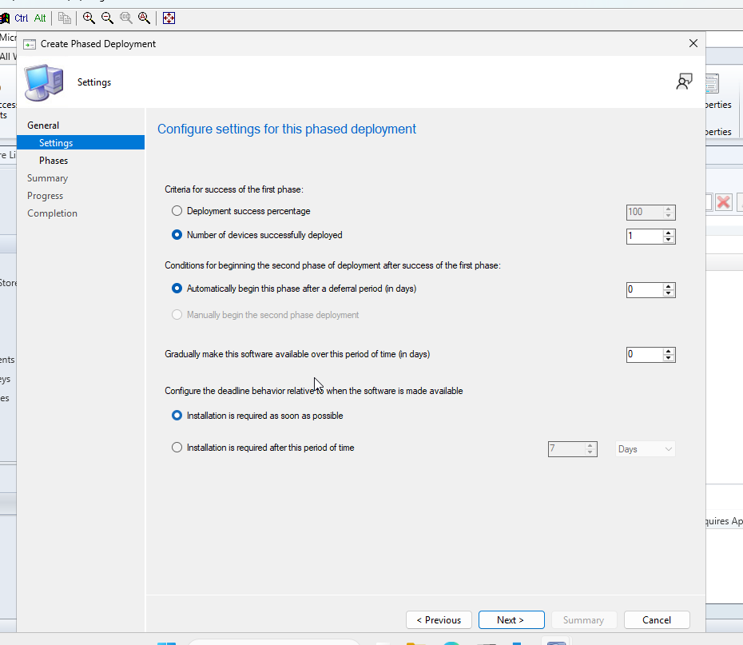
  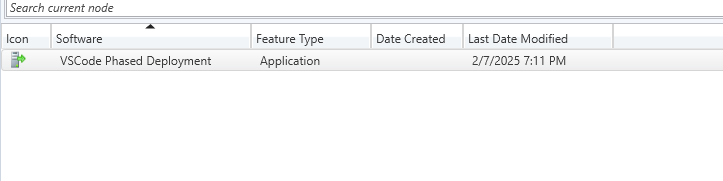
4. You should see under deployments your phase 1. If it hits your target, phase 2 should pop up (in my case it took long time even I selected it to wait 0 days, and manually ran summarization.)
  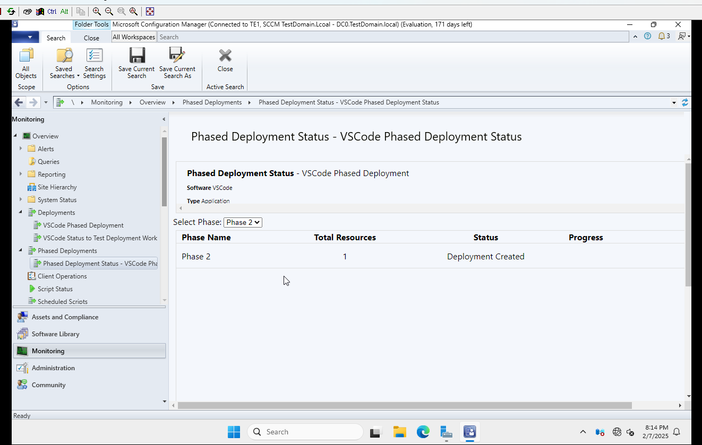
5. When second phase is hit, second collection will start to install your application.
  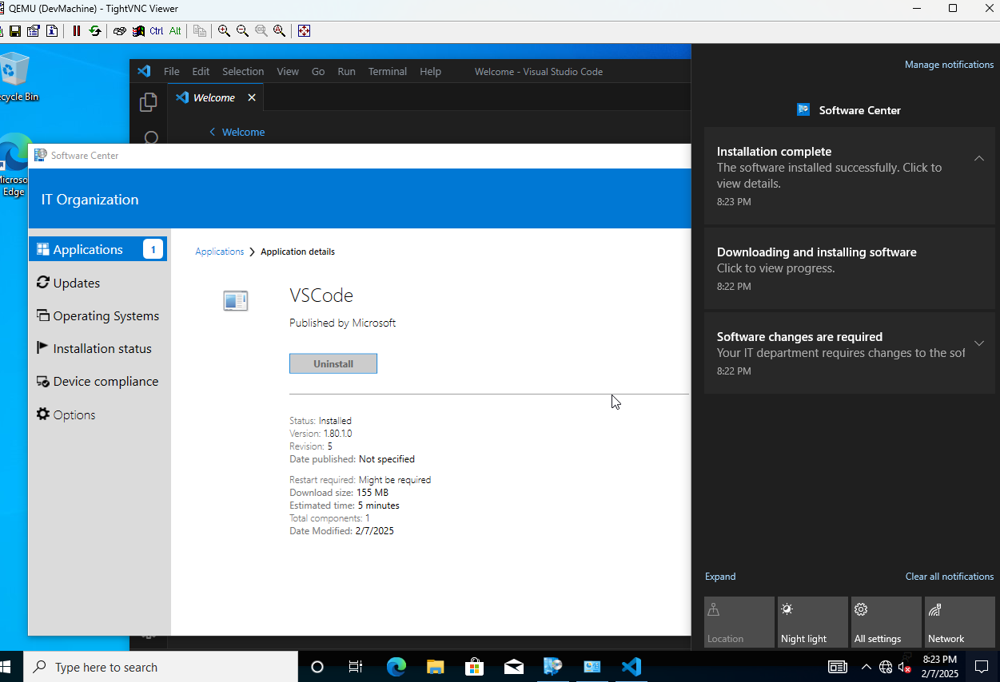
  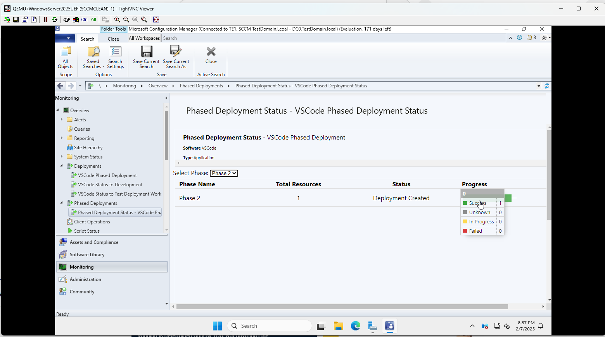

Tldr: Phased Deployment is really similar to regular deployment, I expected it to be slightly more interesting. It's a definitely good tool to use to test if your applications will deploy correctly and will not cause issues on massive amount of machines. In my lab I used 2 machines, but if I would deploy to like 5000 machines i think it's where it really shines.

## Software Center
Okay, so before writing this scenario I've seen at university that I was able to install software with different versions, for example Cisco Packet tracer and all the older versions. I've assumed that's SCCM software center. But upon looking at it again it was not. Lol. So if i would want to achieve something like that in SCCM i would need to create each application on its own.

## Dependencies
Okay, so additionally I want to see how dependencies work. 
1. Okay so under Deployment Types there is dependency tab. I added VSCode to 7zip (because I already had it).
  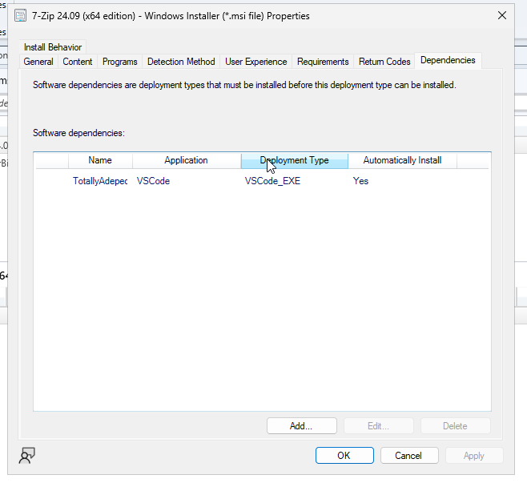
2. Now when installing, it mentions that there are "Total components: 2" which would make sense because I added dependency. 
  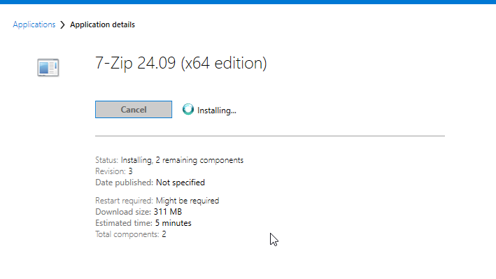
3. After installation in software center I can see only 7 zip, but VSCode is installed too. I expected that VSCode would show up too, but I guess this was expected too.
  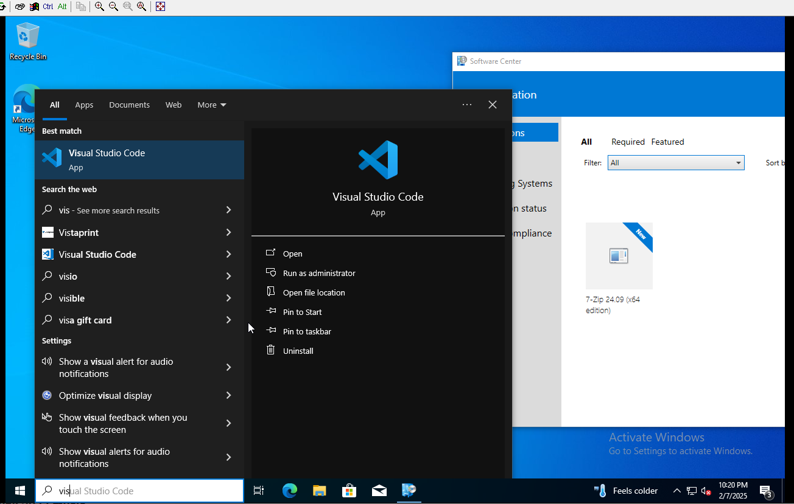

I don't think i have anything else to add, when i installed SCCM i though about it as a big scary thing but pretty much it looks like it's 3/10 in difficulty scale. I need to explore it more in the future. 