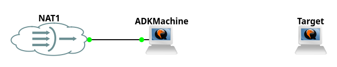
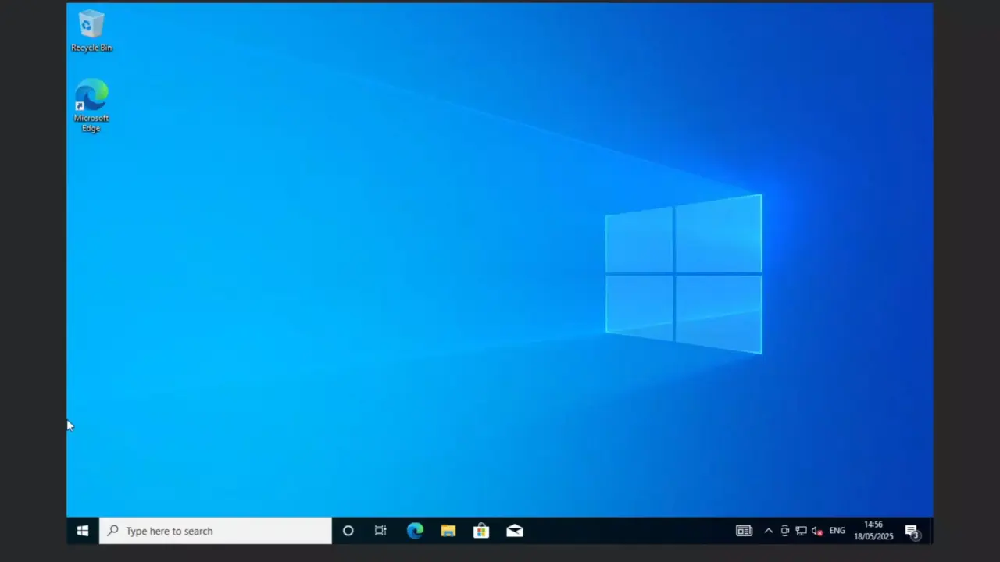
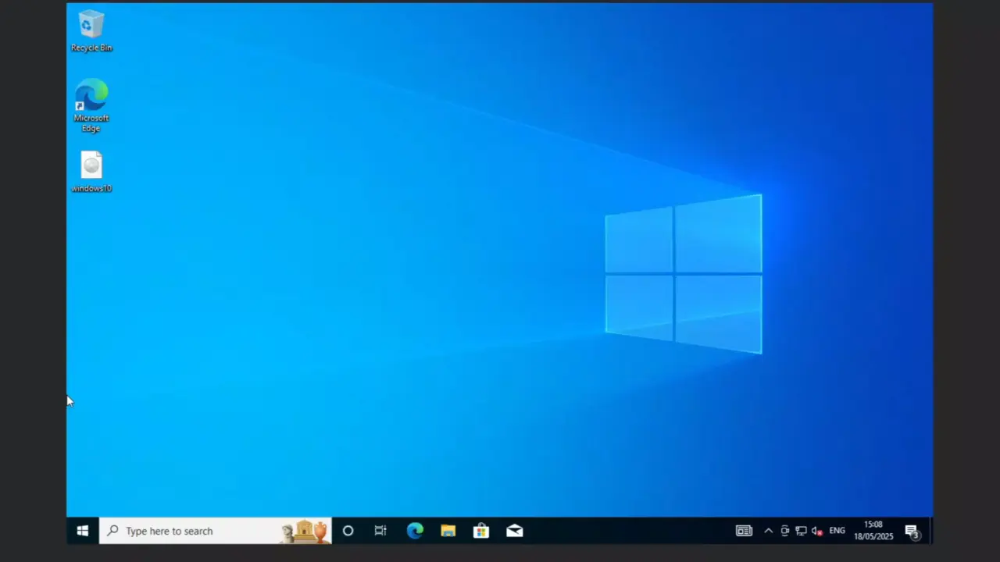
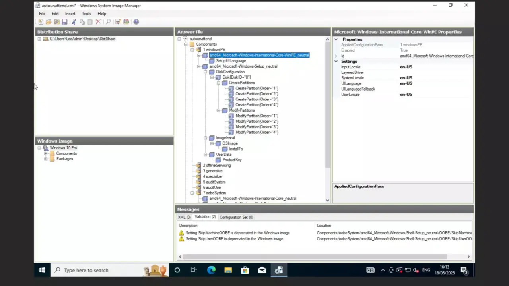
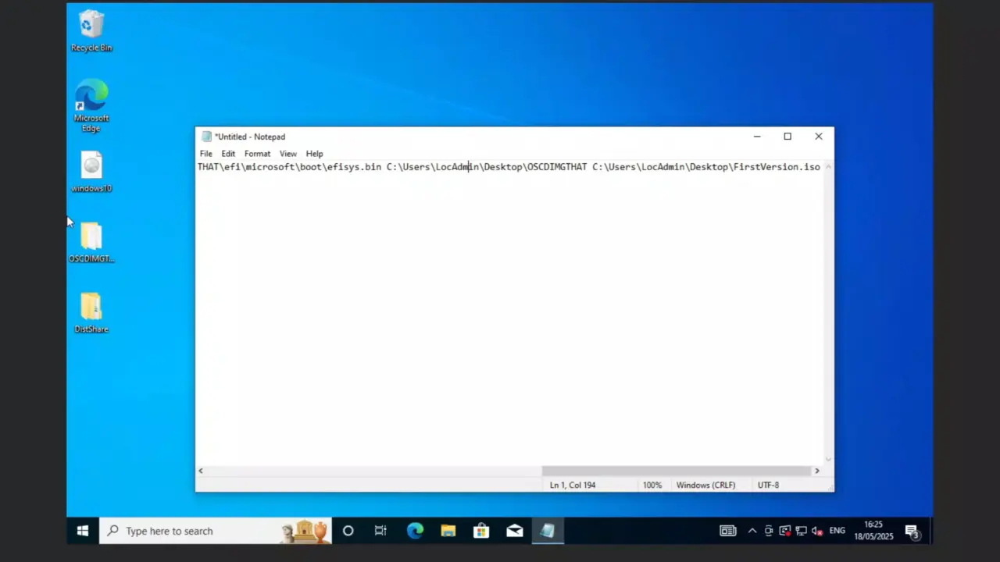
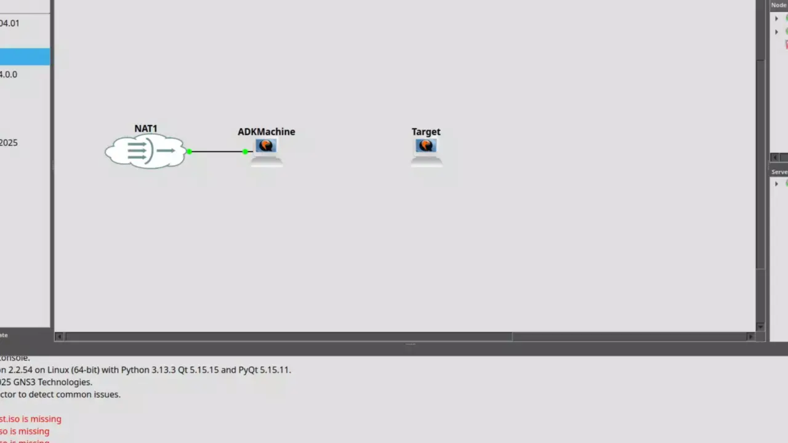

# Unattended ISO
In this example I am going to configure ISO file that automatically installs windows. <br>
This is going to be pretty simple example.

## Lab Setup
 <br>
ADKMachine needs internet to download ADK and iso file. <br>
Target will boot my iso file. 

## Creating Unattended File
For this part I followed this tutorial which is pretty good https://www.windowscentral.com/how-create-unattended-media-do-automated-installation-windows-10
1. Acquire Windows.iso I suggest to download from https://www.microsoft.com/en-gb/software-download/windows10ISO
2. Download and Install Windows ADK <br>

3. Extract .iso file and prepare "Windows System Image Manager" for creation of Answer File <br>

4. Create Answer file and import required Modules <br>

5. Configure required modules for automatic install <br>
This configuration works only on UEFI, for BIOS you need to configure partitions differently <br>
This is covered in tutorial I provided <br>

6. Create .iso file from folder <br>
Make sure to put the Answer File with this exact file name "autounattend.xml". It needs to be in same folder where setup.exe is (main folder). <br>
Additionally the command I provide only allows to boot only on UEFI, for BIOS different options should be used. <br>
```oscdimg -m -o -u2 -udfver102 -bootdata:2#p0,e,b(Location of extracted iso folder)\boot\etfsboot.com#pEF,e,b(Location of extracted iso folder)\efi\microsoft\boot\efisys.bin (Location of extracted iso folder) (Where to save iso)``` <br>


## Testing
After all of this, the result should look like that <br>
