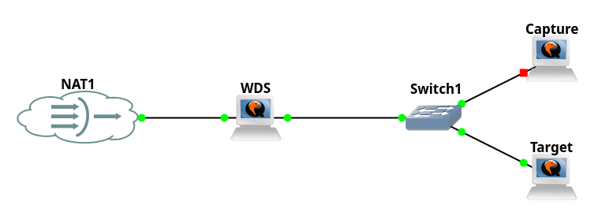
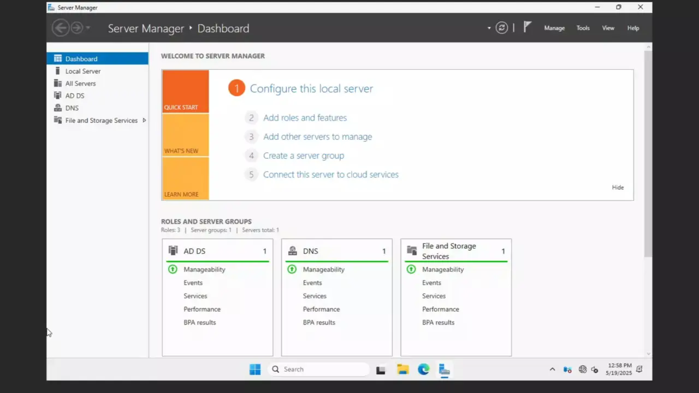
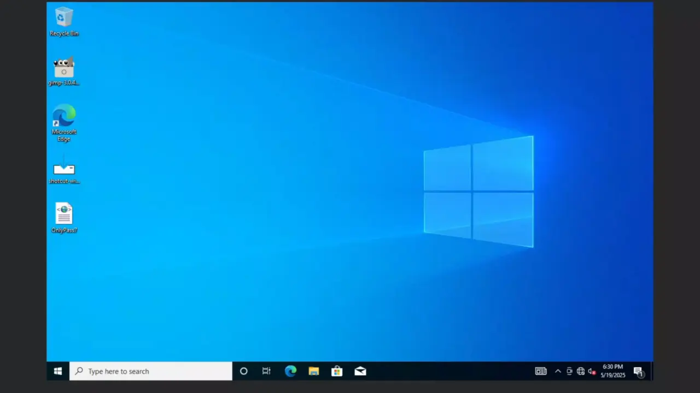
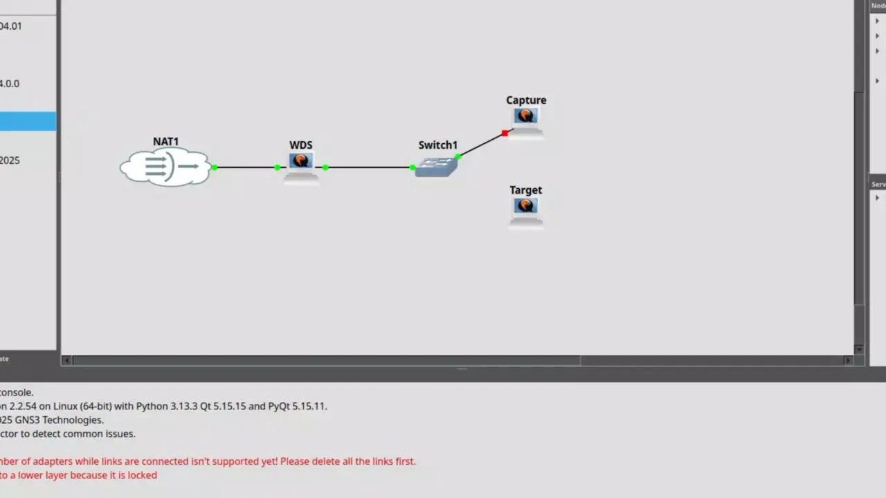
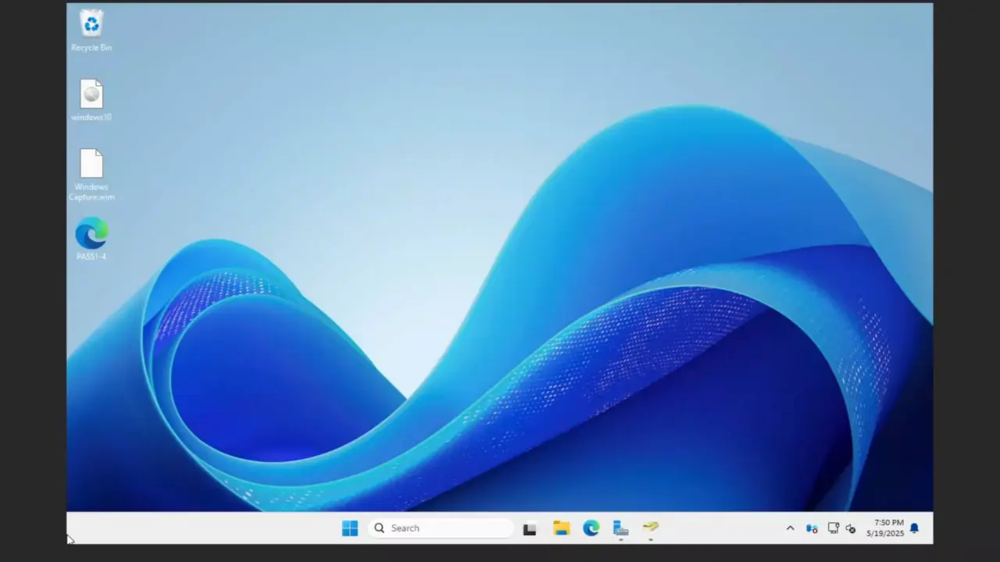

# WDS
In this example I am going to:
- Capture Windows 10 image with Shotcut and Gimp
- Configure WDS to automatically deploy Windows 10
- Automatically join to domain 

## Lab Setup
  

## Initial Configuration Of Windows Server
1. Configure ADDS  

2. Configure DHCP + WDS  

3. Create a secure domain user to join the domain  
In unattended.xml we have to specify user that is in domain and will join the computer to the domain. The problem is the password will be in plain text and providing something like domain administrator is unsecure.  
Here is a good configuration of this type of user. 

## Preparation of Deployment
1. Create capture Image on WDS  

2. Create Required Unattended.xml  
It's important to note that WDS handles passes 1-4 meaning if you specify to skip OOBE which is in pass 7. Nothing actually will happen and user will be greeted with OOBE screen.  
To actually do this correctly make sure to split your unattend to two files one for WDS one for the image itself.  
Additionally previously I have shown how to create an Unattended file I will provide my configuration there only.  
Also make sure to include first reboot, like I did in my configuration as without it the PC will join to domain however you won't be able to log in.  

3. Prepare the capture image  
In my example I will install Shotcut and Gimp before capturing the image  
Additionally make sure to put your PASS7.xml to ``C:\Unattend.xml``. There are other location options but those didn't work for me for some reason.  
  
Make sure to run sysprep! 

## Capturing the image
Capturing the image is pretty easy, you just pxe boot and select the capture image.  
However make sure that you have usb or external hard drive plugged in because it won't let you do the capture without other disk  

## Finishing Configuration
At this point you captured the image, and it will show on WDS.  
Make sure to apply your unattended passes1-4 in WDS.  

## Success
